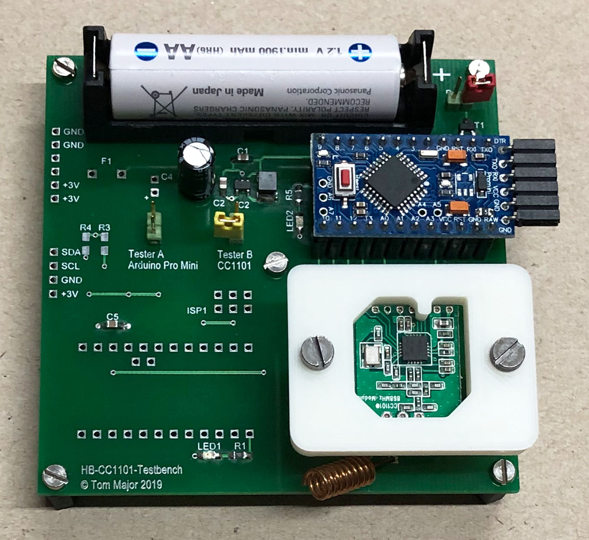
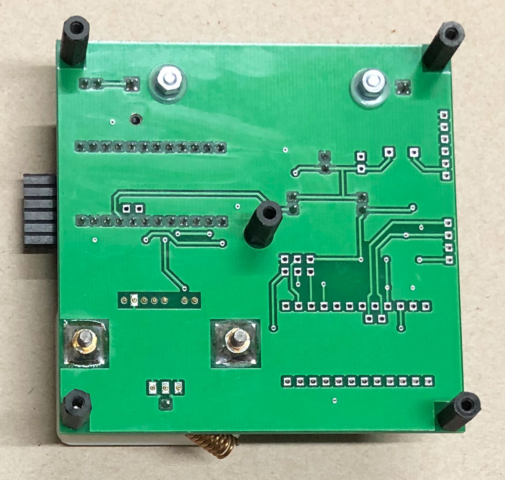
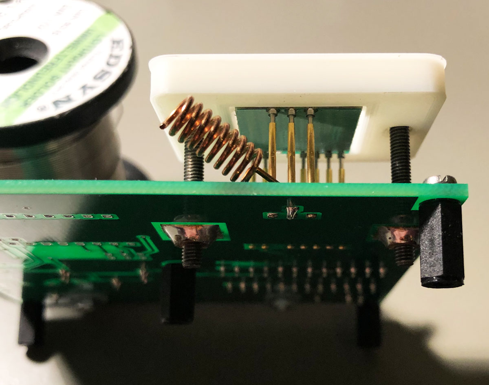
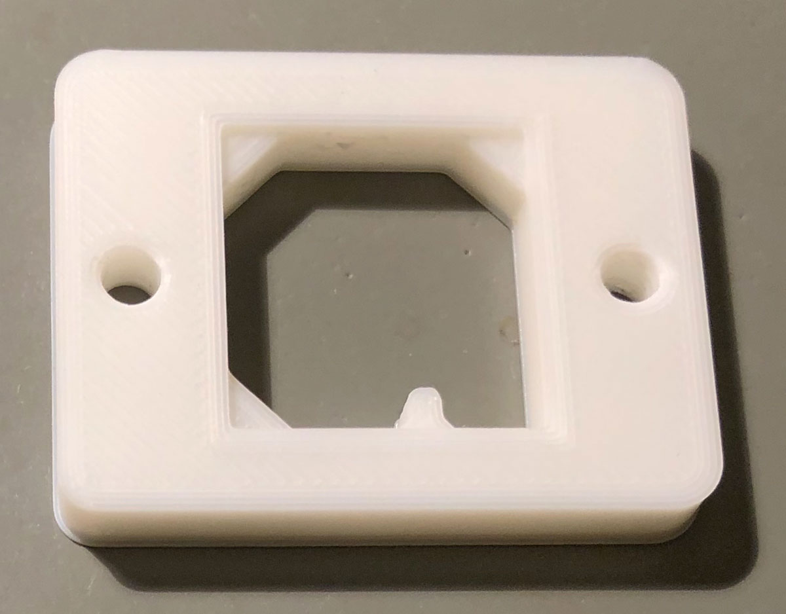
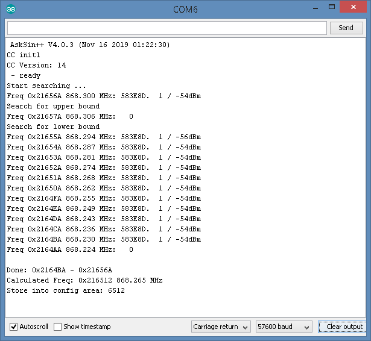
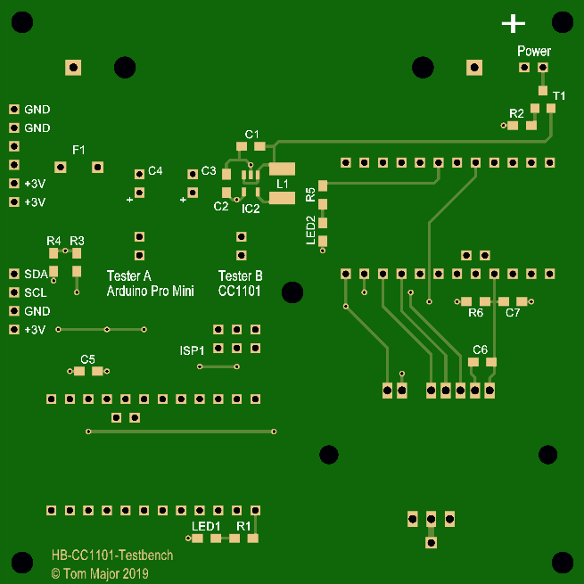
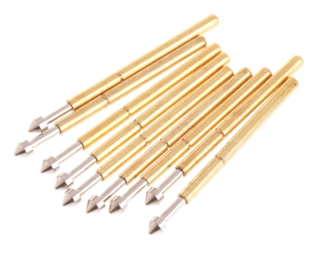
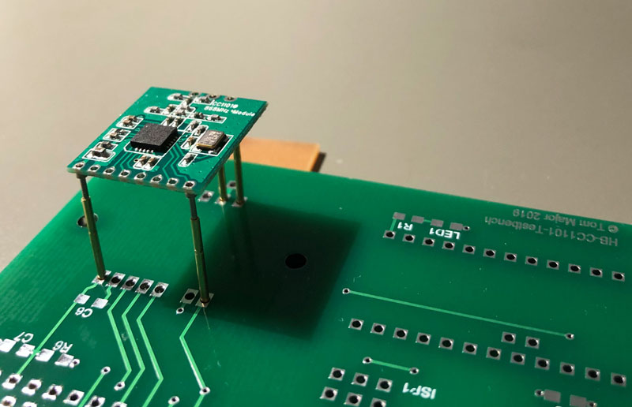

# HB-CC1101-Testbench

- Testbench für CC1101 Frequenztests und für weitere Anwendungen.

Features: 
- 3V Spannungsquelle für Testaufbauten (aus einer Zelle)
- inkl. Verpolschutz

Teil A (links) 
- Arduino Pro Mini Ruhestrom Tester
- Arduino Pro Mini ISP Programmierung
- I2C Connector für Breakout-Board Tests

[Sketch Ruhestromtest](https://github.com/TomMajor/SmartHome/tree/master/Info/Ruhestrom#%C3%BCberpr%C3%BCfung-des-avr-ruhestroms-power-down-mode)

Teil B (rechts) 
- CC1101 Frequenz Tester

[Sketch Frequenztest](https://github.com/pa-pa/AskSinPP/tree/master/examples/FreqTest)

Man braucht nicht unbedingt die 3V Spannungsquelle mit MAX1724 für Testaufbauten aus einer Zelle aufzubauen. 
Genauso gut kann man den Pro Mini über den FTDI Adapter versorgen oder am Power Jumper oben rechts eine andere Versorgung einspeisen.

## Bilder

## Schaltplan

[:arrow_right: Schaltplan](PCB/Files/HB-CC1101-TestBench.pdf)

## Platine

[:arrow_right: PCB Gerber](PCB)

## Aufbau / Stückliste

- Der CC1101 Halter war eine schnelle Idee von mir, den *Jan_von_neben_an* dankenswerterweise umgesetzt hat. 
Er funktioniert gut, ich bin aber sicher dass ein findiger Konstrukteur eine für den CC1101 Wechsel schnellere Lösung (Schnell-Klemmvorrichtung o.ä.) bauen könnte. 

- Momentan muss man den CC1101 auf die Pogo-Pins auflegen, dann den Halter auf den CC1011 und dann die 2 Schrauben ein paar wenige Umdrehungen eindrehen. 
[:arrow_right: Halter by Schmelzerboy](https://www.thingiverse.com/thing:4002846)

- Die Pogo-Pins **P75-E2** für die Testbench haben einen kleinen Kegel an der Spitze: 

[:arrow_right: P75-E2 bei aliexpress](https://de.aliexpress.com/item/32874022638.html?transAbTest=ae803_3)

- Wichtig bei anderen  Pogo-Pins wäre dass sie bei den 2mm Padabstand des CC1101 nicht aneinander stoßen, andererseits dürfen sie nicht zu dünn sein, damit sie nicht durch die Löcher in den CC1101 Pads durchrutschen.

- Aus eigener Erfahrung würde ich beim Aufbau unbedingt mit den Pogo-Pins beginnen, sonst kann es später fummelig werden. 
Dazu die Platine auf eine wärmefeste Unterlage legen (damit sich die erhitzen Pogo-Pins nicht unten einbrennen) und mit den äußeren Pogo-Pins anfangen. 
Den CC1101 auflegen, leicht andrücken, die Pogo-Pins ausrichten und anlöten. 
Dann mit den inneren Pins weitermachen, durch das leichte Andrücken des CC1101 beim Anlöten eines jeden Pins sollten sich diese automatisch auf die Löcher in den CC1101 Pads ausgerichten.

#### Stückliste

| Anzahl	| Name	    | Wert	            | Gehäuse       | Bemerkungen |
|---|---|---|---|---|
|**TODO**|||||

## Benötige Libraries

[AskSinPP Library](https://github.com/pa-pa/AskSinPP) 
[EnableInterrupt](https://github.com/GreyGnome/EnableInterrupt) 
[Low-Power](https://github.com/rocketscream/Low-Power)

## Lizenz

**Creative Commons BY-NC-SA** 
Give Credit, NonCommercial, ShareAlike

 This work is licensed under a <a rel="license" href="http://creativecommons.org/licenses/by-nc-sa/4.0/">Creative Commons Attribution-NonCommercial-ShareAlike 4.0 International License</a>.
