# Infos und AddOn zum 4,2" ePaper Display HB-Dis-EP-42BW

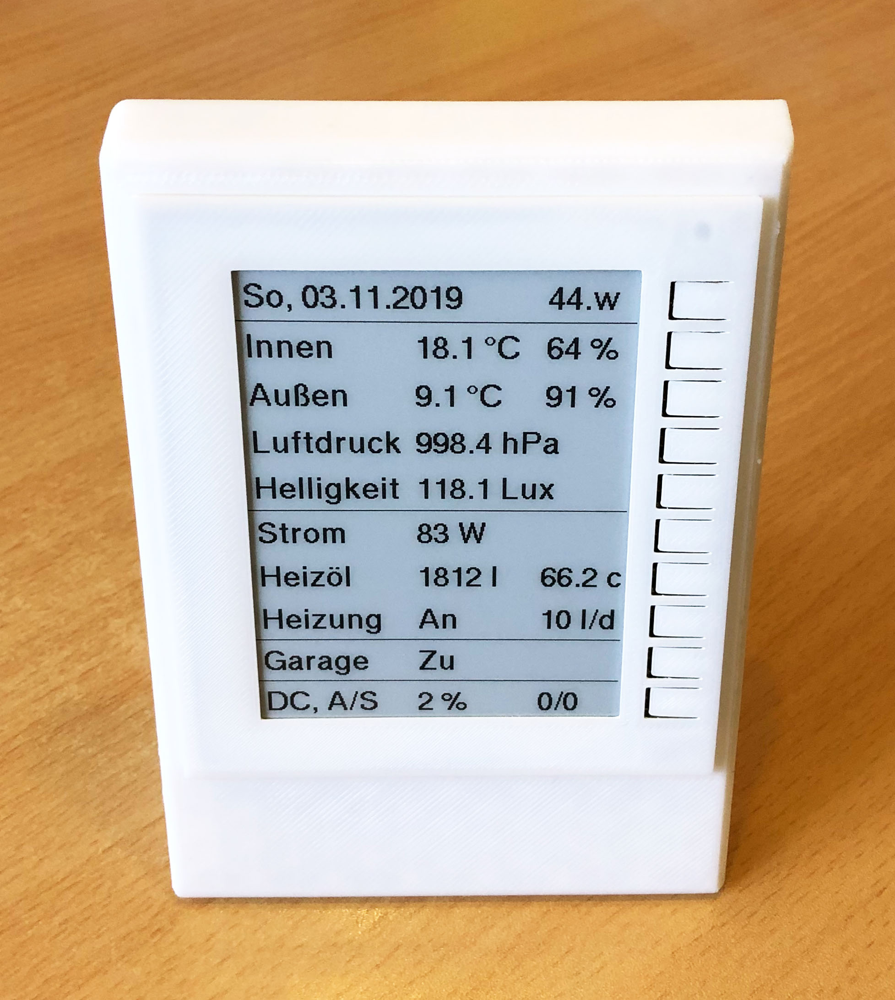

- Die Infos hier beziehen sich auf Jeromes Projekt ePaper Display HB-Dis-EP-42BW<br>
[Original HB-Dis-EP-42BW](https://github.com/jp112sdl/HB-Dis-EP-42BW)


## AddOn für CCU2/CCU3/RaspberryMatic 

- meine Version des HB-Dis-EP-42BW ePaper Addon aus dem Jahr 2019 (Stripdown aus Jeromes JP-HB-Devices-addon nur für das ePaper) wurde eingestellt.

- Dafür kommt jetzt bei mir die neue und erweiterte Version [HB-TM-JP-AddOn-Reduced](https://github.com/TomMajor/SmartHome/tree/master/HB-TM-JP-AddOn-Reduced) zum Einsatz, die nebem dem HB-Dis-EP-42BW ePaper Gerät auch noch die Geräte HB-RC-12-EP und HB-OU-MP3-LED kann.

:exclamation: Achtung, bitte entweder nur Jeromes JP-HB-Devices-addon oder das HB-TM-JP-AddOn-Reduced installieren, niemals beide AddOn gleichzeitig, das wird nicht funktionieren!


## Aufbau - Alveran's Gehäusevariante

- Danke an Marco (stan23) für seine professionelle Arbeit beim Platinendesign und die Bereitstellung der Platinen. :smile: <br>
  Danke an Alveran für seine professionelle Arbeit im 3D-Druck Bereich und die Bereitstellung des Gehäuses. :smile: <br>
  Danke natürlich auch an papa für seine geniale AskSinPP Library und an Jerome für seine Pionierarbeit bei den Homebrew Geräten.

- Es sind nur 2mm Abstand zwischen Displayboard und ATmega1284P-Platine vorhanden, eingestellt durch die im Foto zu sehenden 2mm Spacer.

- Das CC1101 Modul wird deswegen von hinten, "verkehrt herum" bestückt.

- Taster mit 5mm Bauhöhe<br>
  [THT Taster 6x6x5 mm 4 Pin Kurzhubtaster Drucktaster Print Bedrahtet 6*6*5mm](https://www.ebay.de/itm/THT-Taster-6x6x5-mm-4-Pin-Kurzhubtaster-Drucktaster-Print-Bedrahtet-6-6-5mm-/112592788992)

- LED, 3 mm, bedrahtet, 3-Pin, rot/grün<br>
  [KBT L-115WEGW](https://www.reichelt.de/led-3-mm-bedrahtet-3-pin-rot-gruen-40-mcd-60-kbt-l-115wegw-p231039.html)
  
- 2 Schrauben M3x20 um die Frontblende von unten zu arretieren.

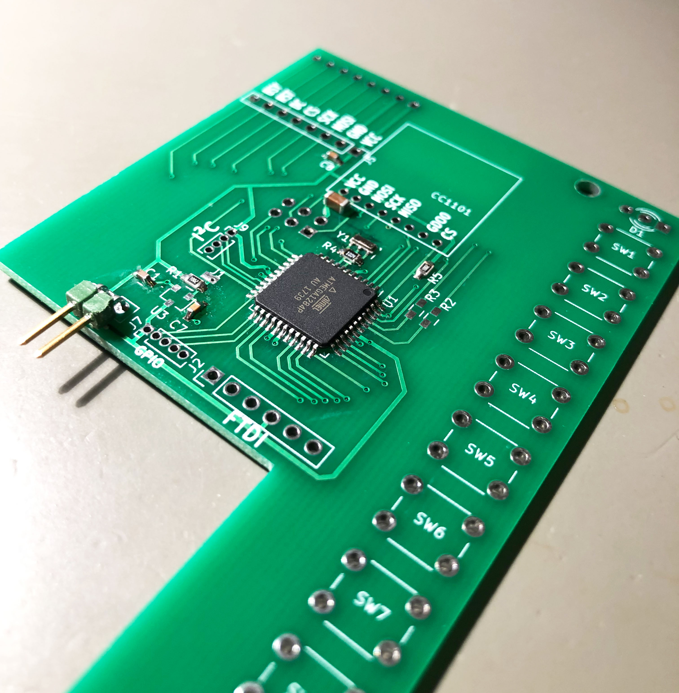

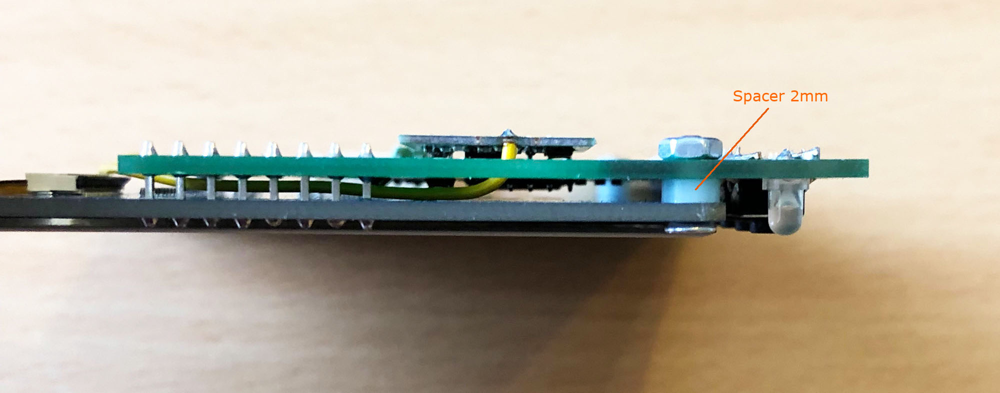

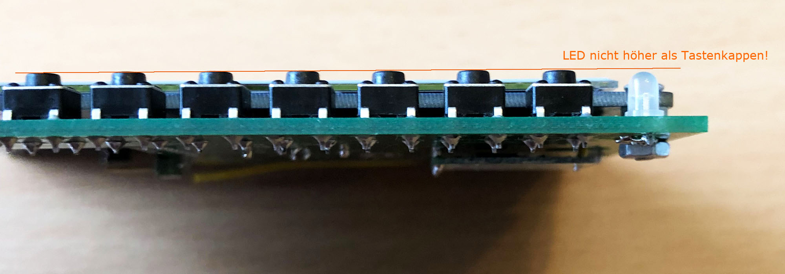

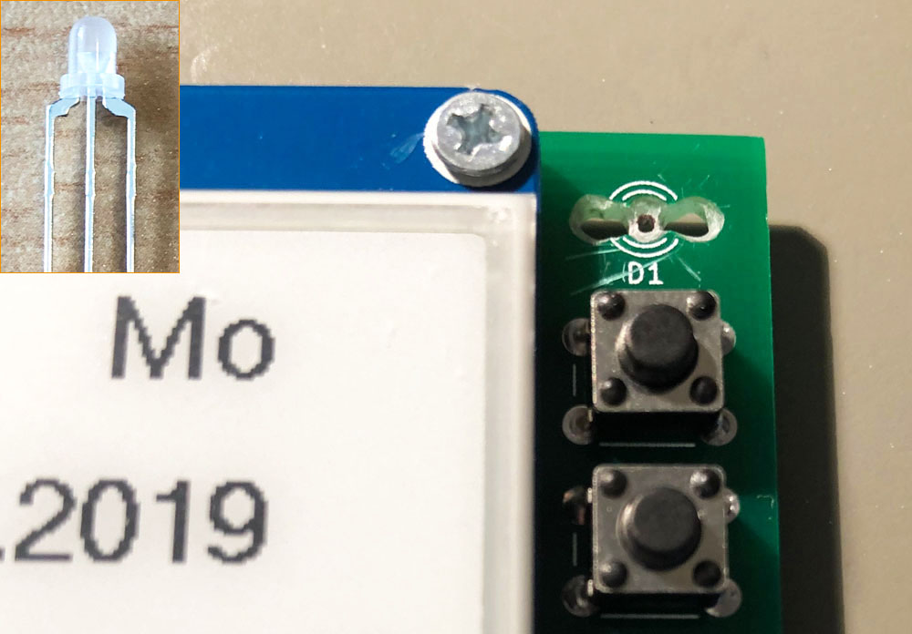

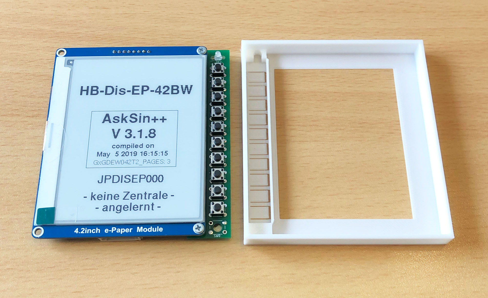

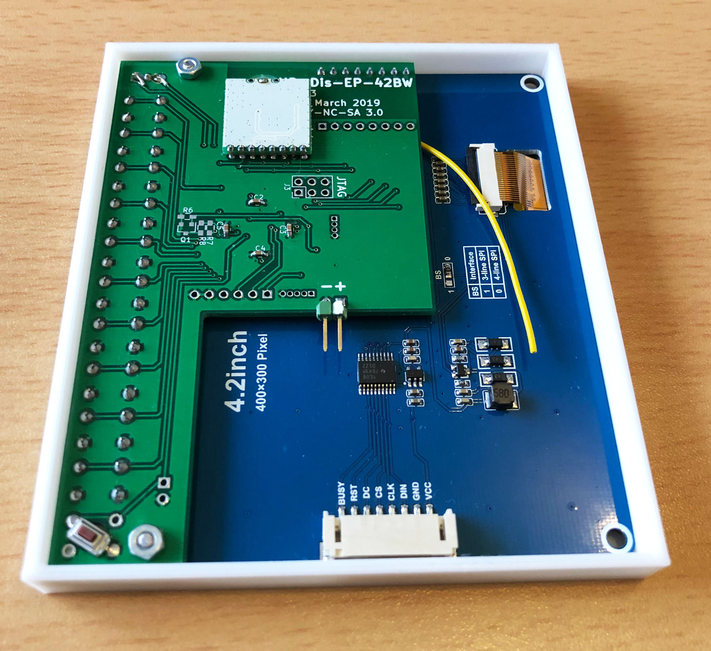

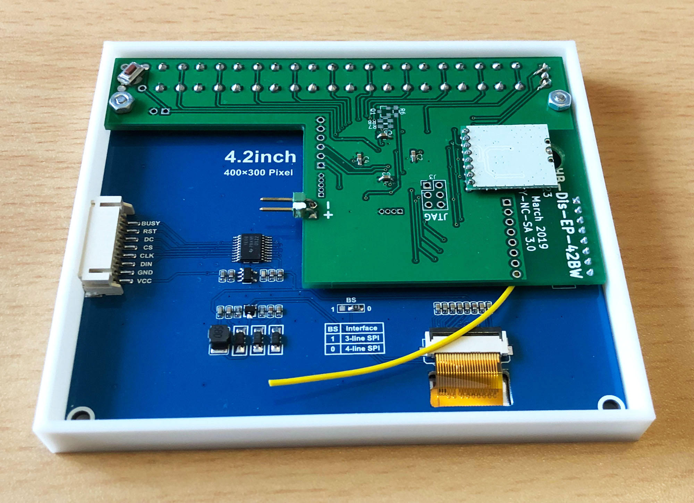

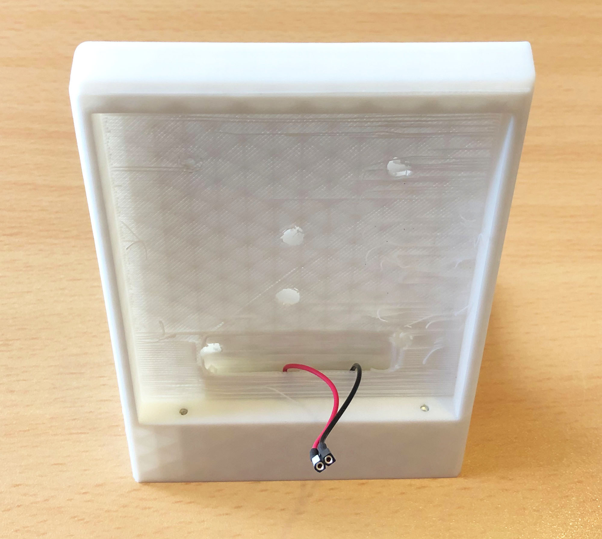

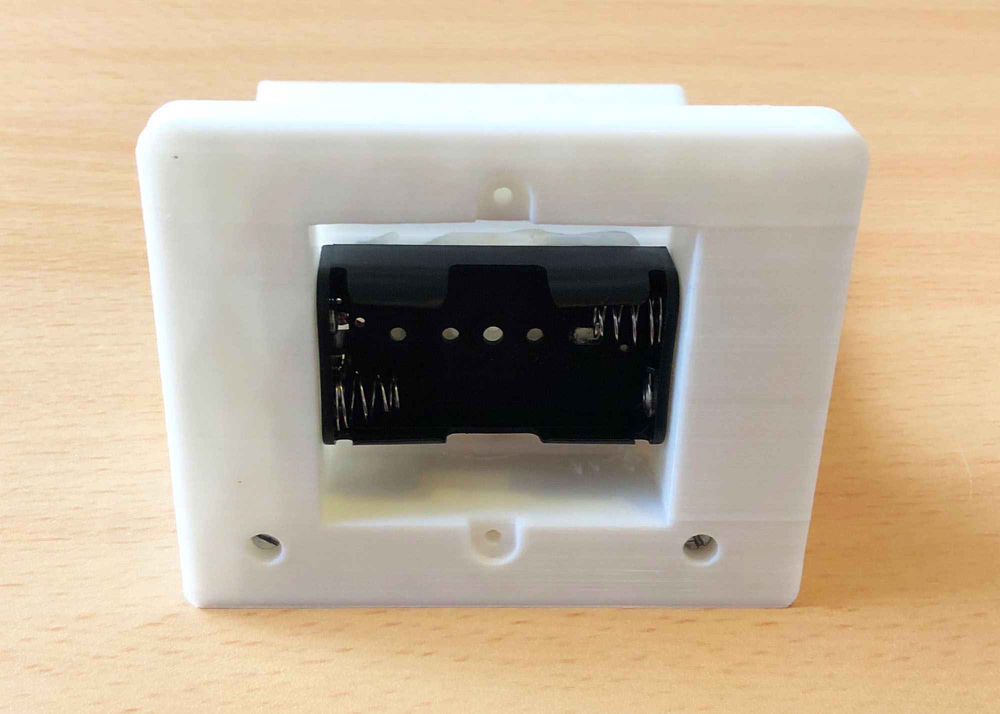


## Script Helper

- Mit dem Script Helper kann man mit minimalem Aufwand aus HomeMatic Skripten heraus Texte an das ePaper Display senden.
- Installation:
```
    1. SSH Zugang aktivieren (Einstellungen > Systemsteuerung > Sicherheit)
    2. SSH Verbindung zur Zentrale
    3. Skript downloaden:
    wget -O /usr/local/addons/epaper42.tcl https://raw.githubusercontent.com/TomMajor/SmartHome/master/HB-Dis-EP-42BW/Script_Helper/epaper42.tcl
```
- Anwendung:
```
  usage: epaper42 serial /line text [icon number] [/nextline text [icon number]] ...
  
  * Der erste Parameter ist die Seriennummer des Displays, z.B. JPDISEP000
  * Jede neue Zeile beginnt mit einem / gefolgt von der Zeilennummer.
  * Danach folgt der anzuzeigende Text, enthält der Text Leerzeichen muss man den ganzen Text in '' einschliessen, andernfalls geht es auch ohne.
  * Die im WebUI vordefinierten Texte 1..20 werden mit dem Code @txx erzeugt, wobei xx zwischen 01 und 20 liegen kann und immer 2 Stellen haben muss.
  * Der 3. Parameter ist die Iconnummer oder einfach den Parameter weglassen wenn man kein Icon in der Zeile haben will.
      Die Iconnummer braucht nur eine Stelle bei Icons < 10.
  * CUxD/CMD_EXEC wie in den Bsp. braucht man dabei nicht zwingend. Man kann das auch mit system.Exec() aufrufen.
  * Ab Version 0.50 kann man für Texte die x-Position angeben um z.B. eine Darstellung in Spalten zu erreichen.
      Dies geht mit @pxx, xx gibt hier die Anfangsposition des Textes in % der Displaybreite an.
      Das gleiche bewirkt @fxx, nur dann in Farbe falls es ein (3-)Farben-Display ist.
      Das Feature x-Position ist an 2 Bedingungen geknüpft:
      1) Die Textzeile muss in den Geräteeinstellungen auf 'linksbündig' eingestellt sein.
      2) Der Text muss mit einem solchen x-Positionscode @pxx (oder @fxx) anfangen um den Textanfang eindeutig zu bestimmen.
      Falls der Text x-Positionscodes enthält wird kein Icon angezeigt.
  
  Beispiel 1 - variabler Text in einer Zeile:
  Zeigt den Text 'Test ABC ÄÖÜäöüß' in Zeile 5 mit Icon 1 auf dem ePaper mit Serial JPDISEP000 an:
  string displayCmd = "JPDISEP000 /5 'Test ABC ÄÖÜäöüß' 1";
  dom.GetObject("CUxD.CUX2801001:1.CMD_EXEC").State("tclsh /usr/local/addons/epaper42.tcl " # displayCmd);
  oder
  system.Exec("tclsh /usr/local/addons/epaper42.tcl " # displayCmd);
  
  Beispiel 2 - variabler Text in mehreren Zeilen:
  Zeigt 3 Zeilen Text in den Zeilen 5, 7, 10 an, dabei Zeile 5 und 10 mit Icons, 7 ohne Icon
  string displayCmd = "JPDISEP000 /5 'Test ABC 123' 1 /7 Textzeile_7 /10 Textzeile_10 12";
  dom.GetObject("CUxD.CUX2801001:1.CMD_EXEC").State("tclsh /usr/local/addons/epaper42.tcl " # displayCmd);
  
  Beispiel 3 - Sensorwert
  Zeigt die Temperatur vom Gerät UNISENS077 in Zeile 2 an
  string temp = dom.GetObject('BidCos-RF.UNISENS077:1.TEMPERATURE').Value().ToString(1) # "°C";
  string displayCmd = "JPDISEP000 /2 'Temperatur " # temp # "'";
  dom.GetObject("CUxD.CUX2801001:1.CMD_EXEC").State("tclsh /usr/local/addons/epaper42.tcl " # displayCmd);
  
  Beispiel 4 - vordefinierte Texte
  Zeigt den vordef. Text 4 in Zeile 1, den vordef. Text 19 in Zeile 9 und den vordef. Text 20 in Zeile1 10 an, Zeile 1 zusätzlich mit Icon
  string displayCmd = "JPDISEP000 /1 @t04 6 /9 @t19 /10 @t20";
  dom.GetObject("CUxD.CUX2801001:1.CMD_EXEC").State("tclsh /usr/local/addons/epaper42.tcl " # displayCmd);
  
  Beispiel 5 - variable und vordefinierte Texte gemischt in einer Zeile
  Zeigt den vordef. Text 2 gemischt mit variablen Text in Zeile 1 an
  string displayCmd = "JPDISEP000 /1 abcd@t02efgh";
  dom.GetObject("CUxD.CUX2801001:1.CMD_EXEC").State("tclsh /usr/local/addons/epaper42.tcl " # displayCmd);
  
  Beispiel 6 - x-Position
  Zeigt den vordef. Text 9 (Außen) bei 3% x-Position, Temperatur bei 45% x-Position, Feuchte bei 78% x-Position an
  string tempOut = dom.GetObject('BidCos-RF.UNISENS077:1.TEMPERATURE').Value().ToString(1) # " °C";
  string humOut = dom.GetObject('BidCos-RF.UNISENS077:1.HUMIDITY').Value().ToString(0) # " %";
  string displayCmd = "JPDISEP000 /3 '@p03@t09@p45" # tempOut # "@p78" # humOut # "'";
  dom.GetObject("CUxD.CUX2801001:1.CMD_EXEC").State("tclsh /usr/local/addons/epaper42.tcl " # displayCmd);
  
  Beispiel 7.1 - Farbe zeilenweise
  Zeigt den Text in Zeile 2 in Normalfarbe, den Text in Zeile 3 in Rot
  string displayCmd = "JPDISEP000 /2 'Eine normale Zeile' /3 '@fzEine rote Zeile'";
  dom.GetObject("CUxD.CUX2801001:1.CMD_EXEC").State("tclsh /usr/local/addons/epaper42.tcl " # displayCmd);
  
  Beispiel 7.2 - Farbe mit x-Position / spaltenweise
  Zeigt den Text "Garage" in Zeile 2 und 3 bei 3% x-Position in Normalfarbe
  und bei 50% x-Position wird "Auf" in Rot und "Zu" in Normalfarbe dargestellt
  string displayCmd = "JPDISEP000 /2 '@p03Garage@f50Auf' /3 '@p03Garage@p50Zu'";
  dom.GetObject("CUxD.CUX2801001:1.CMD_EXEC").State("tclsh /usr/local/addons/epaper42.tcl " # displayCmd);
```

- Das Feature x-Position ist an 2 Bedingungen geknüpft:<br>
  1. Die Textzeile muss in den Geräteeinstellungen auf **linksbündig** eingestellt sein.<br>
  2. Der Text muss mit einem solchen x-Positionscode @pxx (oder @fxx) **anfangen** um den Textanfang eindeutig zu bestimmen und das Feature für diese Zeile zu aktivieren.<br><br>

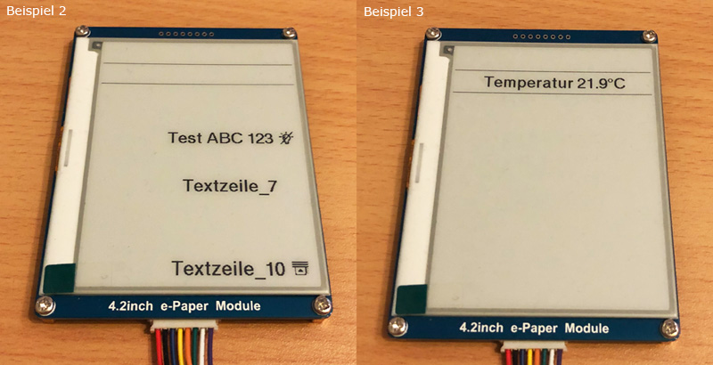

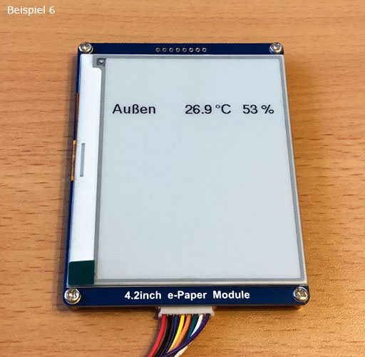

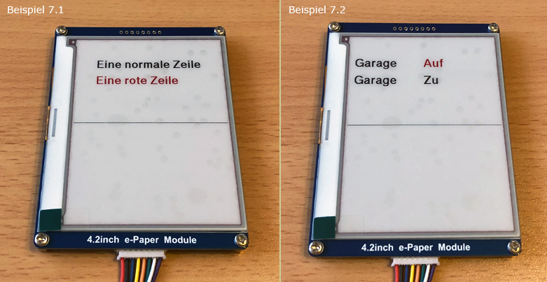

[Script Helper epaper42.tcl](Script_Helper)


## HomeMatic-Skript: Nur die geänderten Zeilen an das Display senden (DutyCycle sparen)

- in meinem zyklischen Skript für das Display-Update berechne ich<br>
  1) alle Zeileninhalte die ich aktuell haben will und danach<br>
  2) gibt es einen Teil der diese mit den aktuellen Zeileninhalt auf dem Display abgleicht und nur die Zeilen sendet die sich geändert haben.<br>
  Der aktuelle Displayinhalt wird dabei in der Systemvariablen *EPAPER.Lines* gespeichert.

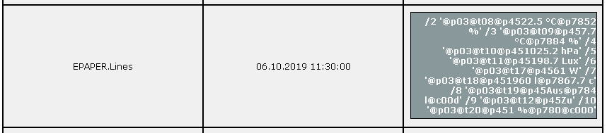

- die aktuell erzeugten Strings für die einzelnen Zeilen 2..10 müssen in den Skriptvariablen line2..line10 aufgebaut werden, z.B. für Zeile 3:

```
  ! Temp/Feuchte außen
  string tempOut = dom.GetObject('BidCos-RF.UNISENS010:1.TEMPERATURE').Value().ToString(1) # " °C";
  string humOut = dom.GetObject('BidCos-RF.UNISENS010:1.HUMIDITY').Value().ToString(0) # " %";
  string line3 = "/3 '@p03@t09@p45" # tempOut # "@p78" # humOut # "'";
```

- Zeile 1 wird bei mir nur um Mitternacht mit dem Datum geschrieben und ist deshalb hier in der Logik nicht enthalten.

- Danach sorgt der folgende generische Teil im Skript dafür dass nur die geänderten Zeilen gesendet werden.

- Außerdem wird darin berücksichtigt dass aufgrund von Beschränkungen beim Senden in der Zentrale nicht alles 10 Zeilen in einem Funktelegramm untergebracht werden können falls sich alle Zeilen geändert haben sollten, deswegen wird immer in zwei Funktelegramme unterteilt.

- Durch Beschränkungen im Sprachumfang von HomeMatic-Skript ist der Code etwas länger als man sonst z.B. in C++ oder Python dafür brauchen würde. :crying_cat_face:

```
  ! Um DutyRate zu sparen nur die Zeilen übertragen die sich geändert haben
  string lastLines = dom.GetObject("EPAPER.Lines").Value();
  string index;
  string linesDoNotUpdate = "";
  foreach (index, lastLines) {
      if (index.Substr(0, 2) == "/2") {
          if (index == line2) {
              linesDoNotUpdate = linesDoNotUpdate # "L02";
          }
      } elseif (index.Substr(0, 2) == "/3") {
          if (index == line3) {
              linesDoNotUpdate = linesDoNotUpdate # "L03";
          }
      } elseif (index.Substr(0, 2) == "/4") {
          if (index == line4) {
              linesDoNotUpdate = linesDoNotUpdate # "L04";
          }
      } elseif (index.Substr(0, 2) == "/5") {
          if (index == line5) {
              linesDoNotUpdate = linesDoNotUpdate # "L05";
          }
      } elseif (index.Substr(0, 2) == "/6") {
          if (index == line6) {
              linesDoNotUpdate = linesDoNotUpdate # "L06";
          }
      } elseif (index.Substr(0, 2) == "/7") {
          if (index == line7) {
              linesDoNotUpdate = linesDoNotUpdate # "L07";
          }
      } elseif (index.Substr(0, 2) == "/8") {
          if (index == line8) {
              linesDoNotUpdate = linesDoNotUpdate # "L08";
          }
      } elseif (index.Substr(0, 2) == "/9") {
          if (index == line9) {
              linesDoNotUpdate = linesDoNotUpdate # "L09";
          }
      } elseif (index.Substr(0, 3) == "/10") {
          if (index == line10) {
              linesDoNotUpdate = linesDoNotUpdate # "L10";
          }
      }
  }
  
  ! Wegen einem Limit bei der RF Übertragung in der CCU kann man nicht alle 10 in einem Funktelegramm übertragen.
  ! Deswegen wird hier die Übertragung immer in 2 Funktelegramme aufgeteilt.
  string displayCmdA = "JPDISEP000";
  string displayCmdB = "JPDISEP000";
  integer iChangedLinesA = 0;
  integer iChangedLinesB = 0;
  
  if (linesDoNotUpdate.Find("L02") < 0) {
      displayCmdA = displayCmdA # " " # line2;  iChangedLinesA = iChangedLinesA + 1;
  }
  if (linesDoNotUpdate.Find("L03") < 0) {
      displayCmdA = displayCmdA # " " # line3;  iChangedLinesA = iChangedLinesA + 1;
  }
  if (linesDoNotUpdate.Find("L04") < 0) {
      displayCmdA = displayCmdA # " " # line4;  iChangedLinesA = iChangedLinesA + 1;
  }
  if (linesDoNotUpdate.Find("L05") < 0) {
      displayCmdA = displayCmdA # " " # line5;  iChangedLinesA = iChangedLinesA + 1;
  }
  if (linesDoNotUpdate.Find("L06") < 0) {
      displayCmdB = displayCmdB # " " # line6;  iChangedLinesB = iChangedLinesB + 1;
  }
  if (linesDoNotUpdate.Find("L07") < 0) {
      displayCmdB = displayCmdB # " " # line7;  iChangedLinesB = iChangedLinesB + 1;
  }
  if (linesDoNotUpdate.Find("L08") < 0) {
      displayCmdB = displayCmdB # " " # line8;  iChangedLinesB = iChangedLinesB + 1;
  }
  if (linesDoNotUpdate.Find("L09") < 0) {
      displayCmdB = displayCmdB # " " # line9;  iChangedLinesB = iChangedLinesB + 1;
  }
  if (linesDoNotUpdate.Find("L10") < 0) {
      displayCmdB = displayCmdB # " " # line10; iChangedLinesB = iChangedLinesB + 1;
  }
  
  if (iChangedLinesA > 0) {
      dom.GetObject("CUxD.CUX2801001:1.CMD_EXEC").State("tclsh /usr/local/addons/epaper42.tcl " # displayCmdA);
  }
  if (iChangedLinesB > 0) {
      dom.GetObject("CUxD.CUX2801001:1.CMD_EXEC").State("tclsh /usr/local/addons/epaper42.tcl " # displayCmdB);
  }
  
  ! Für nächsten Vergleich speichern, Tab Seperator für for_each loop benötigt
  string currentLines = line2 # "\t" # line3 # "\t" # line4 # "\t" # line5 # "\t" # line6 # "\t" # line7 # "\t" # line8 # "\t" # line9 # "\t" # line10;
  dom.GetObject("EPAPER.Lines").State(currentLines);
```


## Strommessung und Kalkulation der Batterielebensdauer

Alle Messungen erfolgten über 20Ohm Shuntwiderstand.

###### 1. Stromanteil durch Burst Detector / Wake-On-Receive (WOR)

Schätzung: die Flächen in A lassen sich in B unterbringen, damit kann man für die Stromaufnahme<br>
`190mV / 20Ohm * 1,56ms / 354ms` <br>
ansetzen, ergibt **42uA**

Burst Detector - ein Puls

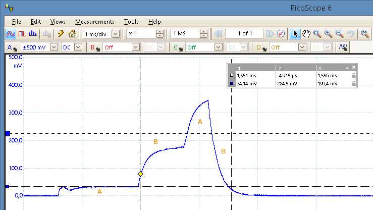

Burst Detector - Zyklus

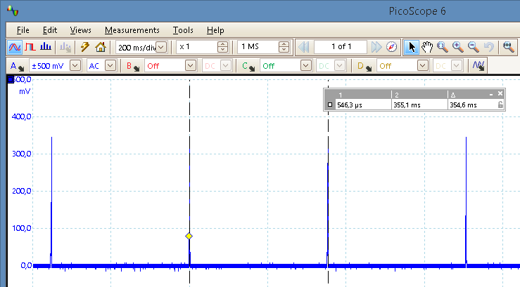

###### 2. Stromanteil durch Displayupdates

Annahme: 2 Displayupdates pro Stunde<br>
Die Refreshzeit des ePaper verkürzt sich etwas wenn man das define **GxGDEW042T2_PAGES** in GxGDEW042T2.h von 20 auf 3 verringert, beim ATmega1284P mit seinen 16kB RAM kann man das machen.<br>
[Info im Forum](https://homematic-forum.de/forum/viewtopic.php?f=76&t=48153&start=330#p505853)
<br>

`20 Pages: 150mV / 20Ohm * 12s * 2 / 3600s`<br>
ergibt **50uA**<br><br>
`3 Pages: 150mV / 20Ohm * 9,4s * 2 / 3600s`<br>
ergibt **39uA**


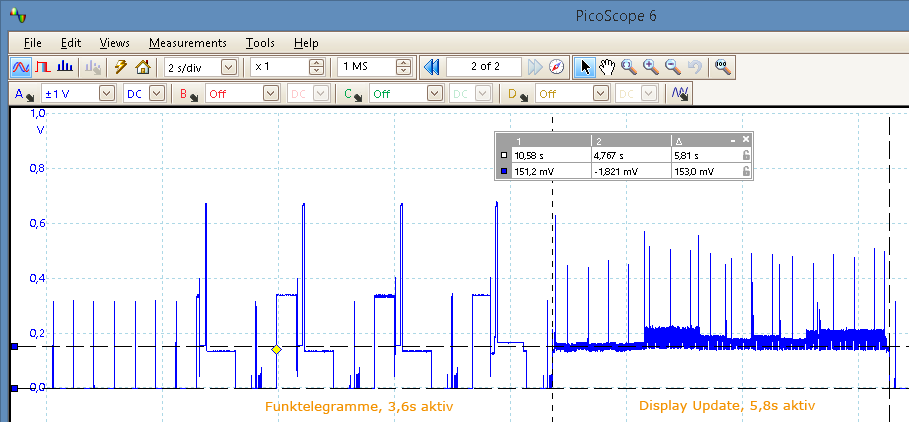

###### 3. Batterielebensdauer, Alkali-Mangan, AA, 2000mAh

- 2 Displayupdates pro Stunde<br>
`2000mAh / (42uA + 39uA)`<br>
**ca. 2,8 Jahre**

- 12 Displayupdates pro Stunde<br>
`2000mAh / (42uA + 234uA)`<br>
**ca. 10 Monate**

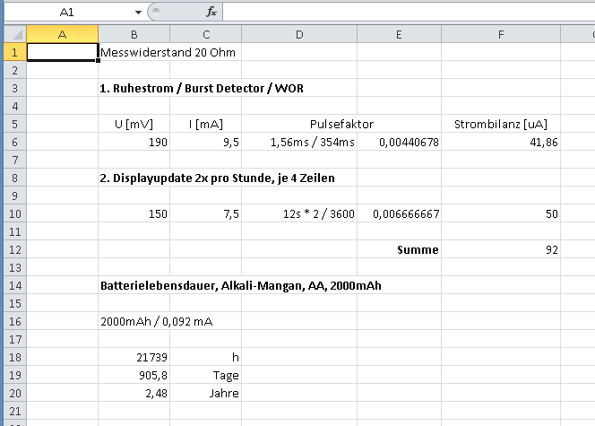


## Meine favorisierten Änderungen falls es mal zu einem Redesign der ePaper Platine von stan23 kommt

- SMD Bauteile 0805 (mein Standard), nicht 0603
- Auslegung auf Akkubetrieb 2x AA NiMH Eneloop o.ä., bis 2V leersaugen lassen<br>
  dafür Reset Baustein BU4820 oder MCP111-195<br>
  dafür ATmega1284P @4MHz -> safe operating area @2V<br>
  ePaper ist bis 2,3V spezifiziert und funktioniert sicherlich auch noch bis 2V
- MCP111/BU4820 von hinten bestückbar, für nachträgliche Änderungen an der Reset-Schwelle
- CC1101 ist momentan für Alveran's Gehäusevariante von hinten verkehrt rum bestückt, beim nächsten Mal ev. gleich auf die andere Seite designen<br>
  Notwendig da bei Alveran's Gehäusevariante nur 2mm Abstand zwischen Displayboard und ATmega1284P-Platine sind
- Config Taster als SMD Taster von hinten bestückbar
- Verpolschutz in der +Leitung mit P-Kanal Mosfet im SOT-23 Package
- Lötpads für 3mm-Zweifarb-LED besser an die Pinform anpassen so dass diese ohne Nacharbeit auf dem Board aufsetzten kann


## Bootloader

[Bootloader ATmega1284P](https://github.com/TomMajor/SmartHome/tree/master/Info/Bootloader/mega1284_RC-Osc_or_Quarz)


## Fuses


## Displaytest

- testet die Funktion des ePaper Displays mit Ansteuerung durch den ATmega1284p - der CC1101 muss nicht verbaut sein.


[DisplayTest_42BW](DisplayTest_42BW)


## Analyse und Dokumentation der Änderungen für den HB-Dis-EP-42BW Anteil im JP-HB-Devices-addon - Nur für Entwickler

###### 1. patchsource - Diff Analyse

|Dir/File|Patch Methode<br>p patch<br>s sed|Diffs|Diffs benötigt für HB-Dis-EP-42BW|
|---|---|---|---|
|/www/rega/esp/side.inc|                            p|      7|      6 (1p 2p 3f 4f 5p 6- 7f)<br>momentan alle 7 patches übernommen|
|/www/config/ic_common.tcl|                         p|      3|      3|
|/www/rega/pages/tabs/admin/views/programs.htm|     p|      3|      2 (1- 2f 3f)<br>momentan alle 3 patches übernommen|
|/www/rega/esp/functions.fn|                        p|      1|      1|
|/www/rega/esp/datapointconfigurator.fn|            (p)|    2|      0|
|/www/webui/js/lang/de/translate.lang.js|           (p)|    1|      0|
|||||
|/www/config/stringtable_de.txt|                    s|      1|      1 (aber nur die 5x HB_EP_xx Einträge)|
|/www/config/devdescr/DEVDB.tcl|                    s|      1|      1 (aber nur die Referenzen auf 2x HB-Dis-EP-42BW png)|
|/www/rega/pages/index.htm|                         s|      1|      1 (Verweis auf jp_webui_inc.js)|
|/www/webui/webui.js|                               s|      7|      5 (1..5) (bei jp ist das eine s/p Kombi, hier nur noch s, kein p mehr)|
|/www/webui/js/lang/de/translate.lang.extension.js| s|      1|      1|
|/www/webui/js/lang/de/translate.lang.stringtable.js| s|    1|      1 (aber nur die 5x stringTableHbEpxx Einträge)|

###### 2. src - benötigte Files

|Dir/File|benötigt für HB-Dis-EP-42BW|
|---|---|
|/src/addon/install_hb-dis-ep-xxx|                                ja|
|/src/addon/uninstall_hb-dis-ep-xxx|                              ja|
|/src/addon/firmware/rftypes/hb-dis-ep-42bw_e_v1_0.xml|           ja|
|/src/addon/js/jp_webui_inc.js|                                   nur class HbStatusDisplayDialogEPaper<br>nicht class iseRFIDKey|
|/src/addon/patch/hb-dis-ep-42bw.patch|                           ja|
|/src/addon/patch/jp.patch|                                       nicht benötigt|
|/src/addon/www/config/easymodes/|                                nichts daraus benötigt|
|/src/addon/www/config/img/devices/250/hb-dis-ep-42bw.png|        ja|
|/src/addon/www/config/img/devices/250/hb-dis-ep-42bw_thumb.png|  ja|
|/src/addon/www/ise/|                                             die icons unter /icons_hm_dis_ep_wm55/24/ auch fürs ePaper|
|/src/addon/www/rega/|                                            nichts daraus benötigt|


>Nur der Vollständigkeit noch mal gesagt: 
So lange sich nur die Stelle (Zeilennummer) in der Datei ändert, hat Patch kein Problem. Da ändere ich dann auch nix. Es kommt beim Patchen nur ein Hinweis, dass der Patch an anderer Stelle applied wurde.
Ich muss nur dann was anfassen, wenn direkt an den für mich relevanten Abschnitten was geändert wurde.
(jp112sdl)


## Lizenz

**Creative Commons BY-NC-SA**<br>
Give Credit, NonCommercial, ShareAlike

<a rel="license" href="http://creativecommons.org/licenses/by-nc-sa/4.0/"></a><br />This work is licensed under a <a rel="license" href="http://creativecommons.org/licenses/by-nc-sa/4.0/">Creative Commons Attribution-NonCommercial-ShareAlike 4.0 International License</a>.
