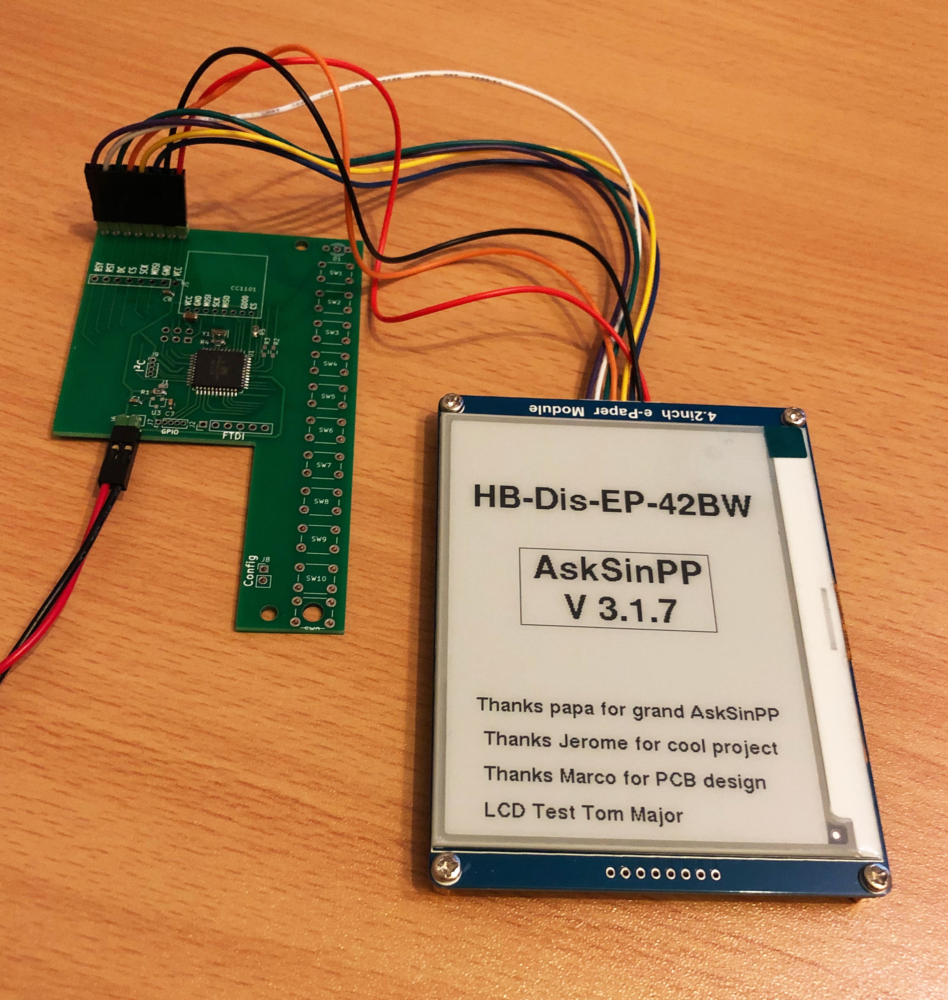
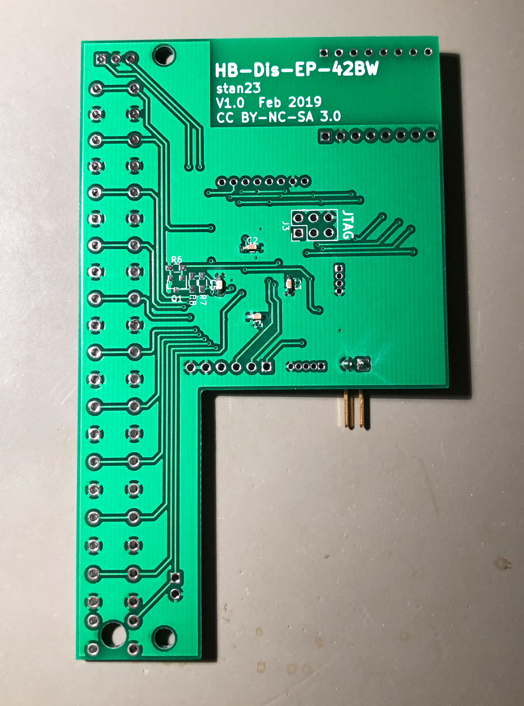
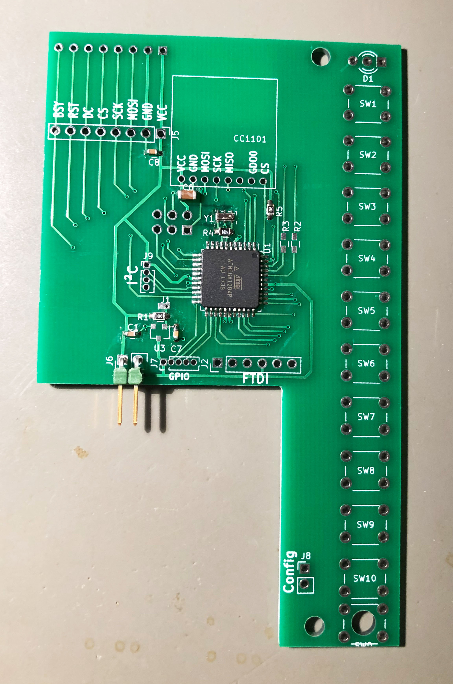

### Infos und AddOn zum 4,2" ePaper Display HB-Dis-EP-42BW

- Die Infos hier beziehen sich auf Jeromes Projekt ePaper Display HB-Dis-EP-42BW<br>
[Original HB-Dis-EP-42BW](https://github.com/jp112sdl/HB-Dis-EP-42BW)

- Ich habe das dafür notwendige HomeMatic/RaspberryMatic AddOn aus Jeromes Universalsammlung JP-HB-Devices-addon "herausoperiert" und ein paar Modifikationen gemacht um ein seperates AddOn nur für das ePaper Projekt zu haben - Danke an Jerome für die Unterstützung bei dieser Arbeit<br>
[Original JP-HB-Devices-addon](https://github.com/jp112sdl/JP-HB-Devices-addon)


### CCU2/CCU3/RaspberryMatic AddOn HB-Dis-EP-42BW

Einstellungen/Systemsteuerung/Zusatzsoftware -> Datei CCU_RM/hb-dis-ep-42bw-addon.tgz installieren.

[HB-Dis-EP-42BW AddOn](CCU_RM)


### Script Helper

- Mit dem Script Helper kann man mit minimalem Aufwand aus HomeMatic Skripten heraus Texte an das ePaper Display senden.
- Installation:
```
    1. SSH Zugang aktivieren (Einstellungen > Systemsteuerung > Sicherheit
    2. SSH Verbindung zur Zentrale
    3. Skript downloaden:
    wget -O /usr/local/addons/epaper42.tcl https://raw.githubusercontent.com/TomMajor/SmartHome/master/HB-Dis-EP-42BW/Script_Helper/epaper42.tcl
```
- Anwendung:
```
    usage: epaper42 serial /line text [icon number] [/nextline text [icon number]] ...
    
    Der erste Parameter ist die Seriennummer des Displays, z.B. JPDISEP000
    Jede neue Zeile beginnt mit einem / gefolgt von der Zeilennummer.
    Danach folgt der anzuzeigende Text, enthält der Text Leerzeichen muss man den ganzen Text in '' einschliessen, andernfalls geht es auch ohne.
    Die im WebUI vordefinierten Texte werden mit dem Code §xx erzeugt, wobei xx zwischen 01 und 20 liegen kann und immer 2 Stellen haben muss.
    Der 3. Parameter ist die Iconnummer oder den Parameter weglassen wenn man kein Icon in der Zeile haben will.
    Die Iconnummer braucht nur eine Stelle bei Icons < 10.
    CUxD/CMD_EXEC braucht man dabei nicht zwingend. Man kann das auch mit system.exec() aufrufen.
    
    Beispiel 1 - variabler Text in einer Zeile:
    Zeigt den Text 'Test ABC ÄÖÜäöüß' in Zeile 5 mit Icon 1 auf dem ePaper mit Serial JPDISEP000 an:
    string displayCmd = "JPDISEP000 /5 'Test ABC ÄÖÜäöüß' 1";
    dom.GetObject("CUxD.CUX2801001:1.CMD_EXEC").State("tclsh /usr/local/addons/epaper42.tcl " # displayCmd);
    
    Beispiel 2 - variabler Text in mehreren Zeilen:
    Zeigt 3 Zeilen Text in den Zeilen 5, 7, 10 an, dabei Zeile 5 und 10 mit Icons, 7 ohne Icon
    string displayCmd = "JPDISEP000 /5 'Test ABC 123' 1 /7 Textzeile_7 /10 Textzeile_10 12";
    dom.GetObject("CUxD.CUX2801001:1.CMD_EXEC").State("tclsh /usr/local/addons/epaper42.tcl " # displayCmd);
    
    Beispiel 3 - Sensorwert
    Zeigt die Temperatur vom Gerät UNISENS077 in Zeile 2 an
    integer temp = dom.GetObject('BidCos-RF.UNISENS077:1.TEMPERATURE').Value().ToString(1) # "°C";
    string displayCmd = "JPDISEP000 /2 'Temperatur " # temp # "'";
    dom.GetObject("CUxD.CUX2801001:1.CMD_EXEC").State("tclsh /usr/local/addons/epaper42.tcl " # displayCmd);
    
    Beispiel 4 - vordefinierte Texte
    Zeigt den vordef. Text 4 in Zeile 1, den vordef. Text 19 in Zeile 9 und den vordef. Text 20 in Zeile1 10 an, Zeile 1 zusätzlich mit Icon
    string displayCmd = "JPDISEP000 /1 §04 6 /9 §19 /10 §20";
    dom.GetObject("CUxD.CUX2801001:1.CMD_EXEC").State("tclsh /usr/local/addons/epaper42.tcl " # displayCmd);
    
    Beispiel 5 - variable und vordefinierte Texte gemischt in einer Zeile
    Zeigt den vordef. Text 2 gemischt mit variablen Text in Zeile 1 an
    string displayCmd = "JPDISEP000 /1 abcd§02efgh";
    dom.GetObject("CUxD.CUX2801001:1.CMD_EXEC").State("tclsh /usr/local/addons/epaper42.tcl " # displayCmd);
```


[Script Helper epaper42.tcl](Script_Helper)


### Displaytest

- testet die Funktion des ePaper Displays mit Ansteuerung durch den ATmega1284p - der CC1101 muss nicht verbaut sein

[DisplayTest_42BW](DisplayTest_42BW)


### Bilder








### Bootloader

[Bootloader](https://github.com/TomMajor/SmartHome/tree/master/Info/Bootloader/mega1284)


### Fuses


### Analyse und Dokumentation der Änderungen für den HB-Dis-EP-42BW Anteil im JP-HB-Devices-addon - Nur für Entwickler

#### 1. patchsource - Diff Analyse

|Dir/File|Patch Methode<br>p patch<br>s sed|Diffs|Diffs benötigt für HB-Dis-EP-42BW|
|---|---|---|---|
|/www/rega/esp/side.inc|                            p|      7|      6 (1p 2p 3f 4f 5p 6- 7f)<br>momentan alle 7 patches übernommen|
|/www/config/ic_common.tcl|                         p|      3|      3|
|/www/rega/pages/tabs/admin/views/programs.htm|     p|      3|      2 (1- 2f 3f)<br>momentan alle 3 patches übernommen|
|/www/rega/esp/functions.fn|                        p|      1|      1|
|/www/rega/esp/datapointconfigurator.fn|            (p)|    2|      0|
|/www/webui/js/lang/de/translate.lang.js|           (p)|    1|      0|
|||||
|/www/config/stringtable_de.txt|                    s|      1|      1 (aber nur die 5x HB_EP_xx Einträge)|
|/www/config/devdescr/DEVDB.tcl|                    s|      1|      1 (aber nur die Referenzen auf 2x HB-Dis-EP-42BW png)|
|/www/rega/pages/index.htm|                         s|      1|      1 (Verweis auf jp_webui_inc.js)|
|/www/webui/webui.js|                               s|      7|      5 (1..5) (bei jp ist das eine s/p Kombi, hier nur noch s, kein p mehr)|
|/www/webui/js/lang/de/translate.lang.extension.js| s|      1|      1|
|/www/webui/js/lang/de/translate.lang.stringtable.js| s|    1|      1 (aber nur die 5x stringTableHbEpxx Einträge)|

#### 2. src - benötigte Files

|Dir/File|benötigt für HB-Dis-EP-42BW|
|---|---|
|/src/addon/install_hb-dis-ep-xxx|                                ja|
|/src/addon/uninstall_hb-dis-ep-xxx|                              ja|
|/src/addon/firmware/rftypes/hb-dis-ep-42bw_e_v1_0.xml|           ja|
|/src/addon/js/jp_webui_inc.js|                                   nur class HbStatusDisplayDialogEPaper<br>nicht class iseRFIDKey|
|/src/addon/patch/hb-dis-ep-42bw.patch|                           ja|
|/src/addon/patch/jp.patch|                                       nicht benötigt|
|/src/addon/www/config/easymodes/|                                nichts daraus benötigt|
|/src/addon/www/config/img/devices/250/hb-dis-ep-42bw.png|        ja|
|/src/addon/www/config/img/devices/250/hb-dis-ep-42bw_thumb.png|  ja|
|/src/addon/www/ise/|                                             die icons unter /icons_hm_dis_ep_wm55/24/ auch fürs ePaper|
|/src/addon/www/rega/|                                            nichts daraus benötigt|


>Nur der Vollständigkeit noch mal gesagt: 
So lange sich nur die Stelle (Zeilennummer) in der Datei ändert, hat Patch kein Problem. Da ändere ich dann auch nix. Es kommt beim Patchen nur ein Hinweis, dass der Patch an anderer Stelle applied wurde.
Ich muss nur dann was anfassen, wenn direkt an den für mich relevanten Abschnitten was geändert wurde.
(jp112sdl)
