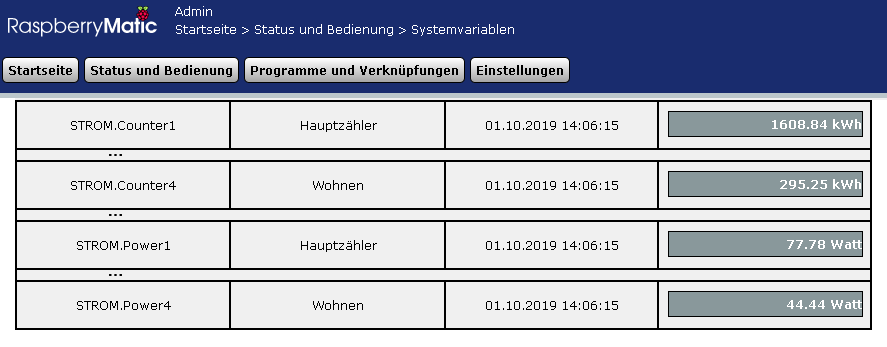
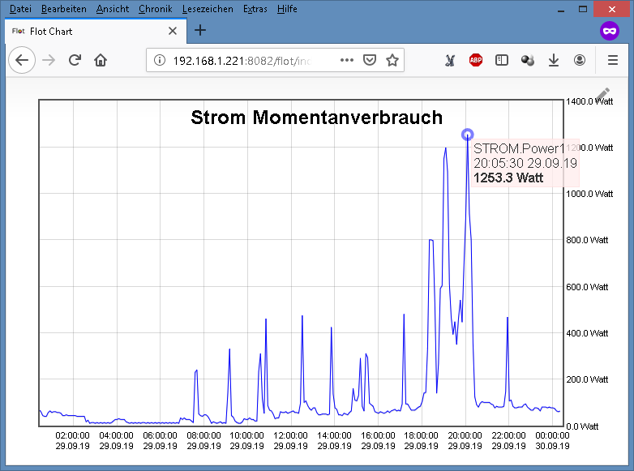
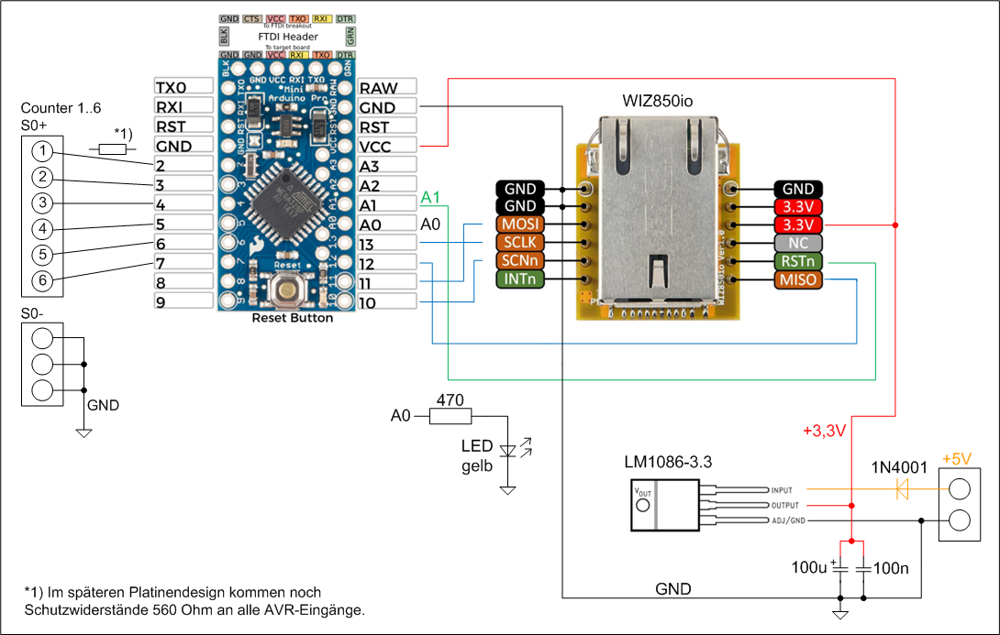
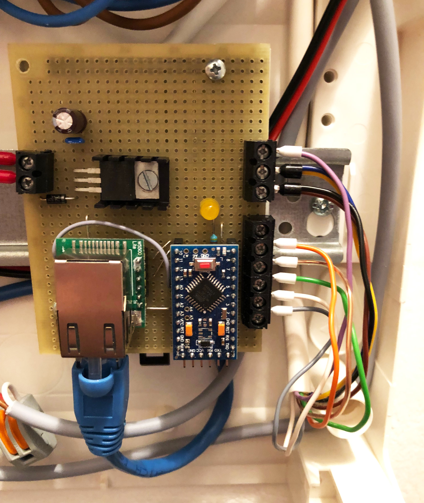
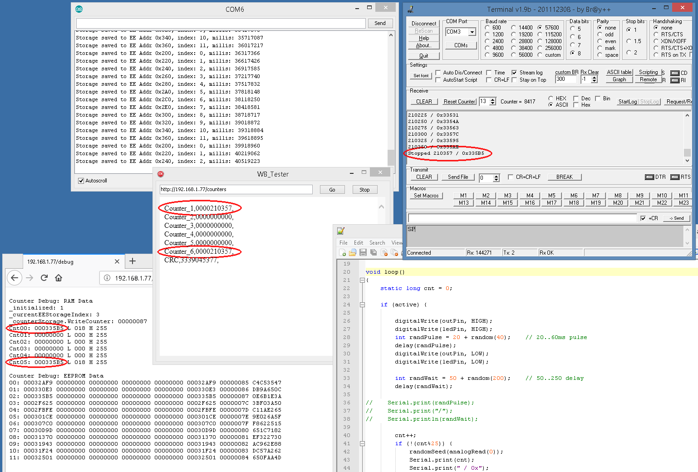

# HB-ES-S0-CNT6 : 6fach S0-Stromzähler

Das Gerät HB-ES-S0-CNT6 kann die S0-Impulse von bis zu 6 Wechselstromzählern einlesen und von diesen Zählerstand und Momentanverbrauch berechnen und in der Zentrale verfügbar machen.
Außerdem werden die Gesamtzählerstände aller Kanäle zyklisch intern im Gerät gespeichert um diese auch bei einem Stromausfall zu erhalten.

## Features

- Integration von Wechselstromzähler mit S0-Ausgang in HomeMatic/RaspberryMatic.
- Anbindung an die Zentrale über Ethernet
- anpassbare Kanalanzahl für die Auswertung in der Zentrale, es sind max. 6 HW-Kanäle vorhanden.
- für jeden Kanal gibt es eine Systemvariable Zählerstand [kWh] sowie Momentanverbrauch [Watt].
- Aktualisierung aller 3 Minuten (einstellbar).
- alle benötigten Systemvariablen können durch ein Skript automatisch erzeugt werden.
- Alle Zählerstände werden 1x pro Stunde im EEPROM abgelegt und gehen bei einem Stromausfall nicht verloren.
- Für das Ablegen der Zählerstände verwende ich einen Ringbuffer mit 12 Positionen (dabei nimmt eine Position alle 6 Zählerstände sowie ein Prüfsummen-CRC auf). 
Damit wird der gleiche EEPROM Platz nur 2x am Tag geschrieben, bei 100000 spezifizierten Write/Erase-Zyklen des ATmega328P EEPROM beträgt dessen Lebensdauer >100 Jahre.
- Nach einem Stromausfall werden die letzten Zählerstände mit gültiger Prüfsumme aus dem EEPROM wiederhergestellt.
- Das Gerät überwacht den Ethernet-Link Status und resetet sich selbst nach 1,5h ohne Ethernet-Link, um die korrekte Funktion des Ethernet Stacks abzusichern.
- Der Zähler ist prinzipiell nicht nur für Wechselstromzähler sondern auch für andere Zählgeräte wie für Gas oder Wasser geeignet, sofern diese ähnliche Zähl-Impulsausgänge besitzen. 
In diesen Fall sind die Namen und Einheiten der verwendeten Systemvariablen und die Impulsfaktoren (siehe unten) entsprechend anzupassen.
- Das Gerät läuft seit ein paar Wochen stabil als Prototypenaufbau. Ich werde dafür bei Gelegenheit noch eine Platine für ein Hutschienengehäuse entwickeln.
- Außerdem werde ich wohl noch eine Firmware 2.0 für den Arduino auflegen, die die Rohwerte der S0-Impulse und die Differenzbildung intern behandelt, um noch ein paar Systemvariablen auf der Zentrale einzusparen. Das wäre nur just for fun, wirklich notwendig ist es nicht. 

## Hintergrund

- Seit längerer Zeit betreibe ich im Haus 5 Wechselstromzähler mit S0-Ausgang (1x Gesamtverbrauch + 4x einzelne Kreise). Diese waren bisher über 1-Wire an FHEM angebunden.
- Das FHEM Gerät lief über viele Jahre stabil. Im Zuge meines Umstiegs 2018/2019 von FHEM auf HomeMatic/RaspberryMatic habe ich diese Funktion jetzt in HomeMatic integriert.
- Ich habe mir vorher mehrere Konzepte und Systeme angeschaut. Zunächst wollte ich den HBW-Sen-EP von jfische/stan23 verwenden, habe mich aber wegen des dafür notwendigen HomeMatic-Wired Gateways und Busses dagegen entschieden (da ich HM-Wired sonst nicht brauche). 
Stattdessen habe ich das Konzept meines alten 1-Wire/FHEM 6-Kanal Gerätes für HomeMatic/Ethernet angepasst bzw. Teile davon neu entwickelt.

## Funktionsweise

- Der Arduino misst mittels Timer interruptgesteuert die Verbrauchs-Impulse der angeschlossenen Wechselstromzähler über alle Kanäle an den S0-Schnittstellen. Falls die Impulse im gültigen Bereich liegen (14..150 ms) werden diese gezählt.
- Die Zählerstände werden der Zentrale über einen Minimal-Webserver auf Anfrage zur Verfügung gestellt.
- Die Messung der Impulsbreite und korrekte Zählung der Impulse hat in der Software höchste Priorität (über Timer-Interrupt) so dass keine Impulse verloren gehen.
- Das Steuerprogramm auf der Zentrale fragt per TCL-Skript aller 3 Minuten die Zählerstände ab.
- Danach werden diese per HomeMatic-Skript in kWh umgerechnet, der Momentanverbrauch in Watt wird berechnet und alle Werte in den entsprechenden Systemvariablen werden aktualisiert.
- Über einen weiteren Skript wird der Tages- und Wochenverbrauch ermittelt, diese werden auf USB-Stick gespeichert sowie mittels ioBroker geloggt und visualisiert.

## Aufbau (Prototyp)

Benötigte Bauteile:

| Bauelement | Bemerkungen |
|---|---|
| Arduino Pro Mini 3,3V 8MHz | Aliexpress usw. |
| WIZ850io | [Aliexpress](https://de.aliexpress.com/item/32714438223.html), [TME](https://www.tme.eu/de/details/wiz850io/ethernet-module/wiznet/), Mouser, usw. |
| diverse Kleinteile | keine weitere Stückliste für Prototyp vorhanden, siehe Bild  Verdrahtung |
| :information_source: |Wie oben erwähnt wird es noch eine Platine für ein Hutschienengehäuse geben |

Verdrahtung:

Prototyp:

## Programmierung / Installation

#### Arduino

- im Sketch ab Zeile 35 die IP-Adresse und Gateway des Gerätes an eigenen Bedarf anpassen: 
`byte mac[]     = { 0x90, 0xA2, 0xDA, 0x0D, 0x85, 0xD9 };    // physical mac address` 
`byte ip[]      = { 192, 168, 1, 227 };                      // ip in lan` 
`byte subnet[]  = { 255, 255, 255, 0 };                      // subnet mask` 
`byte gateway[] = { 192, 168, 1, 1 };                        // default gateway` 
- den Sketch auf den Arduino flashen.
- Betriebsspannung und Ethernet anschließen.
- im Browser prüfen ob Gerät über Ethernet erreichbar ist, 
die Website mit den Zählern: 
`http://192.168.1.227/counter` 
die Website mit Debuginformationen: 
`http://192.168.1.227/debug` 
- die S0 Eingänge mit den S0-Ausgängen der Wechselstromzähler verbinden, dabei auf richtige Polung achten, jeder S0 Kreis hat einen + und - Anschluß.

#### CCU / RaspberryMatic (TCL-Skript)

- die Anzahl der verwendeten Kanäle in der Datei update_HB-ES-S0-CNT6.tcl anpassen, möglich sind 1..6 Kanäle: 
`set cCHANNEL_COUNT  5` 
- die im Arduino Sketch verwendete IP-Adresse ebenfalls in update_HB-ES-S0-CNT6.tcl eintragen: 
`set cDEVICE_IP      "192.168.1.227"` 
- SSH Verbindung öffnen und update_HB-ES-S0-CNT6.tcl nach /usr/local/addons kopieren.
- dann noch für diese Datei (/usr/local/addons/update_HB-ES-S0-CNT6.tcl) die Permissions auf 0755 setzen.

#### CCU / RaspberryMatic (HomeMatic-Skript)

- die Anzahl der verwendeten Kanäle in **beide** Dateien STROM.CreateSysVars.hms und STROM.Update2.hms anpassen, möglich sind 1..6 Kanäle: 
`integer CHANNEL_COUNT = 5;` 
- die Impulsfaktoren [Impulse/kWh] für die verwendeten Wechselstromzähler in STROM.Update2.hms anpassen: 
`string LIST_PULSE_KWH = "1000,2000,2000,2000,2000,2000";` 
Die Impulse/kWh sind im Datenblatt des S0-Stromzählers vermerkt bzw. auch auf dem Gerät aufgedruckt.
- in der WebUI der Zentrale ein neues Programmfenster öffnen und das Skript STROM.CreateSysVars.hms einmalig ausführen. 
  Diesen Skript **NICHT** speichern - das Anlegen der Systemvariablen muss nur einmal gemacht werden!
- Prüfen ob die neuen Systemvariablen angelegt wurden: 

| Name | Typ | Bereich | Sichtbar | Bemerkungen |
|---|---|---|---|---|
| STROM.Cnt1..6 | Zahl | 0..2147000000 | nein | <intern> die Rohwerte der S0-Impulse (die vom TCL Skript upgedatet werden) |
| STROM.LastCnt1..6 | Zahl | 0..2147000000 | nein | <intern> die Rohwerte der S0-Impulse vom letzten Skript-Durchlauf |
| STROM.Counter1..6 | Zahl | 0..2147000000 | ja | aktuelle Stromzähler in kWh |
| STROM.Power1..6 | Zahl | 0..2147000000 | ja | aktuelle Momentanverbräuche in Watt |
| STROM.LastCalcTime | Zahl | 0..2147000000 | nein | <intern> der Zeitpunkt des letzten Skript-Durchlaufs |
| STROM.ErrCnt | Zahl | 0..2147000000 | ja | Fehlerzähler des TCL Skripts |
| STROM.ErrMsg | String | - | ja | letzte Fehlermeldung des TCL Skripts |
- in der WebUI ein neues Programm anlegen: 
  - Ausführung aller 3 Minuten 
  - Anhaken: *"Vor dem Ausführen alle laufenden Verzögerungen für diese Aktivitäten beenden (z.B. Retriggern)."*
  - Aktion 1: die Skript-Kommandos aus STROM.Update1.hms sofort ausführen 
  - Aktion 2: die Skript-Kommandos aus STROM.Update2.hms mit 15sec Verzögerung ausführen 
  - siehe auch [Programm STROM.Update](https://github.com/TomMajor/SmartHome/blob/master/HB-ES-S0-CNT6/CCU_RM/STROM.Update.pdf)
- nach einer Wartezeit von ein paar Minuten sollten sich nun in den Systemvariablen STROM.Counter1..x die aktuellen Zählerstände in kWh sowie in den Systemvariablen STROM.Power1..x die aktuellen Momentanverbräuche in Watt befinden.

#### CUxD.CMD_EXEC / system.Exec

- ich erledige die Aufrufe für externe Kommandos aus HomeMatic-Skripten immer mit CUxD, dafür muss natürlich dieses AddOn installiert sein.
- Falls man dies nicht will kann man alternativ auch das interne HomeMatic-Kommando *system.Exec()* verwenden.
- In diesem Fall alle Vorkommen in den HomeMatic-Skripten von 
`dom.GetObject("CUxD.CUX2801001:3.CMD_EXEC").State(` 
  durch 
`system.Exec(` 
ersetzen.

## Factory Reset

Über die serielle Schnittstelle des Arduino Pro Mini (FTDI-Adapter) können alle Zähler auf Null rückgesetzt werden (inklusive der EEPROM Speicherplätze). 
Dazu muss das Kommando *FACTORY_RESET* gesendet werden, es kommt eine Rückfrage zur Sicherheit, diese muss dann innerhalb von 10 sec mit *YES* bestätigt werden.

## Test

- Mit einen zweiten Arduino wurde eine Testgenerator aufgebaut und über diesen 210357 Test-Impulse mit einer zufälligen Impulsbreite (20..60 ms) und nachfolgendem zufälligen Verzögerung (50..250 ms) erzeugt. Diese Impulse wurden auf die Kanäle 1 und 6 des HB-ES-S0-CNT6 gelegt.
- Der ganze Test erstreckte sich über 11 Stunden.
- Parallel dazu wurden mittels Programm (WB_Tester im Bild) alle 4 Sekunden die Zählerstände vom integrierten Webserver des HB-ES-S0-CNT6 geholt um eine hohe HTTP Last zu erzeugen und die Abfragen der Zentrale zu simulieren (die natürlich viel seltener kommen).
- Am Ende des Tests wurde geschaut ob die vom HB-ES-S0-CNT6 gezählten Impulse mit den vom Testgenerator abgegebenen übereinstimmen - es stimmte genau, nicht ein Impuls ging verloren :smile:

## Benötige Libraries

[PaulStoffregen/Ethernet](https://github.com/PaulStoffregen/Ethernet) 

## Weitere Fragen

Dies ist eine Kurzanleitung für erfahrene AVR/Arduino/HomeMatic/RaspberryMatic Benutzer. :smile_cat: 
Bei weiteren Fragen zum Projekt bitte diesen Thread benutzen: 
[HomeMatic Forum: HB-ES-S0-CNT6](https://homematic-forum.de/forum/viewtopic.php?f=76&t=54164)

## Lizenz

**Creative Commons BY-NC-SA** 
Give Credit, NonCommercial, ShareAlike

 This work is licensed under a <a rel="license" href="http://creativecommons.org/licenses/by-nc-sa/4.0/">Creative Commons Attribution-NonCommercial-ShareAlike 4.0 International License</a>.
