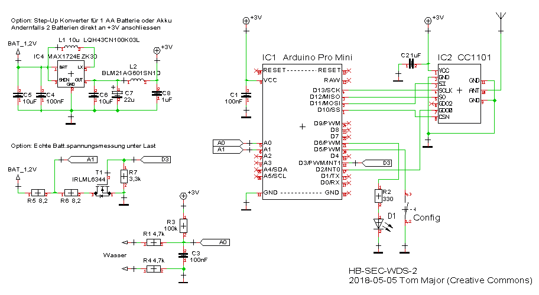
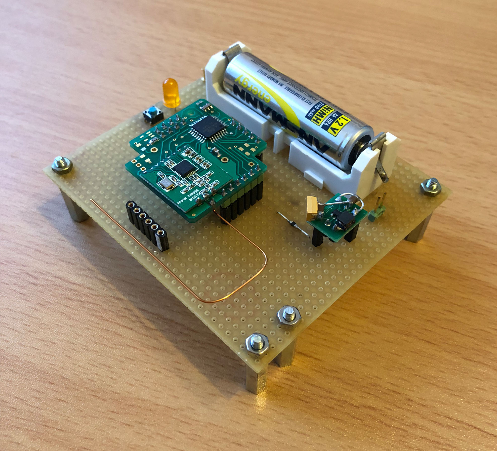
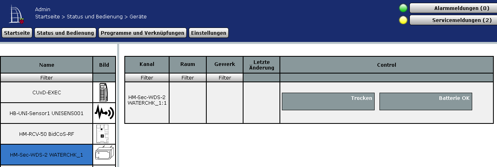
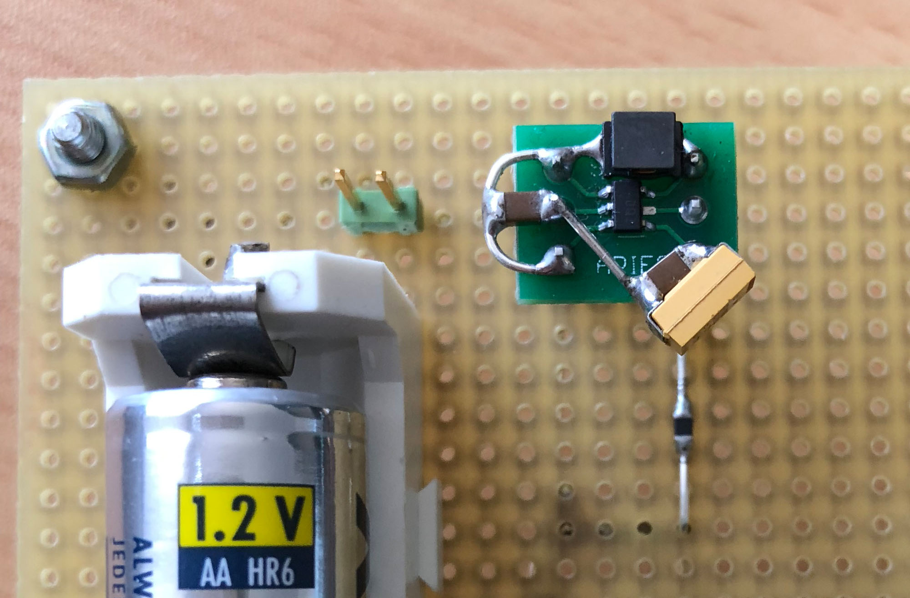
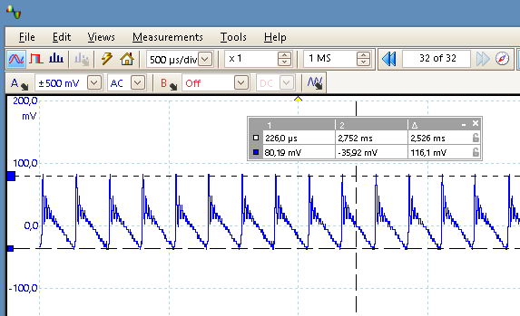
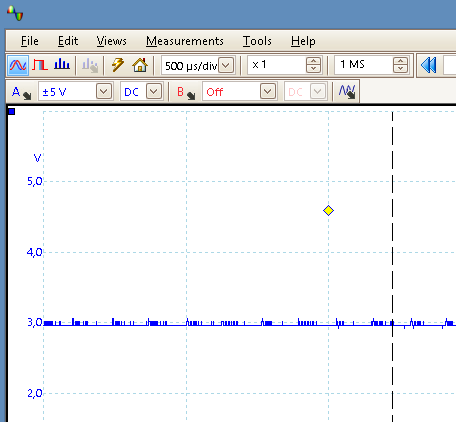

# Wassermelder (HB-SEC-WDS-2)

- Wassermelder mit Leitfähigkeitsmessung zwischen den Elektroden

- Demonstriert die Verwendung vom 'ThreeStateSensor' device type aus der AskSinPP Bibliothek mit einer anpassbaren Messroutine, in diesem Fall die Leitfähigkeitsmessung mit dem integrierten ADC

## Benötige Libraries

[AskSinPP Library](https://github.com/pa-pa/AskSinPP) 
[EnableInterrupt](https://github.com/GreyGnome/EnableInterrupt) 
[Low-Power](https://github.com/rocketscream/Low-Power)

## Schaltung

## Aufbau Prototyp

## Das angemeldete Gerät im RaspberryMatic WebUI

## Option 1: Step-Up Konverter zum Betrieb mit 1 Mignon AA Batterie oder Akku

MAX1724 Testaufbau 
Entscheidend hier sind die Eignung der Spule für den DC/DC Einsatz (DC-Nennstrom, DC-Widerstand, Güte), das Layout der Bauteile und natürlich kurze Signalwege.

Ausgangsspannung +3V @5mA, Restwelligkeit mit 10uF Keramikkondensator am Ausgang

Ausgangsspannung +3V @5mA, Restwelligkeit mit 10uF Keramikkondensator + 20uF Tantalelko am Ausgang

Ausgangsspannung DC

## Option 2: Echte Batteriezustandsmessung unter Last, um frühzeit leere Batterien zu erkennen und zu tauschen.

siehe
[HB-UNI-Sensor1](https://github.com/TomMajor/SmartHome/tree/master/HB-UNI-Sensor1)
Abschnitt "Option3: Echte Batteriespannungsmessung unter Last"

## Lizenz

**Creative Commons BY-NC-SA** 
Give Credit, NonCommercial, ShareAlike

 This work is licensed under a <a rel="license" href="http://creativecommons.org/licenses/by-nc-sa/4.0/">Creative Commons Attribution-NonCommercial-ShareAlike 4.0 International License</a>.
