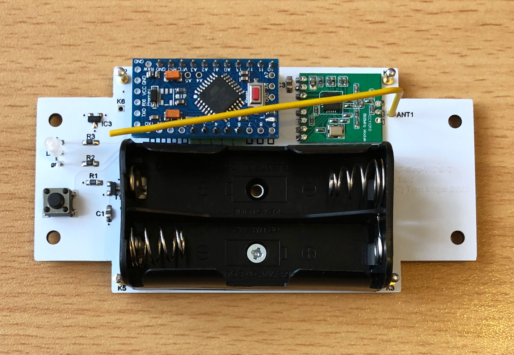
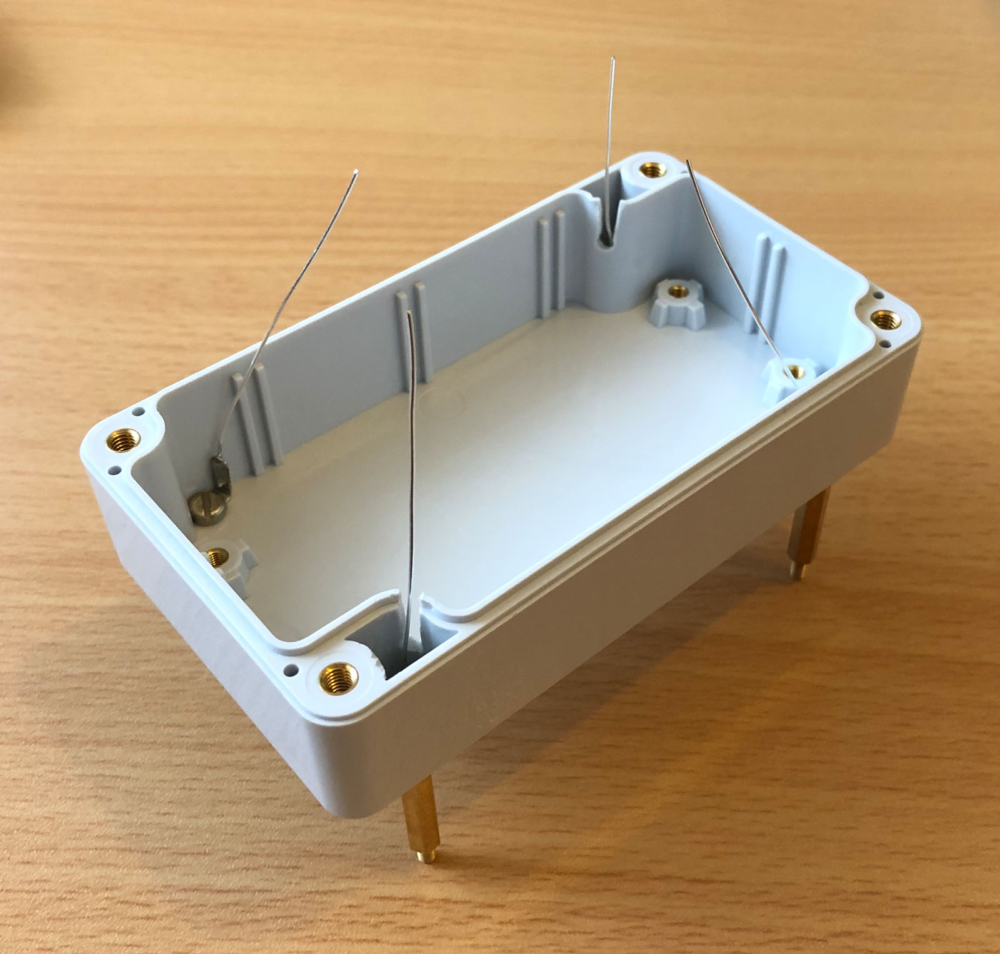
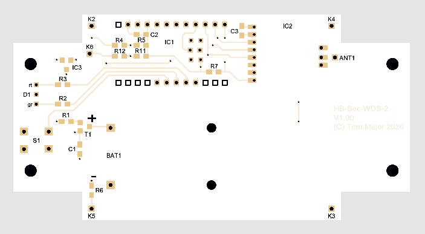
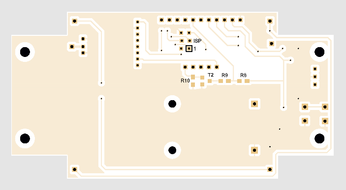
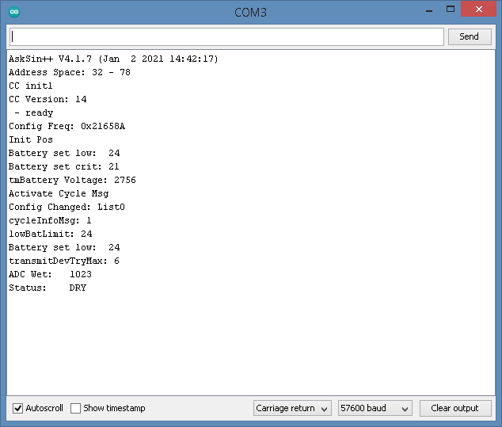

# Wassermelder (HB-SEC-WDS-2)

- Wassermelder mit Leitfähigkeitsmessung zwischen den Elektroden
- für die Leitfähigkeitsmessung wird der integrierte ADC im AVR genutzt, mit im Sketch anpassbarer Messroutine
- das Gerät ist von den Abmessungen und dem Gehäuse dem originalen HM-Sec-WDS-2 nachempfunden
- per define *TWO_STATE / THREE_STATE* im Sketch sind zwei Modi möglich:
  - Trocken/Wasser Erkennung (4 Elektroden, 2+2)
  - Trocken/Feucht/Wasser Erkennung (5 Elektroden, 2+2+1)
- per define *WDS2_STANDARD / WDS2_CUSTOM* im Sketch sind zwei Varianten möglich:
  - HM-Sec-WDS-2 Original, keine Add-On Installation nötig
  - HB-SEC-WDS-2,dieser hat zusätzlich die Batteriespannung des Gerätes als Datenpunkt in der Zentrale, dafür ist mein [HB-TM-Devices-AddOn](https://github.com/TomMajor/SmartHome/tree/master/HB-TM-Devices-AddOn) erforderlich
- Verpolschutz
- (Optional) Echte Batteriespannungsmessung unter Last
- (Optional) Reset-Baustein MCP111 (Schutz vor "Babbling Idiot")

## Hinweise

- Zum Kompilieren des Sketches benötigt man alle Dateien im Verzeichnis *Arduino/HB-SEC-WDS-2*. 

- Der Sketch benötigt den master-Branch der [AskSinPP Library](https://github.com/pa-pa/AskSinPP), nicht den V4 Release-Branch wie dort angegeben. 

- Für möglichst geringen Ruhestrom: Vor dem Einlöten des Arduino Pro Mini empfehle ich das [Entfernen des LDO und der LED](https://github.com/TomMajor/SmartHome/tree/master/Info/Ruhestrom#ruhestrom-arduino-pro-mini) sowie den [Ruhestromtest](https://github.com/TomMajor/SmartHome/tree/master/Info/Ruhestrom#%C3%BCberpr%C3%BCfung-des-avr-ruhestroms-power-down-mode)

* :warning: Momentan noch in Arbeit: Variante WDS2_CUSTOM / Integration dieser in HB-TM-Devices-AddOn*

## Bilder

## Schaltplan

[:arrow_right: HB-SEC-WDS-2 V1.00](https://github.com/TomMajor/SmartHome/tree/master/HB-SEC-WDS-2/Files/HB-SEC-WDS-2_V100.pdf)

## Platine

[:arrow_right: PCB Gerber V1.00](https://github.com/TomMajor/SmartHome/tree/master/HB-SEC-WDS-2/Files/HB-SEC-WDS-2_V100_Gerber.zip)

## Aufbau / Stückliste

| Anzahl    | Name      | Wert              | Gehäuse       | Bemerkungen |
|---|---|---|---|---|
| 1 | IC1	            | Arduino Pro Mini  | -             | 3,3V / 8MHz Version |
| 1 | IC2	            | CC1101	        | -             | |
| 2 | R2, R3            | 1,5k              | 0805          | |
| 3 | R4, R6, (R12)     | 4,7k              | 0805          | |
| 1 | R7                | 10k               | 0805          | |
| 3 | R1, R5, (R11)     | 100k              | 0805          | |
| 2 | C2                | 100nF             | 0805          | |
| 2 | C1, C3            | 1uF               | 0805          | |
| 1 | T1                | IRLML2244         | SOT23-3       | |
| 1 | LED               | KBT L-115WEGW o.ä.| 3mm bedrahtet | [Reichelt](https://www.reichelt.de/led-3-mm-bedrahtet-3-pin-rot-gruen-40-mcd-60--kbt-l-115wegw-p231039.html) |
| 1 | Gehäuse           | GAINTA G203C      | -             | [TME](https://www.tme.eu/de/details/g203c/universal-gehause/gainta) |
| 1 | Taster            | TASTER 3301       | 6x6 bedrahtet | [Reichelt](https://www.reichelt.de/kurzhubtaster-6x6mm-hoehe-4-3mm-12v-vertikal-taster-3301-p27892.html) |
| 1 | ANT1	            | 868 MHz Antenne   | -             | z.B. Drahtstück 86mm lang |
| 3 | Stiftleisten      | 1x11pol., 1x5pol. | RM 2,54       | zum Einlöten des Arduino Pro Mini |
|   |                   |                   |               | |
| 1 | R8	            | 30	            | 0805          | Optional (Echte Batt.messung unter Last) |
| 1 | R9	            | 10	            | 0805          | Optional (Echte Batt.messung unter Last) |
| 1 | R10               | 4,7k	            | 0805          | Optional (Echte Batt.messung unter Last) |
| 1 | T2	            | IRLML6344         | SOT23-3       | Optional (Echte Batt.messung unter Last) |
|   |                   |                   |               | |
| 1 | IC3	            | MCP111T-240	    | SOT23-3       | Optional (BI-Protection) |

[:arrow_right: Gehäuse GAINTA G203C](https://github.com/TomMajor/SmartHome/tree/master/HB-SEC-WDS-2/Files/GAINTA_G203C.pdf)

## Web-UI / HomeMatic-Zentrale

Der HB-SEC-WDS-2 wird ab Version 2.54 meines [HB-TM-Devices-AddOn](https://github.com/TomMajor/SmartHome/tree/master/HB-TM-Devices-AddOn) unterstützt. 
Das ist nur bei der Variante WDS2_CUSTOM notwendig, für die Variante WDS2_STANDARD ist kein Add-On nötig.

## Option: Echte Batteriezustandsmessung unter Last, um frühzeit leere Batterien zu erkennen und zu tauschen.

siehe
[HB-UNI-Sensor1](https://github.com/TomMajor/SmartHome/tree/master/HB-UNI-Sensor1)
Abschnitt "Option3: Echte Batteriespannungsmessung unter Last"

## Historischer Prototyp von 2018

## Links

[HomeMatic Forum: Hardwareentwicklung und Selbstbau von Aktoren und Sensoren](https://homematic-forum.de/forum/viewforum.php?f=76)

[HomeMatic Forum: Vorstellung: Wassermelder HB-SEC-WDS-2](https://homematic-forum.de/forum/viewtopic.php?f=76&t=64212)

## Benötige Libraries

[AskSinPP Library](https://github.com/pa-pa/AskSinPP) 
[EnableInterrupt](https://github.com/GreyGnome/EnableInterrupt) 
[Low-Power](https://github.com/rocketscream/Low-Power)

## Lizenz

**Creative Commons BY-NC-SA** 
Give Credit, NonCommercial, ShareAlike

 This work is licensed under a <a rel="license" href="http://creativecommons.org/licenses/by-nc-sa/4.0/">Creative Commons Attribution-NonCommercial-ShareAlike 4.0 International License</a>.
