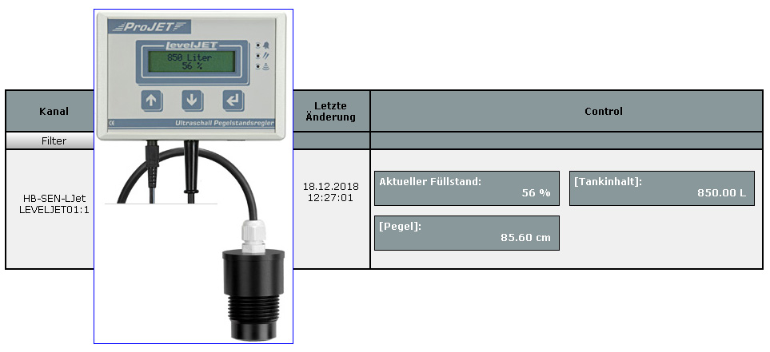
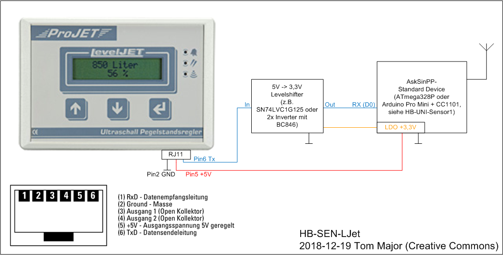

# Füllstandsanzeige Öltank/Wassertank (HB-SEN-LJet)

- Kopplung der Projet LevelJET Ultraschall-Füllstandsanzeige mit HomeMatic für Rotex-Öltanks
- Anpassung an beliebige Tankformen durch Einsatz einer Peiltabelle möglich
- Volumenberechnung erfolgt Millimetergenau aus der Füllhöhe (Interpolation des Volumens zwischen den cm-Stützstellen)

## Schaltung

## Benötige Libraries

[AskSinPP Library](https://github.com/pa-pa/AskSinPP) 
[EnableInterrupt](https://github.com/GreyGnome/EnableInterrupt) 
[Low-Power](https://github.com/rocketscream/Low-Power)

## CCU2/CCU3/RaspberryMatic Installation

Einstellungen/Systemsteuerung/Zusatzsoftware -> Datei CCU_RM/HB-SEN-LJet-addon.tgz installieren.

## Leiterplatte

- Platine in Arbeit
