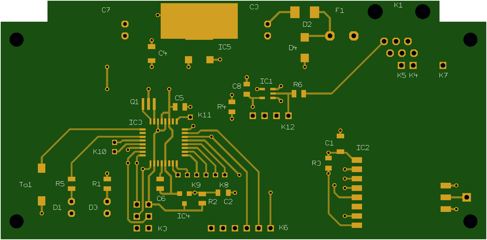
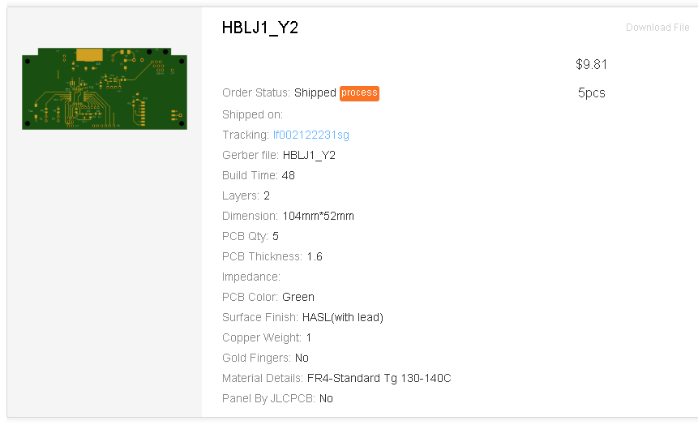

# Füllstandsanzeige Öltank/Wassertank (HB-SEN-LJet)

- Kopplung der Projet LevelJET Ultraschall-Füllstandsanzeige mit HomeMatic für Rotex-Öltanks
- Anpassung an beliebige Tankformen durch Einsatz einer Peiltabelle möglich
- Volumenberechnung erfolgt Millimetergenau aus der Füllhöhe (Interpolation des Volumens zwischen den cm-Stützstellen)

## Bilder

## Konfiguration

- Das ist die aktuelle Standardeinstellung in *HB-SEN-LJet.ino*: 
`LEVELJET<true, true> leveljet;    // Pegel in mm, benutze Peiltabelle`

- Es gibt LevelJET-Geräte die den Pegel in cm ausgeben, in diesem Fall den ersten Parameter auf false setzen.

- Falls man die Peiltabelle nicht benutzen möchte und die Konfiguration der Tankform über das LevelJET-Gerät reicht (bei einfachen geometrischen Tankformen) setzt man den zweiten Parameter auf false und bekommt dann das vom LevelJET berechnete Volumen direkt ohne eigene Peiltabelle.

- Falls man die Peiltabelle für komplexe Tankformen benutzen möchte muss man diese in *src/Peiltabelle.h* an den eigenen Bedarf anpassen (Tabelle Liter <-> cm). Der zweite Parameter bleibt dann auf true.

- Die Tankanzahl in *src/Leveljet.h* an den eigenen Bedarf anpassen: 
`const uint16_t cTANK_ANZAHL = 4;`

## Schaltplan

[:arrow_right: Schaltplan](PCB/Files/HB-SEN-LJet.pdf)

## Platine

[:arrow_right: PCB Gerber](PCB)

## Aufbau / Stückliste

- alle SMD Widerstände und Kondensatoren haben die Bauform 0805 (außer die 1u und 100u Kondensatoren)
- Gehäuse: BOPLA EG-1230
- Bauelementewerte siehe Schaltplan, keine extra Stückliste vorhanden

## Hinweise

- :warning: Beim Flashen über einen FTDI-Adapter an K6 muss der Daten-Eingang vom LevelJET (K1, pin 6) an +5V oder +3,3V gelegt werden damit seriell geflasht werden kann! (der AVR-Pin PD0/RXD braucht High-Pegel). 
  Der LevelJET selbst muss beim Flashen von der Schaltung getrennt werden!
- Zur Geschichte: Die Füllstandsmessung mit LevelJET lief schon viele Jahre mit RFM69 und jeelink Anbindung an FHEM und sie war in dem oben genannten BOPLA Gehäuse verbaut. 
  Bei der Umstellung des Systems nach HomeMatic habe ich bequemerweise das Gehäuse an der Wand weiterverwendet und nur die Platine dafür neu designed. Ohne diese Randbedingung kann man die Platine natürlich kleiner machen.

## CCU2/CCU3/RaspberryMatic Installation

Einstellungen/Systemsteuerung/Zusatzsoftware -> Datei [hb-tm-devices-addon.tgz](https://github.com/TomMajor/SmartHome/tree/master/HB-TM-Devices-AddOn/CCU_RM) installieren.

## Links

[HomeMatic Forum: HB-SEN-LJet - Aufbau](https://homematic-forum.de/forum/viewtopic.php?f=76&t=49512)

## Benötige Libraries

[AskSinPP Library](https://github.com/pa-pa/AskSinPP) 
[EnableInterrupt](https://github.com/GreyGnome/EnableInterrupt) 
[Low-Power](https://github.com/rocketscream/Low-Power)

## Lizenz

**Creative Commons BY-NC-SA** 
Give Credit, NonCommercial, ShareAlike

 This work is licensed under a <a rel="license" href="http://creativecommons.org/licenses/by-nc-sa/4.0/">Creative Commons Attribution-NonCommercial-ShareAlike 4.0 International License</a>.
