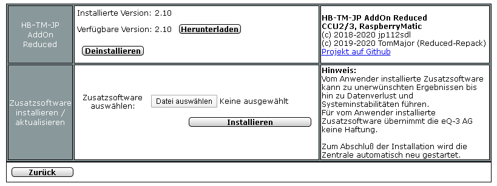

# HB-TM-JP-AddOn-Reduced

## Was ist das?

- Ein Stripdown von Jeromes [JP-HB-Devices-addon](https://github.com/jp112sdl/JP-HB-Devices-addon) zur Unterstützung nur dieser 3 Projekte/Geräte:
  - [HB-Dis-EP-42BW](https://github.com/jp112sdl/HB-Dis-EP-42BW) (4,2" ePaper Display)
  - [HB-RC-12-EP](https://github.com/jp112sdl/HB-RC-12-EP) (12 Kanal Fernbedienung mit ePaper)
  - [HB-OU-MP3-LED](https://github.com/jp112sdl/HB-OU-MP3-LED) (Funkgong mit MP3-Wiedergabe und LED-Signalisierung)
  - außerdem ist mein [Script Helper](https://github.com/TomMajor/SmartHome/tree/master/HB-Dis-EP-42BW#script-helper) für das 4,2" ePaper Display enthalten.<br><br>

- Ich habe das dafür notwendige HomeMatic/RaspberryMatic AddOn aus Jeromes Universalsammlung JP-HB-Devices-addon "herausoperiert" und ein paar Modifikationen gemacht um ein separates AddOn nur für die genannten Geräte zu haben.<br><br>
Vielen Dank an Jerome für die Unterstützung bei dieser Arbeit. :thumbsup: <br>


## Warum?

Ich habe vollstes Vertrauen in Jeromes Modifikationen und Patches für seine vielen Selbstbau-Projekte!<br>
Da ich zur Zeit nur wenige davon aktiv einsetze und ich anderseits gern das Gefühl hätte, noch ungefähr zu wissen was man beim AddOn tun muss und außerdem unabhängig von Jeromes AddOn sein möchte falls er mal den Support für neuere Versionen der RM/CCU Firmware einstellen *sollte* hätte ich gern ein Strip-down des JP-HB-Devices-addon - nur für die von mir genutzen Geräte daraus.


## Installation

- Einstellungen/Systemsteuerung/Zusatzsoftware -> die hier im Repo liegende Datei [hb-tm-jp-addon-reduced.tgz](CCU_RM/hb-tm-jp-addon-reduced.tgz) installieren.<br>
Die Zentrale startet sich danach automatisch neu.



:exclamation: Achtung, bitte entweder nur Jeromes JP-HB-Devices-addon oder das hier behandelte HB-TM-JP-AddOn-Reduced installieren, niemals beide AddOn gleichzeitig, das wird nicht funktionieren!


## Details zur Reduzierung

[:arrow_right: Konzept](Docs/stripdown.pdf)

[:arrow_right: rc.d Diffs](Docs/diff_rc.d.pdf)


## Logfile nach erfolgreicher Installation

/usr/local/addons/hb-tm-jp-addon-reduced/log/inst.log

```
Starting complete installation within 'init' 10.04.2020 18:53:46
Found 0 monit process(es)
Found 0 ReGaHss process(es)
Found 0 rfd process(es)
Found firmware version 3.51.6 - using patchversion 2
patchworker (install) (hb-tm-jp-addon-reduced) (2) (3.51.6.20200229)
First time install, save backup 3.51.6.20200229
Apply common patches
Applying <common> patch file functions.fn.patch
patching file rega/esp/functions.fn
Applying <common> patch file ic_common.tcl.patch
patching file config/ic_common.tcl
Applying <common> patch file webui.js.patch
patching file webui/webui.js
Apply firmware dependend patches
Applying <ge_345> patch file programs.htm.patch
patching file rega/pages/tabs/admin/views/programs.htm
Applying <ge_345> patch file side.inc.patch
patching file rega/esp/side.inc
(Re-)Creating symlinks for jp_webui_inc.js...
Running scripts...
  - install_hb-dis-ep-xxx
  - install_hb-ou-mp3-led
  - install_hb-rc-12-ep
Copying customized firmware files...
(Re-)Creating symlinks for firmware files...
Installation done. 
```


## Lizenz

**Creative Commons BY-NC-SA**<br>
Give Credit, NonCommercial, ShareAlike

<a rel="license" href="http://creativecommons.org/licenses/by-nc-sa/4.0/"></a><br />This work is licensed under a <a rel="license" href="http://creativecommons.org/licenses/by-nc-sa/4.0/">Creative Commons Attribution-NonCommercial-ShareAlike 4.0 International License</a>.
