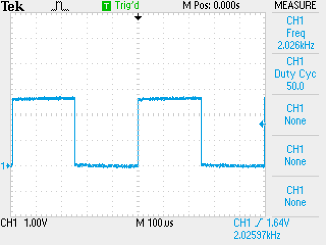
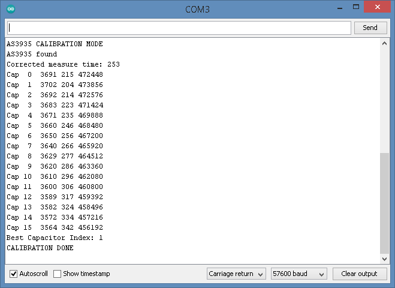
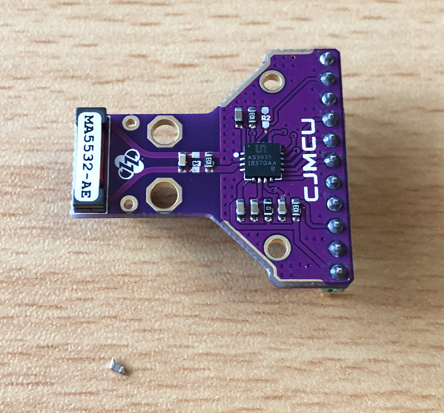
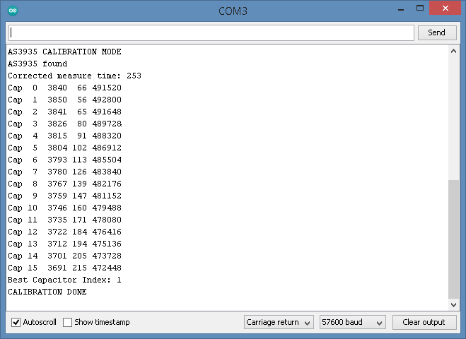
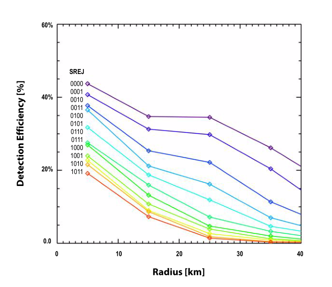

# HB-UNI-Sensor-Blitz

- Der HB-UNI-Sensor-Blitz ist ein Homebrew HomeMatic-Sensor zur Erkennung von Blitzen, basierend auf dem AS3935 Franklin-Blitzsensor IC von ams (Austria Mikro Systeme).
- Der AS3935 ist ein programmierbarer Sensor, der Blitzaktivitäten in einer Entfernung von bis zu 40 km erkennen kann. Er verwendet einen proprietären, fest verdrahteten Algorithmus, um Rauschen und künstlich verursachte Störfaktoren herauszufiltern und die Entfernung zur Gewitterfront abzuschätzen.
- Er verfügt über programmierbare Detektionsebenen, Schwellenwerteinstellungen und Antennenabstimmung, im Gegensatz zu vielen früheren terrestrischen Blitzsensoren kann er sowohl Blitzaktivitäten von Wolke zu Boden als auch innerhalb von Wolken erfassen.
- Alle Parameter des Chips sind über das HomeMatic WebUI konfigurierbar.
- Pro erkanntes Blitzereignis wird eine Nachricht an die Zentrale gesendet. Dabei inkrementiert jedes Ereignis den Datenpunkt 'Blitzzähler' und außerdem wird der Datenpunkt 'Blitz-Entfernung' (Entfernung zur Gewitterfront) entsprechend aktualisiert.
- Zusätzlich habe ich noch einen Temperatursensor mit DS18B20 in das Gerät integriert.

## Hinweise

- Zum Kompilieren des Sketches benötigt man alle Dateien unterhalb der Verzeichnisses *Arduino*. 

- Der HB-UNI-Sensor-Blitz Sketch benötigt den master-Branch der [AskSinPP Library](https://github.com/pa-pa/AskSinPP), nicht den V4 Release-Branch wie dort angegeben. 
  Grund: Verwendung der broadcastEvent() Methode.
  
- Für den Prototyp habe ich Stefans geniales All-in-One Board [Arduino-Pro-Mini-RF](https://github.com/Asselhead/Arduino-Pro-Mini-RF) verwendet, welches ATmega328, CC1101 und weitere notwendige Komponenten auf einem Board integriert. 
  Der Verdrahtungsplan unten zeigt die herkömmliche Verdrahtung mit Arduino Pro Mini und separaten CC1101.

## Bilder

###### AS3935 Sensor

###### HB-UNI-Sensor-Blitz Prototyp

## Schaltung

###### Verdrahtung

###### Interne Schaltung des AS3935 Breakout-Boards

- Die beiden in der Verdrahtung gezeigten 10k Widerstände an SCL und SDA sind nur einmal nötig. Je nach AS3935 Breakout-Board sind diese eventuell bereits dort enthalten.
- Im hier verwendeten Board ist z.B. der 10k Widerstand an SCL vorhanden. Also muss man nur noch den 10k Widerstand an SDA einsetzen.

###### Ruhestrom

Der Ruhestrombedarf des Gerätes liegt bei ca. 72µA. Dies wird hauptsächlich vom Blitzsensor IC selbst verursacht, da dieser die ganze Zeit scannen und evaluieren muss. 
Mit 2 AA Zellen mit 2500mAh würde das in der Theorie eine Laufzeit von ca. 4 Jahren ergeben, in der Realität natürlich viel kürzer wegen den Sendenachrichten an die Zentrale und der Selbstentladung der Batterien. 
Ich glaube das man dennoch mit ca. 2 Jahren Laufzeit rechnen kann, was für diese Art Sensor auch kein schlechter Wert wäre. 

Achtung, um den niedrigen Ruhestrom zu erreichen muss der Widerstand R2 auf dem Breakout-Board entfernt werden!

## Abgleich

Der AS3935 sollte möglichst genau auf seine Empfangsfrequenz von 500kHz abgestimmt werden da der interne Algorithmus zur Erkennung von Blitzen darauf ausgelegt ist.  
Im Sketch sind diese 2 Arduino Pins zur Aktivierung des Modus zur Kalibrierung definiert: 
`#define CALIBRATION_PIN1 A0` 
`#define CALIBRATION_PIN2 A1` 

Diese beiden Pins müssen bei Power-On bzw. Reset wechselweise an Masse gelegt werden um in die 2 Modi zur Kalibrierung zu gelangen:

###### 1. AVR Taktfrequenz: CALIBRATION_PIN1 an Masse

 - Im seriellen Monitor ist "AVR FREQUENCY MEASURE MODE" zu lesen.
 - Die AVR Taktfrequenz wird heruntergeteilt an Pin 6 ausgegeben, bei exakt 8MHz Takt werden exakt 2000Hz ausgegeben.
 - Die Frequenz möglichst genau an Pin 6 messen und in der Datei Sens_AS3935.h, Zeile 39 eintragen, in Hertz, z.B.: 
   `#define CLK_TEST_FREQ_HZ 2026`
 - Dieser Test ist nur bei Verwendung des AVR internen RC-Oszillators als Taktquelle nötig. Bei Nutzung eines 8MHz Quarzes am AVR ist die Taktfrequenz hinreichend genau, in diesem Fall 2000 eintragen: 
   `#define CLK_TEST_FREQ_HZ 2000`
 - :warning: Nach Änderung des Wertes CLK_TEST_FREQ_HZ muss der Sketch neu kompiliert und geflasht werden damit die ausgemessene Frequenz im nächsten Schritt zur Verfügung steht.

###### 2. AS3935 Empfangsfrequenz: CALIBRATION_PIN2 an Masse

 - Im seriellen Monitor ist "AS3935 CALIBRATION MODE" zu lesen.
 - Es werden die Sensor-internen, 16 möglichen Abtimmkapazitäten durchgeschaltet und jeweils die AS3935 Empfangsfrequenz dafür gemessen.
 - Nach Abschluss des Durchlaufs wird der beste Kapazitätsindex im Bereich 0..15 angezeigt (der, der am Nächsten zu 500kHz liegt).
 - Diesen Kapazitätsindex muss nach dem Anlernen des Gerätes in den Geräteeinstellungen für den HB-UNI-Sensor-Blitz eingetragen werden.

###### 3. Empfangsfrequenz von 500kHz wegen Bauteiltoleranzen nicht erreicht

- Bei meinem AS3935 Exemplar lag ich zunächst auch nach dem Abgleich der Empfangsfrequenz relativ weit von den empfohlenen 500kHz weg, bei 473,8kHz.
- Im Netz hatte ich gelesen das je nach Lieferung und Bauteiltoleranzen die Parallelschaltung aus C2/1nF und C3/100pF am L-C Schwingkreis des Empfängers zu viel sein kann.
- Also habe ich mal testweise C3/100pF entfernt. Tatsächlich brachte dann ein erneuter Abgleich 492,8kHz, was besser zur Empfehlung passt.
- Der im Chip implementierte Algorithmus zur Blitzerkennung ist für 500kHz Empfangsfrequenz optimiert.

## Web-UI / HomeMatic-Zentrale

Der HB-UNI-Sensor-Blitz wird ab Version 2.53 meines [HB-TM-Devices-AddOn](https://github.com/TomMajor/SmartHome/tree/master/HB-TM-Devices-AddOn) voll unterstützt.

###### Gerät mit Datenpunkten

###### Geräteparameter

###### Serieller Log

## Erklärung der Geräteparameter

1. Kapazitätsindex
  - Der ermittelte Wert aus der Kalibrierung, siehe Abschnitt Abgleich oben.

2. Standort im Innenbereich
  - Das Analog Front-End des AS3935 wurde für zwei Umgebungen optimiert, für Innen- und Außenbereich. Für den Innenbereich den Haken setzen.

3. Störerkennung (nur zum Debuggen)
  - Für Testzwecke kann der AS3935 auch Interrupts auslösen, wenn eine Störquelle (kein Blitzereignis) erkannt wurde. Dies wird im seriellen Monitor ausgegeben wenn der Haken hier gesetzt wird.
  - Eine Nachricht an die Zentrale bei einer Störung erfolgt nicht. Der Parameter ist nur für den seriellen Log relevant. Man kann mit der Option einen optimalen Standort suchen und die folgenden Parameter feintunen.

4. Parameter Noise Floor Level
  - Das Ausgangssignal des Analog Front-End wird auch zur Messung des Rauschens verwendet. Das Grundrauschen wird kontinuierlich mit einem Referenzwert (Rauschschwelle) verglichen.
  - Wann immer das Grundrauschen den Referenzwert überschreitet, gibt es einen weiteren Interrupt (INT_NH) zur Information dass der AS3935 aufgrund des hohen Eingangsrauschens nicht richtig funktionieren wird.
  - Auch dieser Interrupt ist im seriellen Monitor zu sehen.

5. Parameter Spike Rejection
  - Die Spike Rejection kann verwendet werden, um die Robustheit gegenüber Fehlalarmen, verursacht durch Störquellen, zu erhöhen.
  - Standardmäßig steht der Wert auf 2.
  - Größere Werte führen zu einer robusteren Störerunterdrückung, jedoch mit der Nachteil einer Abnahme der Detektionseffizienz.

6. Parameter Watchdog Threshold
  - Der Watchdog Threshold muss bei einem Blitzereignis überwunden werden, um in den Signal-Verifikationsmodus zu gelangen.
  - Auch dieser Wert steht standardmäßig auf 2.
  - Ähnlich wie bei der Spike Rejection wird hier durch Erhöhung der Schwelle der AS3935 robuster gegenüber Störquellen, gleichzeitig aber auch unempfindlicher für schwächere Signale von weit entfernten Blitzereignissen.

7. Parameter Min. Number of Lightnings
  - Der AS3935 kann so programmiert werden, dass er Blitzereignisse nur dann ausgibt, wenn eine Mindestanzahl dieser in einem Zeitrahmen von 15 Minuten erkannt werden.
  - Diese Mindestanzahl von Blitzereignissen kann dabei auf 1, 5, 9 oder 16 eingestellt werden. Sobald der Schwellenwert erreicht ist, übermittelt der Blitzsensor jedes weitere erkannte Blitzereignis.

Alle Details dazu sind ausführlicher in [Datenblatt](Files/AS3935.pdf) und [Application-Note](Files/AS3935-Application-Note-Standard-board.pdf) zu finden.

## Links

[HomeMatic Forum: Hardwareentwicklung und Selbstbau von Aktoren und Sensoren](https://homematic-forum.de/forum/viewforum.php?f=76)

[HomeMatic Forum: Vorstellung: HB-UNI-Sensor-Blitz](https://homematic-forum.de/forum/viewtopic.php?f=76&t=62249)

## Benötige Libraries

[AskSinPP Library](https://github.com/pa-pa/AskSinPP) 
[EnableInterrupt](https://github.com/GreyGnome/EnableInterrupt) 
[Low-Power](https://github.com/rocketscream/Low-Power)

Für einen DS18x20 Sensor (Temperatur): 
[OneWire](https://github.com/PaulStoffregen/OneWire)

## Lizenz

**Creative Commons BY-NC-SA** 
Give Credit, NonCommercial, ShareAlike

 This work is licensed under a <a rel="license" href="http://creativecommons.org/licenses/by-nc-sa/4.0/">Creative Commons Attribution-NonCommercial-ShareAlike 4.0 International License</a>.
