# Universalsensor (HB-UNI-Sensor1)

- Demonstriert einen HomeMatic/RaspberryMatic/FHEM Universalsensor für Temperatur, Luftdruck, Luftfeuchte, Helligkeit usw.
- modifizierbar für andere Sensoren
- konfigurierbares Sendeintervall über WebUI
- konfigurierbare Höhe (für Berechnung des Luftdrucks auf Meeresniveau/Normaldruck) über WebUI
- über die defines am Anfang des Sketches können entweder Dummy Werte für die Sensoren (zum Testen der Anbindung an HomeMatic/RaspberryMatic/FHEM) oder reale Sensoren aktiviert werden
Beispiel: 
`#define SENSOR_BME280    // realer BME280 angeschlossen` 
`//#define SENSOR_BME280    // es werden BME280 Dummy Werte gesendet`
- Es können mehrere HB-UNI-Sensor1 an einer Zentrale verwendet werden. Dafür müssen sich die einzelnen Sensoren nur in Device ID und Device Serial unterscheiden: 
`const struct DeviceInfo PROGMEM devinfo = ` 
`  { 0xA5, 0xA5, 0x00 },    // Device ID` 
`  "UNISENS001",            // Device Serial` 
- Ich empfehle den MAX44009 Helligkeitssensor anstatt dem TSL2561, siehe 
[SensorTest_Lux](https://github.com/TomMajor/AskSinPP_Examples/tree/master/Info/SensorTest_Lux)
- Der Status eines digitalen Eingangs kann mit übertragen werden. Falls diese Option aktivert ist wird bei einer Änderung an diesem Eingang sofort ein neues Telegramm an die Zentrale gesendet, unabhängig vom eingestellten Sendeintervall.
- Folgende Sensoren sind zur Zeit beim HB-UNI-Sensor1 aktivierbar: 
`#define SENSOR_DS18X20` 
`#define SENSOR_BME280` 
`#define SENSOR_BMP180` 
`#define SENSOR_TSL2561` 
`#define SENSOR_MAX44009` 
`#define SENSOR_SHT10` 
`#define SENSOR_DIGINPUT` 

## Prototyp

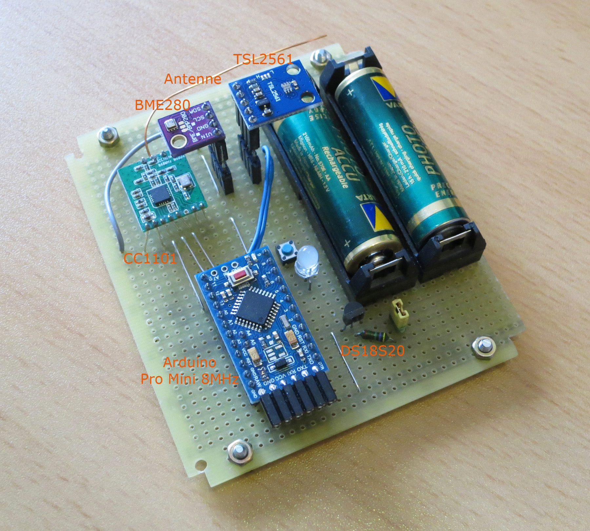

## Schaltung

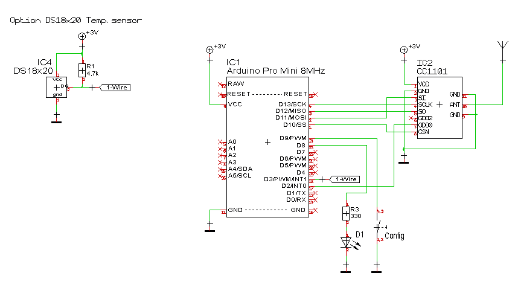

## Aussensensor

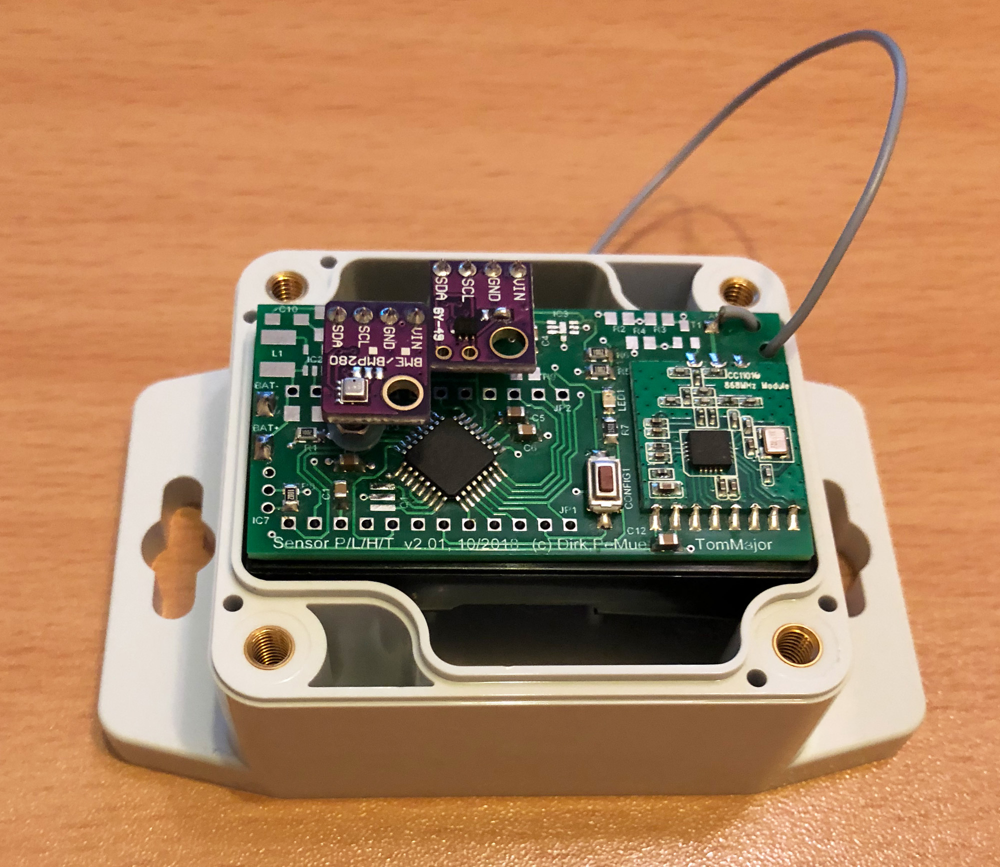

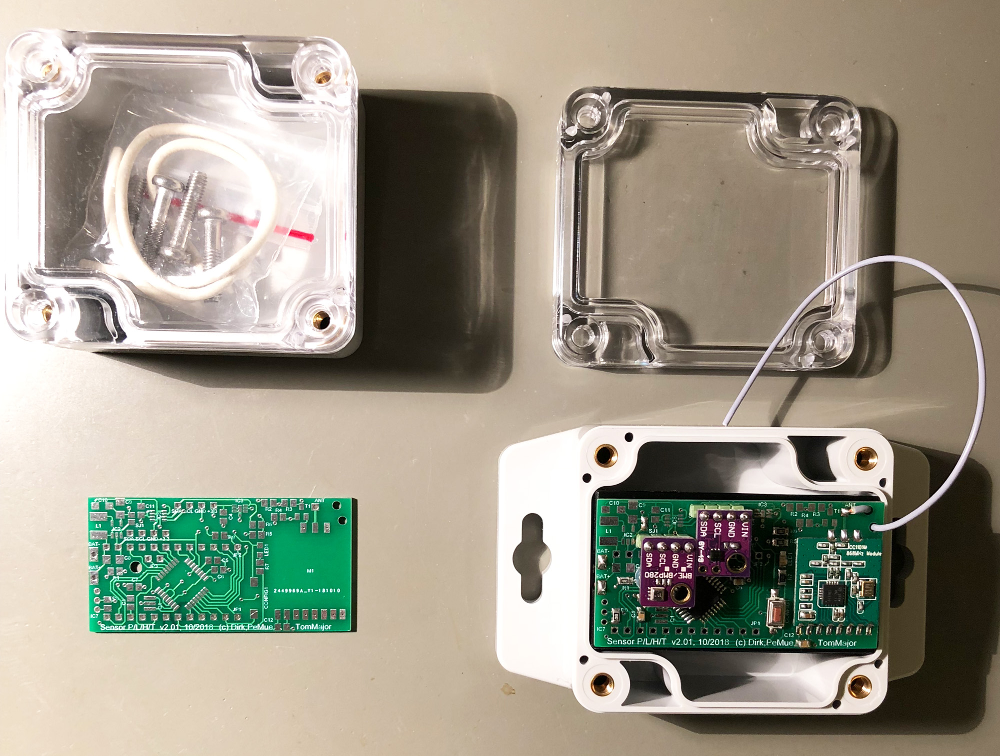

[Projekt](https://github.com/TomMajor/AskSinPP_Examples/tree/master/PCB/Sensor_PLHT)

[Schaltung](https://github.com/TomMajor/AskSinPP_Examples/tree/master/PCB/Sensor_PLHT/Files/SensorPLHT_v201.pdf)

[Verringerung Ruhestrom](https://github.com/TomMajor/AskSinPP_Examples/tree/master/Info/Ruhestrom)

## Messung der Batteriespannung

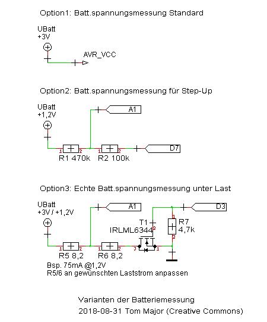

- Option 1: Standard, UBatt = Betriebsspannung AVR 
keine zusätzliche Hardware notwendig 
`#define BAT_SENSOR tmBattery` 

- Option 2: Batteriespannungsmessung für StepUp/StepDown 
2 zusätzliche Widerstände notwendig 
`#define BAT_SENSOR tmBatteryResDiv<A0, 9, 5700>` 
`// sense pin A0, activation pin D9, Faktor = Rges/Rlow*1000, z.B. 470k/100k, Faktor 570k/100k*1000 = 5700`

- Option 3: Echte Batteriespannungsmessung unter Last 
`#define BAT_SENSOR tmBatteryLoad<A0, 9, 4000, 200>` 
`// sense pin A0, activation pin D9, Faktor = Rges/Rlow*1000, z.B. 10/30 Ohm, Faktor 40/10*1000 = 4000, 200ms Belastung vor Messung`

Die Batteriespannungsmessung unter Last dient u.a. dem Schutz vor einem "Babbling Idiot, siehe
[Babbling Idiot Protection](https://github.com/TomMajor/AskSinPP_Examples/tree/master/Info/Babbling%20Idiot%20Protection)
  
Aus meiner Sicht würde es sehr helfen, eine echte Messung des Batteriezustands unter Last zu haben, um frühzeitig leere Batterien zu erkennen und zu tauschen. Bekanntermaßen sagt eine Spannungsmessung an unbelasteter Batterie, je nach Batterie- bzw. Akkutyp, nicht viel über den Ladezustand aus.
  
Die Schaltung belastet die Batterie bzw. den Akku für einige Hundert Millisekunden und misst dabei die Spannung.
Dies führt meiner Meinung nach zu realistischeren Werten über den Batteriezustand als eine asynchrone und unbelastete Messung.
  
Dazu wurde eine neue Batterieklasse nach Vorbild von papas Batterieklassen erstellt. Sie heißt hier BatterySensorLoad und befindet sich unter Sensors/BatterySensorLoad.h  
Mit dieser Klasse und der Schaltung werden die Batterien bei 3V mit ca. 75mA für die kurze Zeit der Messung belastet. Anpassungen an andere Spannungen und Ströme sind natürlich leicht über die Widerstände R2/R3 möglich. Momentan geschieht das 2 mal am Tag. 
`TODO code für Dekl. der Klasse` 
`hal.battery.init(seconds2ticks(60UL*60*12), sysclock, 2000);` 
`// 2x Batt.messung täglich, Spannungsteiler 1:2` 

Das Bild zeigt den Einbruch der Batteriespannung wenn für 200ms mit 75mA belastet wird. Die Spannung bricht um 142mV ein und wird am Ende der 200ms gemessen.
 

## CCU2/RaspberryMatic Installation

Einstellungen/Systemsteuerung/Zusatzsoftware -> Datei CCU_RM/HB-UNI-Sensor1-addon.tgz installieren.

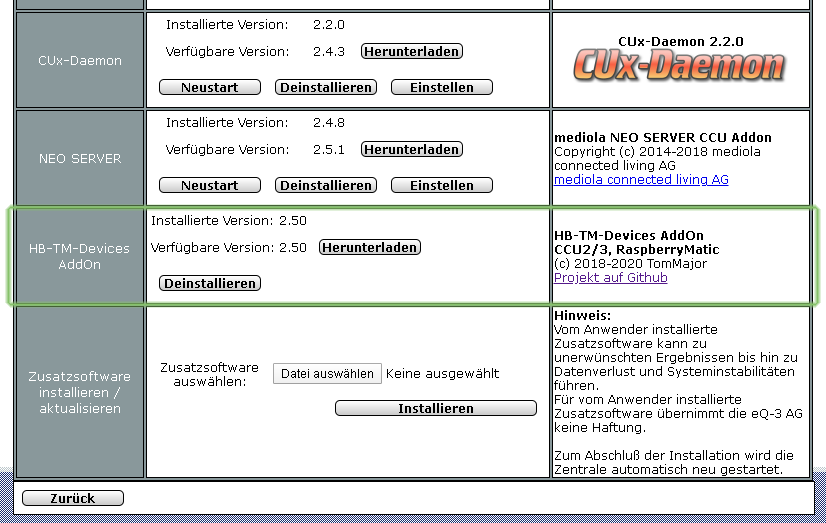

## RaspberryMatic WebUI

Der angemeldete Sensor auf der RaspberryMatic:

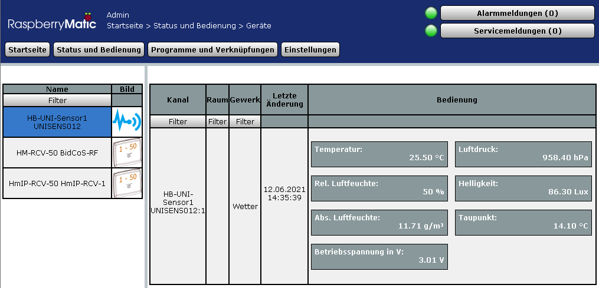

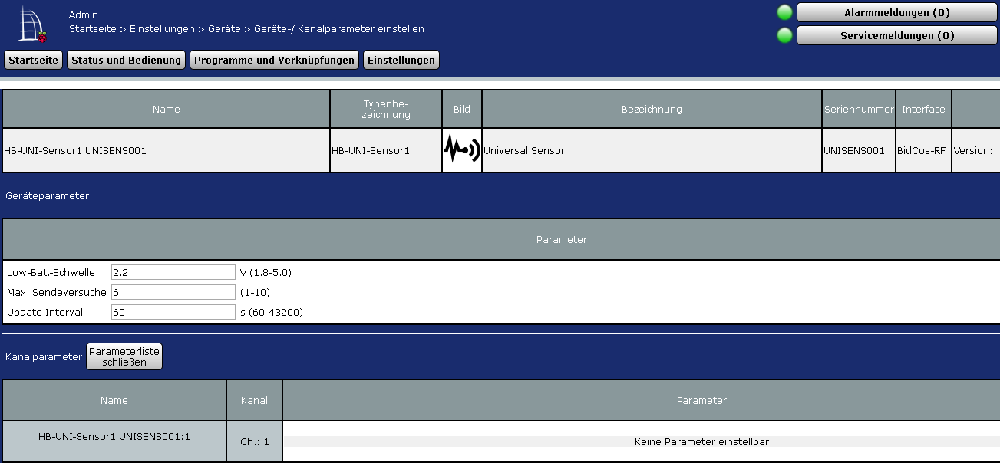

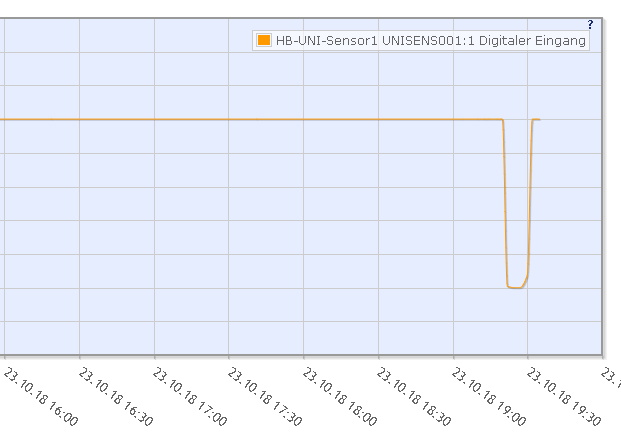

## FHEM Installation

Die Datei FHEM/HMConfig_UniSensor1.pm nach /opt/fhem/FHEM kopieren, dann FHEM neustarten.

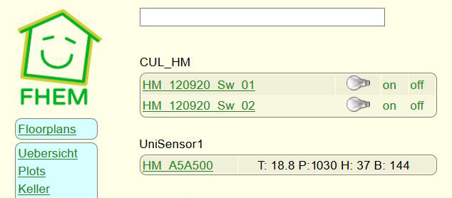

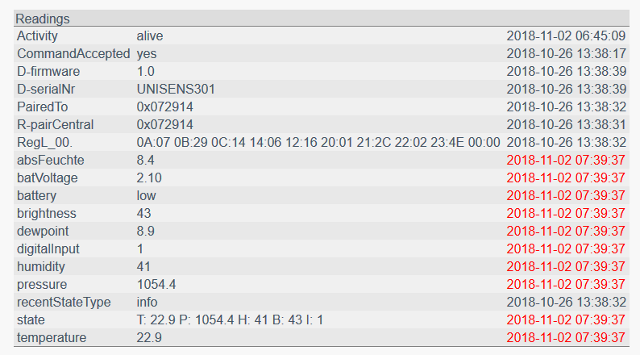

**Parameter Höhe einstellen:** 
"Ich konnte bei meinem THPL Sensor mit BME280 und MAX44009 über getConfig // **Config drücken** // set regSet altitude 590 // **Config drücken** // getConfig // **Config drücken** die Höhe einstellen. Bitte berichtigt mich, wenn ich da zu viel drücke und mache- so hat es jedenfalls funktioniert ::)" 
_FHEM user kpwg_

## Warnung vor dem Flashen von 3,3V Geräten mit USBasp Klones

[Flashen PLHT Sensor](https://github.com/TomMajor/AskSinPP_Examples/tree/master/PCB/Sensor_PLHT#warnung-vor-dem-flashen-von-33v-ger%C3%A4ten-mit-usbasp-klones)

## Bewegungsmelder mit PIR AS312 am digitalen Eingang

- Der Inverter mit Transistor sorgt für minimalen Ruhestrom (keine Bewegung, PIR Ausgang Low, Transistor gesperrt) und trägt außerdem durch die Entkopplung zum sicheren Betrieb bei (keine unerwünschte Auslösung des PIR während des 868MHz Sendevorgangs an die Zentrale).
- Die Bilder demonstrieren die Ideen und den konstruktiven Aufbau von user fhemfreund, getrimmt auf minimale Gerätegröße. Danke für den Ideenaustausch und die Aussicht auf ein Gerät.  :smile:
- Mit der RTC Option beträgt der Ruhestrom inklusive PIR nur ca. 14uA und es besteht somit die Hoffnung dass die eingesetzte Batterie CR2450 möglichst lange hält.

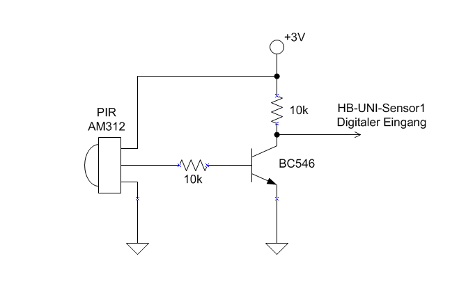

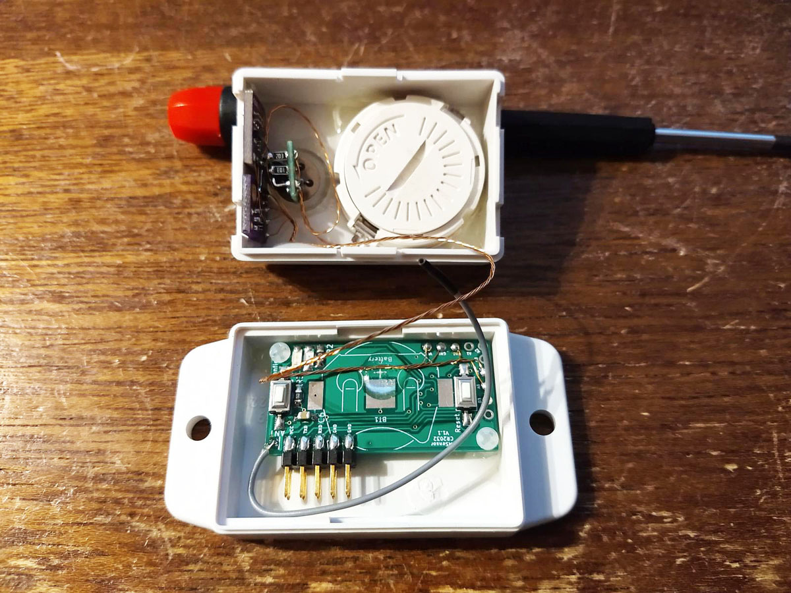
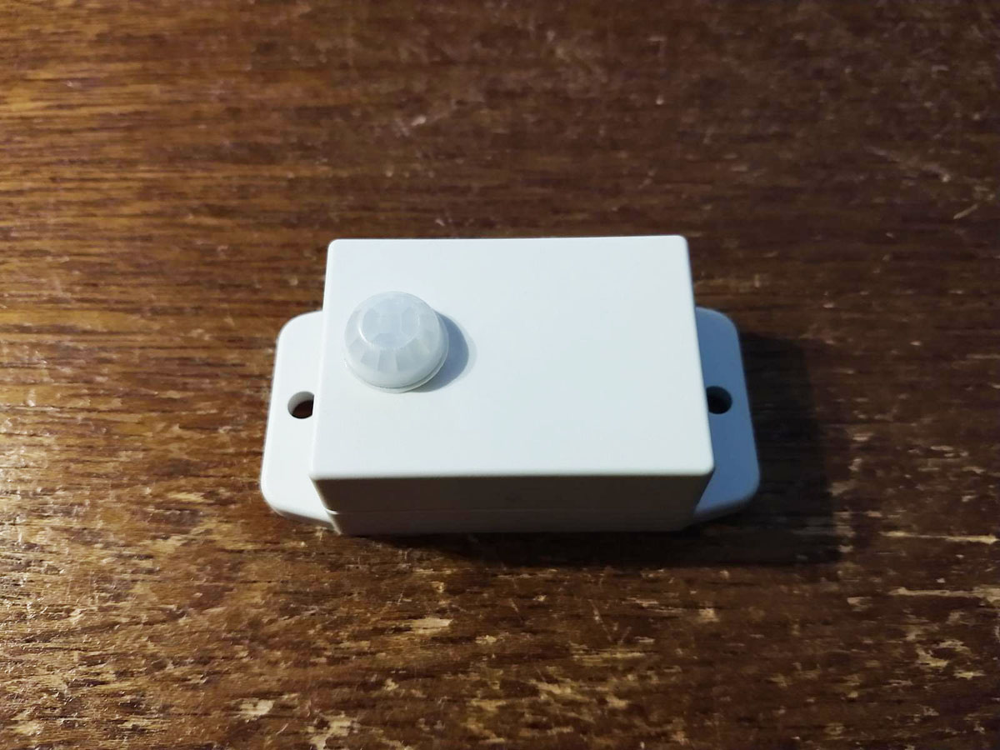
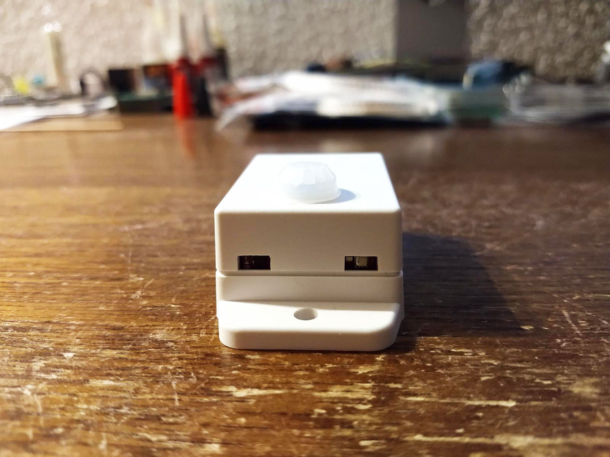

## Benötige Libraries

[AskSinPP Library](https://github.com/pa-pa/AskSinPP) 
[EnableInterrupt](https://github.com/GreyGnome/EnableInterrupt) 
[Low-Power](https://github.com/rocketscream/Low-Power)

Für einen DS18x20 Sensor (Temperatur): 
[OneWire](https://github.com/PaulStoffregen/OneWire)

Für einen BME280 Sensor (Temperatur/Druck/Feuchte): 
[BME280](https://github.com/finitespace/BME280)

Für einen BMP180 Sensor (Temperatur/Druck): 
[BMP180](https://github.com/enjoyneering/BMP180)

Für einen TSL2561 Sensor (Helligkeit in Lux): 
[TSL2561](https://github.com/adafruit/TSL2561-Arduino-Library)

Für einen MAX44009 Sensor (Helligkeit in Lux): 
keine zusätzliche Library nötig.

Für einen SHT10 Sensor (Feuchte): 
[SHT10](https://github.com/spease/Sensirion)
