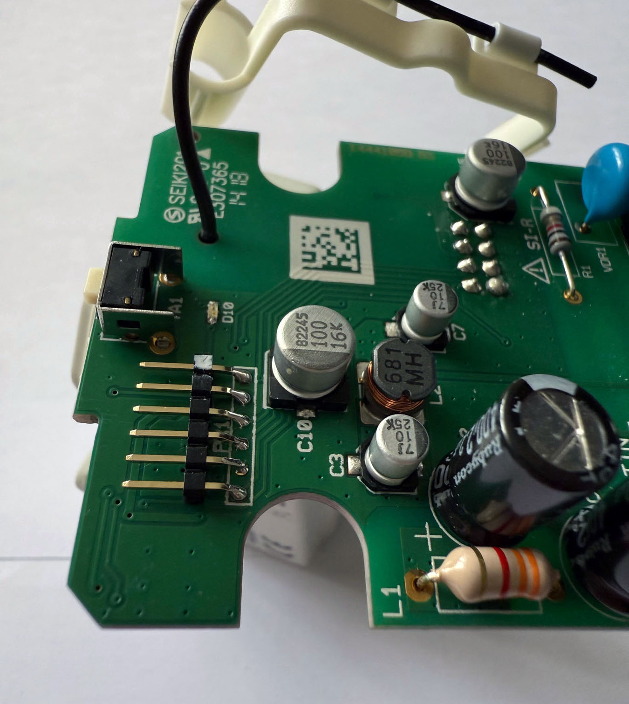
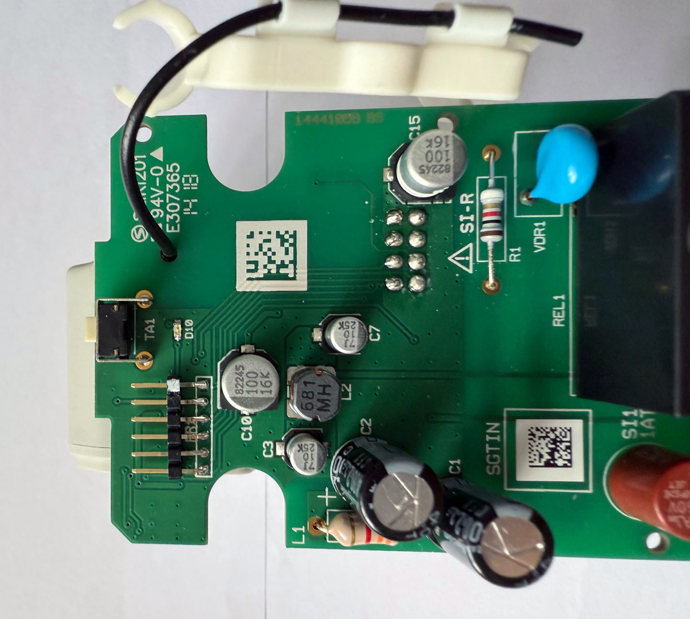
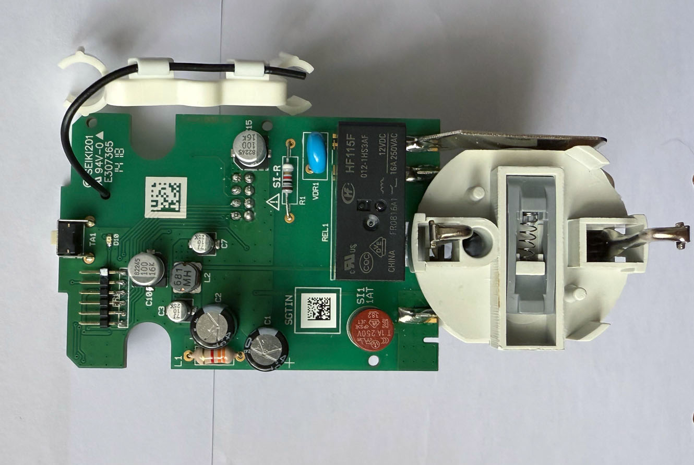
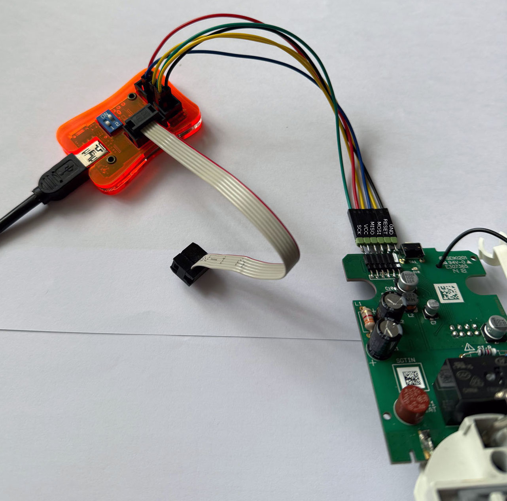
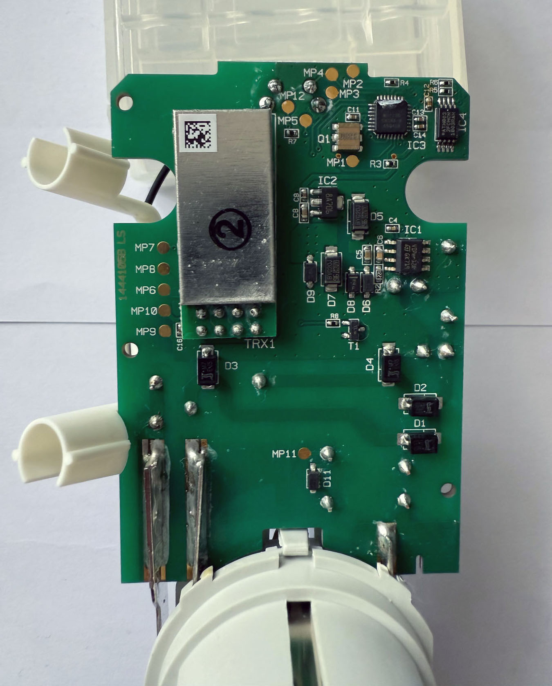
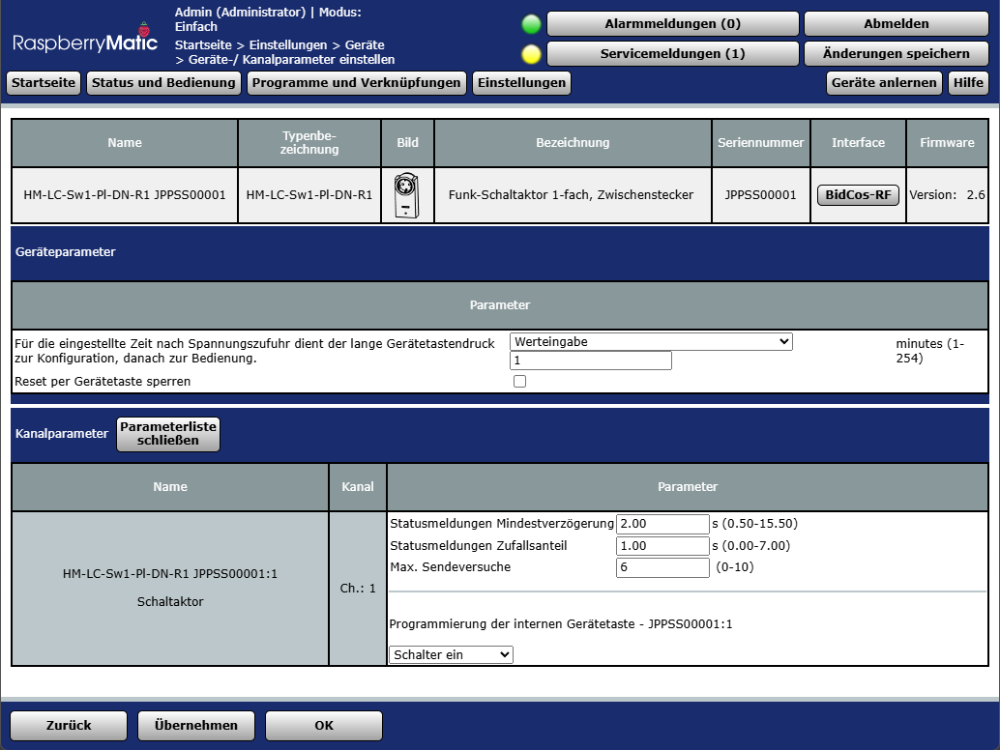

# Infos zum AskSinPP Projekt HM-LC-Sw1-Pl-DN-R1_PSS

- für den RWE/Innogy/Livisi 230V Zwischenstecker PSS

- Sketch von Jérôme: [HM-LC-Sw1-Pl-DN-R1_PSS](https://github.com/jp112sdl/Beispiel_AskSinPP/tree/master/examples/RWE/HM-LC-Sw1-Pl-DN-R1_PSS)

- AskSinPP Bibliothek von pa-pa: [AskSinPP](https://github.com/pa-pa/AskSinPP)

- Vielen Dank an jp112sdl, pa-pa und re-vo-lution für ihre Arbeit.

- Thread im HomeMatic-Forum zu diesem Gerät: [RWE/Innogy/Livisi Zwischenstecker Innen PSS](https://homematic-forum.de/forum/viewtopic.php?f=76&t=64286)

## Bilder

