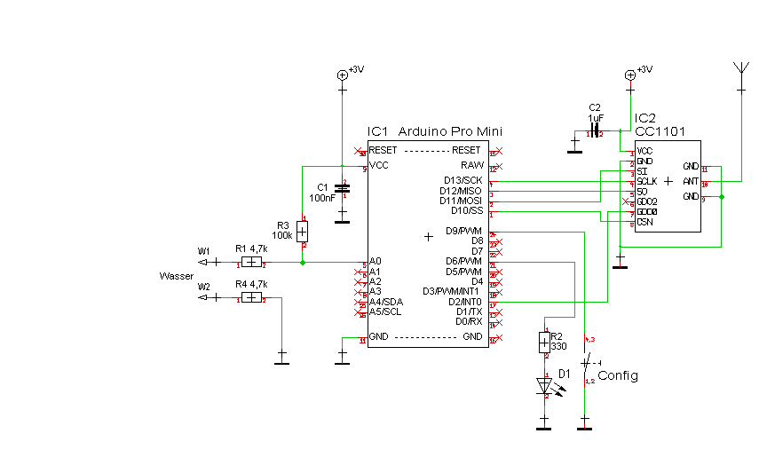

## Wassermelder (HM-SEC-WDS-2)

- Demonstriert die Verwendung vom ThreeStateSensor device type mit einer anpassbaren Messroutine, in diesem Fall eine Leitfähigkeitsmessung zwischen den Elektroden mit ADC.

# Benötige Libraries

[AskSinPP Library](https://github.com/pa-pa/AskSinPP) 
[EnableInterrupt](https://github.com/GreyGnome/EnableInterrupt) 
[Low-Power](https://github.com/rocketscream/Low-Power)

# Schaltung

