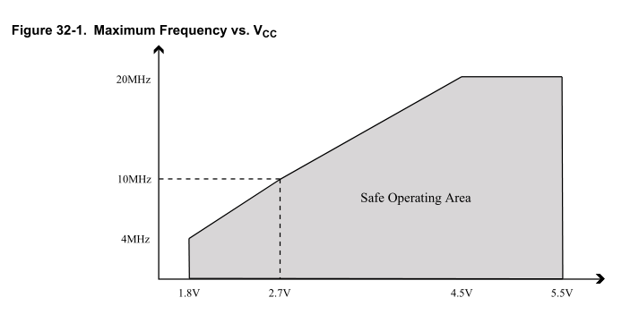

## ATmega328P - Maximale Taktfrequenz bei einer bestimmten Betriebsspannung

- Das Diagramm *Maximum Frequency vs. VCC* aus dem ATmega328P Datenblatt zeigt die maximal zulässige (garantierte) Taktfrequenz bei einer bestimmten Betriebsspannung, das sogenannte *Safe Operating Area*.

- Die Kurve hat zwei unterschiedliche Steigungen, eine im Bereich von 1,8V bis 2,7V, die andere im Bereich von 2,7V bis 4,5V.

- Daraus wurde die untenstehene Tabelle für die maximale Taktfrequenz bei einer bestimmten Betriebsspannung in 0,1V Schritten berechnet. Sie berücksichtigt die beiden unterschiedlichen Steigungen.

- In der Regel lässt sich ein AVR auch etwas außerhalb des Safe Operating Area betreiben, ich hatte z.B. mal früher eine Applikation, bei der ich einen AT90CAN128 erfolgreich mit 22MHz laufen lassen konnte. 
Im Sinne eines zuverlässigen Betriebes würde ich jedoch empfehlen, das Safe Operating Area einhalten.

- Beispiel: Ein 3,3V/8MHz Arduino Pro Mini ließe sich bei seinen 3,3V sicher bis 13,3Mhz betreiben wenn man den Resonator austauscht. 
Andererseits könnte man mit dem verbauten 8MHz Resonator mit der Betriebsspannung bis auf 2,4V runtergehen.

- Interessant ist außerdem in diesem Zusammenhang das der Quarzoszillator durchaus bei niedrigen Spannungen und hoher Quarzfrequenz arbeiten kann, das heißt die Einschränkungen des Safe Operating Area *Maximum Frequency vs. VCC* beziehen sich "nur" auf die SysClk.

> Table 13-3. Low Power Crystal Oscillator Operating Modes (1)
> Note:
> 1. If the crystal frequency exceeds the specification of the device (depends on VCC), the CKDIV8 Fuse
> can be programmed in order to divide the internal frequency by 8. It must be ensured that the
> resulting divided clock meets the frequency specification of the device.

- Man könnte so z.B. einen 16MHz Arduino Pro Mini sicher für 3,3V/8MHz Betrieb und Quarzgenauigkeit (gegenüber der ungenaueren internen 8MHz RC-Clock) verwenden indem man die CKDIV8 Fuse programmiert (für den sicheren Start-Up) und dann zur Laufzeit (möglichst früh, z.B. in einem modifizierten [Bootloader](https://github.com/TomMajor/SmartHome/blob/master/Info/Bootloader/mega328_RC-Osc_with_Calibration/ATmegaBOOT_168.c#L280)) das Clock Prescaler Register CLKPR auf Teiler 2 einstellt um wieder die 8MHz zu erhalten. 
Siehe auch dieser Thread [Sicherer Betrieb eins 16MHz atmel328P bei 3.3V](https://homematic-forum.de/forum/viewtopic.php?f=76&t=58776).
