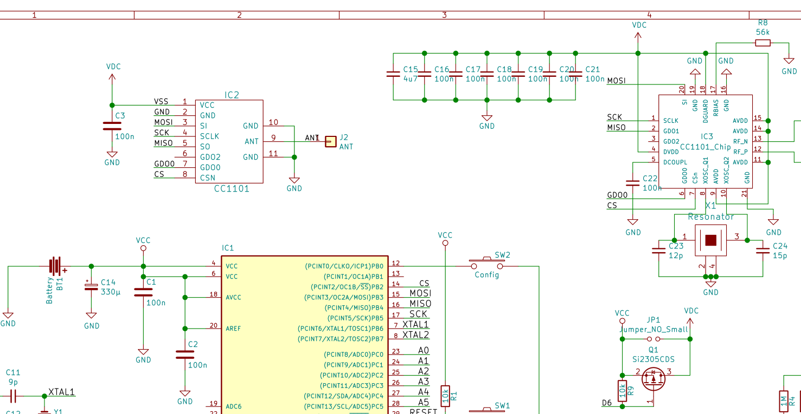
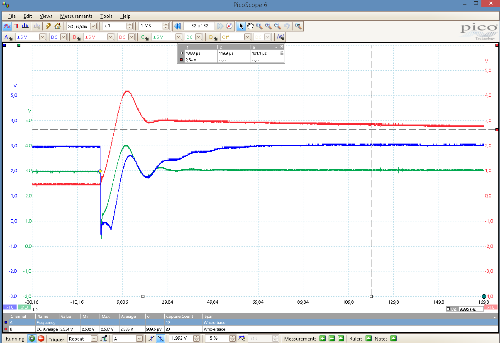
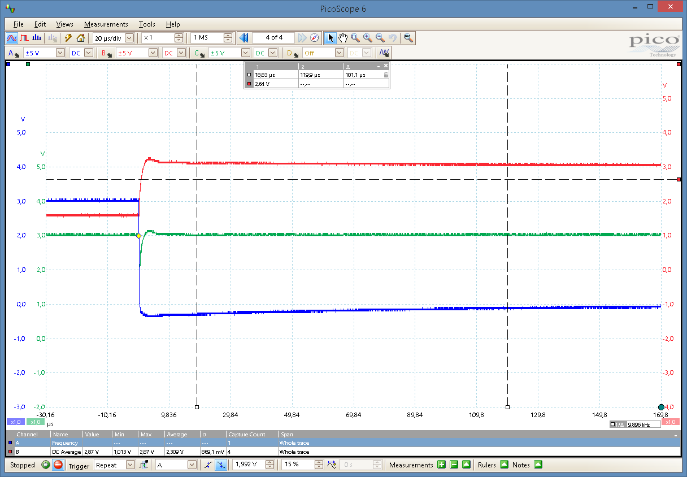
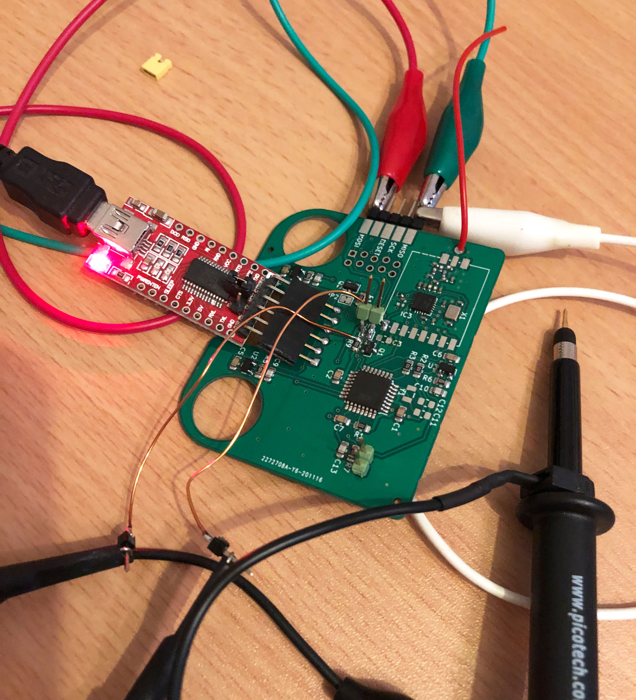

## Abschaltung des CC1101 über Mosfet bei AskSinPP-Geräten

###### Hintergrund

- Ich hatte mich im Januar 2021 mit dem Thema beschäftigt und möchte das hier kurz dokumentieren damit es nicht vergessen wird.

- Hintergrund war das papa in seinem neuem HB-SEC-RHS-3 Design die Abschaltung des CC1101 über einen Mosfet vorgesehen hatte, bei jedem Zuschalten des CC1101 war jedoch leider ein AVR Reset zu beobachten. Ich habe darauf hin ein paar Messungen und Experimente für papa durchgeführt. Außerdem designt Stefan gerade die STM32L151-RF Platine, bei der auch der CC1101 abschaltbar gemacht werden soll (Stand 03/2021).

- Schaltungsauszug der hier relevanten Teile des HB-SEC-RHS-3 Designs:

###### Messungen

- In den Bildern sind die Kanäle des Oszi folgendermaßen belegt:
  - Ch1 Blau: D6 (Mosfet On/Off Steuerung)
  - Ch2 Rot: VDC
  - Ch3 Grün: VCC

- Dies war meine erste Messung in dem Moment wenn der CC1101 eingeschaltet werden sollte. Irgendwie glaubte ich zunächst der Mosfet verursacht einen hohen Strom weil er ein Defekt am Gate hat o.ä. und habe den darauf gegen einen Si2365 von mir getauscht. Das brachte aber gar nichts.

- Danach nochmal die Schaltung und Platine studiert und dann habe ich es gesehen. Der Pufferelko an der Batterie, C14 war nicht bestückt dafür wird aber C15 durch Q1 geschaltet. Man sieht gut im grünen Graph wie das VCC für ein paar us runterzieht was zu einem Reset führt.

- Dann habe ich für C14 testweise 47uF eingeführt und C15 sowie C3 entfernt, dabei ist C15 natürlich der Haupttäter wegen seinem Wert.
Das ergibt dann das folgende Verhalten und der Code im Sketch nach dem Einschalten des CC1101 läuft durch. Man sieht auch da noch einen kleinen Spike auf VCC, aber der tut nichts mehr.

###### Empfehlung

- Für ein Konzept mit CC1101 Abschaltung sollte man keine großen Kondensatoren in der An/Abschaltung drin haben, wie zu sehen ist, außerdem kostet das jedes mal extra Energie. Der 4,7u an sich ist schon ok, aber macht ihn an Source von Q1, nicht an Drain. Ein paar 100n am CC1101 sind ok.

- Um es noch mal deutlich zu sagen, wenn man z.B. 5x100nF hinter dem Mosfet-Schalter hat würde ich z.B. das 10fache direkt vor dem Schalter machen, also an Source, so nahe wie möglich.

- Weiterhin, wenn der CC1101 abschaltet wird und der AVR in den Deep sleep geht sollten alle SPI Pins inkl. /CS sowie GDO0 entweder hochohmig oder low sind, sonst ist das a) ein unerlaubter Zustand für den CC1101 und b) wird vermutlich extra Ruhestrom kosten.

###### Fazit

Prinzipiell finde ich das Abschalten ein nettes Feature um flexibler zu sein, auch wenn die Strom-Einsparung nicht groß ist. 
Nur wegen dem Ruhestrom wird es nicht viel ausmachen, laut Datenblatt 0,2 oder 0,5uA, je nach CC1101 Sleep Mode den man verwendet. 

Ich sehe aber das Potential, einen  Babbling Idiot (BI) damit zu verhindern, wenn man [hier](https://github.com/TomMajor/SmartHome/tree/master/Info/Babbling%20Idiot%20Protection#update-april-2020) den Abschnitt von Jeromes BI ließt wird genau dieser BI verhindert werden da der AVR im Reset den D6 Pin nicht mehr auf Low halten kann. 
Gerade bei schwachen Batterien wie der CR2032 könnte das interessant sein. 

Der "große" Kondensator auf fertigen CC1101 Modulen hat nach meinen Messungen ca. 3,3uF. 
Wahrscheinlich reichen dann z.B. auch 10uF am Mosfet, wichtig ist dass der Einschaltstrom genau aus diesem C genommen wird und nicht woanders her, deswegen muss der direkt am Source Pin sitzen, im Pfad, also Vcc -> C -> Source-Pin.

###### Links

[HomeMatic Forum: Abschaltung des CC1101 über Mosfet bei AskSinPP-Geräten](https://homematic-forum.de/forum/viewtopic.php?f=76&t=66483)
