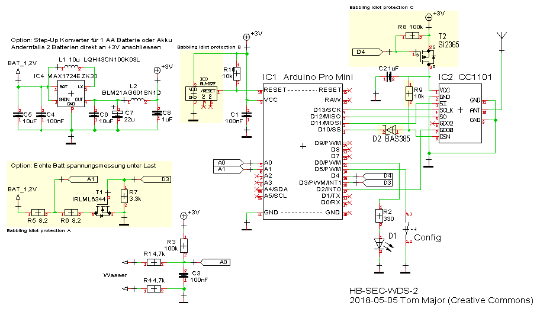

# Schutz vor "Babbling Idiot" (BI)

Auf dieser Seite sollen Lösungen zum Schutz gegen einen "Babbling Idiot" im Homematic Netzwerk bei Selbstbaugeräten vorgestellt werden. 
Ein "Babbling Idiot", im folgenden mit **BI** abgekürzt, ist hier ein Dauersender, der das Funknetzwerk lahmgelegt, da die anderen Teilnehmer durch den Störsender nicht mehr miteinander kommunizieren können.

Beim Homematic Funknetzwerk kann ein BI wegen der 1% Regel sehr schnell das ganze System über Stunden lahmlegen.

#### Problem

Der Auslöser der Überlegungen hier war der Post von jp112sdl im FHEM Forum über die "Stilllegung" seines Homematic Netzwerkes im Haus:

> *Hat schon mal jemand das Phänomen beobachtet, dass ein Arduino/CC1101 auf Dauersendung war? 
> Ist mir nun schon ein zweites Mal passiert...  :-[ 
> In der ganzen Bude ging nix (Funkgesteuertes) mehr. 
Hab zum Glück nen SDR und konnte den Störer schnell ausfindig machen. 
Ein nachgebauter WDS 10 TH O. 
Die CCU sagte mir "Kommunikationsstörung" zu so ziemlich allen meinen Geräten.*

[[Quelle: FHEM Forum, Antw: AskSin++ Library]](https://forum.fhem.de/index.php/topic,57486.msg783197.html#msg783197)

#### Ein weiteres Beispiel:

> *Mich hat jemand angeschrieben, der das 8fach-DS18B20 Projekt nachgebaut hat und - oh Wunder - bei leerer Batterie einen BI hatte! : 
Du sag mal, wenn der Temperatursensor leer wird, also die Batterien zu schwach sind, warum geht dann hier keine Funkfernbedienung mehr?*

[Quelle: Projekt 8fach-DS18B20, Info über Private Nachricht erhalten]

#### Noch ein Beispiel:

> *Re: schlagartig Kommunikationsstörungen 
Schließlich habe ich die Ursache gefunden: Ein einziger Sensor HM-SCI-3-FM hat den Funkverkehr weitgehend lahmgelegt. Ob nur die Batterie entladen ist oder der Sensor defekt muss ich noch untersuchen. 
Auf die Spur hat mich CCU-Historian gebracht, der bei mir auch alle (Alchy-)Systemnachrichten mitschreibt. Der betroffenen Sensor ist in den letzten Wochen auffällig oft genannt worden, so habe ich ihn kurzerhand durch Batterieentzug stillgelegt. Jetzt ist wieder Ruhe ... bis zum nächsten mal.*

[[Quelle: homematic-forum, schlagartig Kommunikationsstörungen]](https://homematic-forum.de/forum/viewtopic.php?f=65&t=43150)

#### Und noch ein Beispiel:

> Jetzt hab' ich tatsächlich exakt das vom Themenersteller beschriebene Problem - allerdings leider bislang ohne Lösung. 
Meine Zentrale zeigt zwischen 60 und 120 Servicemeldungen an, und selbst Direktverknüpfungen funktionieren nur noch, wenn man den Sender wenige Zentimenter nah an den Empfänger bringt. 
Das Problem lässt sich leider nicht auf einen einzelnen Raum oder einen Bereich des Hauses eingrenzen, sondern betrifft die gesamte Installation, die übrigens seit sieben Jahren läuft und ein solches Fehlerbild noch nie produziert hat.

> So, hab' das Problem nun identifiziert: Ein Wandthermostat war auf dem Weg zu einer leeren Batterie und hat irgendwie noch aus dem letzten Loch gepfiffen und gemeint, die Umwelt mit Störsignalen verpesten zu müssen. Batterien raus und neue rein - der Spuk hat ein Ende!

[[Quelle: homematic-forum, Störsender innerhalb des Homematic System]](https://homematic-forum.de/forum/viewtopic.php?p=442442#p442442)

#### BI bei Wikipedia

> Ein Babbling Idiot ist ein Knoten eines Netzwerks, der die Kommunikation durch Fehlverhalten stört. Dies kann durch das Senden von Nachrichten zu willkürlichen, nicht mit dem Netzwerk synchronisierten Zeitpunkten oder durch fehlerhaften Inhalt von Nachrichten hervorgerufen werden. 
Er kann somit die Knoten stören, die ihre Nachrichten synchron mit dem Netzwerk übertragen. Als Folge kann es zu Fehlkommunikation bis hin zu einem vollständigen Kommunikationsverlust im Netzwerk kommen. Um dem vorzubeugen, kann beispielsweise jeder Netzwerkteilnehmer einen sogenannten Buswächter (Bus Guardian) besitzen. Dieser stellt sicher, dass der Netzwerkteilnehmer nur innerhalb seines statisch zugewiesenen Zeitslots sendet.
 

[[Quelle: Wikipedia - Babbling Idiot]](https://de.wikipedia.org/wiki/Babbling_idiot) 

#### Maßnahmen

jp112sdl und ich haben uns im Frühjahr 2018 etwas intensiver zu dem Thema ausgetauscht und Lösungen entwickelt.

Ich stelle hier 3 Maßnahmen vor, um sich vor diesem Effekt zu schützen, anhand meines Beispiels für den Wassermelder 
[HB-SEC-WDS-2](https://github.com/TomMajor/AskSinPP_Examples/tree/master/HB-SEC-WDS-2)

Der BI könnte entstehen, wenn beim Senden die Batteriespannung so weit zusammenbricht, das ein normaler Programmablauf nicht mehr gegeben ist, dadurch der angefangene Sendevorgang nicht abgeschlossen werden kann, die Spannung aber noch für den Betrieb der Sendeendstufe im CC1101 reicht.  Dieser Zustand ist kritisch und soll mit den hier gezeigten Maßnahmen vermieden werden.

Ich möchte außerdem anmerken dass die Störung des Programmablaufes beim Senden nicht nur durch den AVR entstehen kann sondern wahrscheinlich auch durch den CC1101 selbst. Dieser hat ebenso einen Mikrocontroller mit Firmware integriert, die beim Senden aufgrund des Spannungseinbruchs genau so wie der AVR abstürzen könnte. 
Ob ein BI also im AVR oder CC1101 entsteht kann nur durch Messung im Falle des Falles am Gerät bewiesen werden, wegen der Reproduzierbarkeit ein schwieriges Unterfangen.

### Schaltung A

Aus meiner Sicht würde es sehr helfen, eine echte Messung des Batteriezustands unter Last zu haben, um frühzeitig leere Batterien zu erkennen und zu tauschen. Bekanntermaßen sagt eine Spannungsmessung an unbelasteter Batterie, je nach Batterie- bzw. Akkutyp, nicht viel über den Ladezustand aus. 
Die Schaltung belastet die Batterie bzw. den Akku für einige Hundert Millisekunden und misst dabei die Spannung.
Dies führt meiner Meinung nach zu realistischeren Werten über den Batteriezustand als eine asynchrone und unbelastete Messung, wie z.B. in der Standard-Initialisierung
`hal.battery.init(seconds2ticks(3600)` 
Mit Schaltung A wird der 1,2V Akku mit ca. 75mA für die kurze Zeit der Messung belastet. Anpassungen an andere Spannungen und Ströme sind natürlich leicht über die Widerstände R5/R6 möglich.  
Das Bild zeigt den Einbruch der Batteriespannung wenn für 200ms mit 75mA belastet wird. Die Spannung bricht um 142mV ein und wird am Ende der 200ms gemessen. Aus meiner Sicht führt dies zu einer viel besseren Information über den Batteriezustand. 

### Schaltung B

Am AVR wird ein Reset-Baustein zur Spannungsüberwachung (MCP111 oder BU48xx) angeschlossen. Fällt die Spannung unter den Schwellwert wird das RESET Signal für den AVR aktiv. Falls der AVR der Verursacher des BI ist wird er damit ruhig gestellt. 
 Anmerkung: 
Alternativ zum externen Reset-Baustein kann man auch die interne Brown-Out Detection (BOD) des AVR mit der 2,7V oder 1,8V Schwelle verwenden. Allerdings hebt diese den Strom im Sleep von ca. 4uA um 18uA auf ca. 22uA (@3V) an. 
Die angesprochenen externen Reset-Bausteine haben eine Stromaufnahme um 1uA, deswegen verwende ich die wesentlich lieber. 
Außerdem muß man bei Verwendung der internen BOD beachten dass diese per Software deaktiviert werden kann. Dies ist generell ein Verlust an Sicherheit, außerdem deaktiviert die verwendete Low-Power Library in ihren Standardeinstellungen den BOD um Strom zu sparen.
Aus diesen Gründen empfehle ich einen externen Reset-Baustein.

### Schaltung C

Diese Maßnahme setzt Schaltung B voraus. Fällt die Spannung unter den Schwellwert wird das RESET Signal für den AVR aktiv. Dadurch werden intern beim AVR alle I/O auf Input Mode gesetzt. Der Ausgang D4 kann dadurch keinesfalls mehr den P-Kanal Mosfet T2 schalten, als Resultat wird der CC1101 von der Spannung abgeklemmt und ruhig gestellt. 
Diese Maßnahme verwendet man am Besten wenn sicher ist dass der CC1101 und nicht der AVR bei Einbruch der Batteriespannung zum BI wird bzw. wenn man alle Fälle abdecken möchte.

### Fazit

Im momentanen Stadium der Prototypen verwende ich die Maßnahmen A und B, die die Sicherheit vor dem BI Zustand meines Erachtens deutlich erhöhen. 
Maßnahme C würde da noch mal eins drauf setzen und den CC1101 ebenfalls abschalten.
