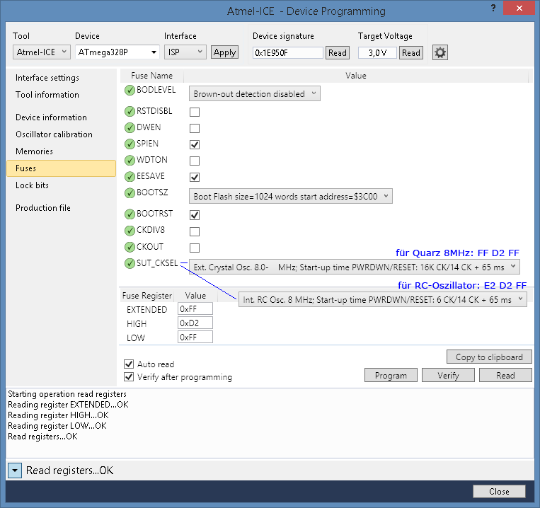
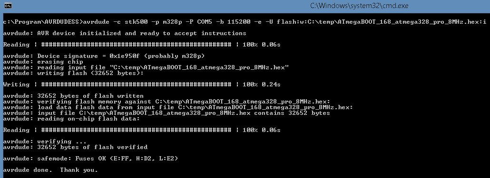
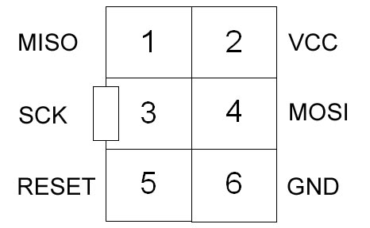

# Bootloader/Fuses/Flashen

## Standard Bootloader ATmega328P RC-Oszillator oder Quarz 8MHz

- für RC-Oszillator oder Quarz 8MHz verwendbar, der Unterschied zwischen RC-Oszillator und Quarz steckt nur in der Fuse SUT_CKSEL, siehe Bild unten
- Standard ATmega328P Bootloader (ATmegaBOOT), 8MHz: 
  *ATmegaBOOT_168_atmega328_pro_8MHz.hex*
- mit früher Watchdog-Abschaltung, damit kann man in eigenen Sketchen den WD-Reset nutzen: 
  *ATmegaBOOT_168_atmega328_pro_8MHz_wdt.hex*
- in einem ProMini 8MHz aus China enthaltener Bootloader: 
  *ProMiniChina8MHz_OriginalBootloader.hex*

-> [ATmega328P Bootloader (RC-Oszillator oder Quarz 8MHz)](https://github.com/TomMajor/SmartHome/tree/master/Info/Bootloader/mega328_RC-Osc_or_Quarz)

## Bootloader ATmega328P RC-Oszillator mit Kalibrierung

- Kalibrierung der RC-Oszillatorfrequenz für erhöhte Genauigkeitsanforderungen ohne Verwendung eines Quarzes
- Bootloader für RC-Oszillator mit Auslesen der Frequenzkalibrierung aus dem EEPROM
- der Wert für die Frequenzkalibrierung kann vorher mit dem Sketch OSCCAL ermittelt und in den EEPROM geschrieben werden

-> [ATmega328P Bootloader (RC-Oszillator mit Kalibrierung)](https://github.com/TomMajor/SmartHome/tree/master/Info/Bootloader/mega328_RC-Osc_with_Calibration)

## Bootloader ATmega1284P RC-Oszillator oder Quarz 8MHz

- Standard ATmega1284P Bootloader, 8MHz, für HB-DIS-EP-42BW

-> [ATmega1284P Bootloader (RC-Oszillator oder Quarz 8MHz)](https://github.com/TomMajor/SmartHome/tree/master/Info/Bootloader/mega1284_RC-Osc_or_Quarz)

## Atmel AVR Fuse Calculator

[Engbedded Atmel AVR® Fuse Calculator](http://www.engbedded.com/fusecalc/)

## Beispiele für avrdude Kommandos

###### Fuses lesen
    avrdude -c stk500 -p m328p -P COM5 -b 115200 -U lfuse:r:lowfuse.hex:h -U hfuse:r:highfuse.hex:h -U efuse:r:extfuse.hex:h

###### Fuses schreiben
    avrdude -c stk500 -p m328p -P COM5 -b 115200 -U lfuse:w:0xE2:m -U hfuse:w:0xD2:m -U efuse:w:0xFF:m

###### Flashspeicher lesen
    avrdude -c stk500 -p m328p -P COM5 -b 115200 -U flash:r:readtest.hex:i

###### Bootloader/Flashspeicher schreiben
    avrdude -c stk500 -p m328p -P COM5 -b 115200 -e -U flash:w:C:\temp\ATmegaBOOT_168_atmega328_pro_8MHz.hex:i

 

## Pinbelegung AVR ISP 6-polig

 
