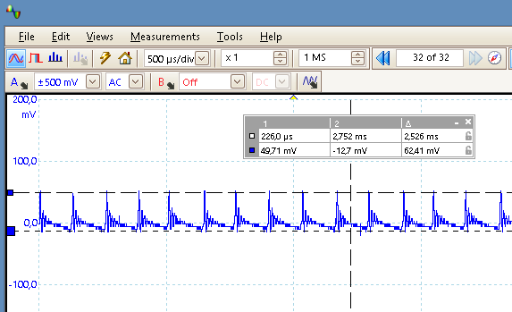

# Step-Up Konverter zum Betrieb mit 1 Mignon AA Batterie oder Akku

## Testaufbau und Messungen

MAX1724 Testaufbau, entscheidend hier sind die Eignung der Spule für den DC/DC Einsatz (DC-Nennstrom, DC-Widerstand, Güte), das Layout der Bauteile und natürlich kurze Signalwege:

Ausgangsspannung AC-Messung, +3V @5mA, Restwelligkeit mit 10uF Keramikkondensator am Ausgang:

Ausgangsspannung AC-Messung, +3V @5mA, Restwelligkeit mit 10uF Keramikkondensator + 20uF Tantalelko am Ausgang:

Ausgangsspannung DC-Messung:

## Lizenz

**Creative Commons BY-NC-SA** 
Give Credit, NonCommercial, ShareAlike

 This work is licensed under a <a rel="license" href="http://creativecommons.org/licenses/by-nc-sa/4.0/">Creative Commons Attribution-NonCommercial-ShareAlike 4.0 International License</a>.
