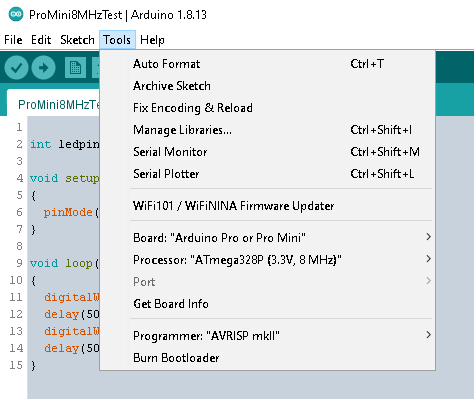
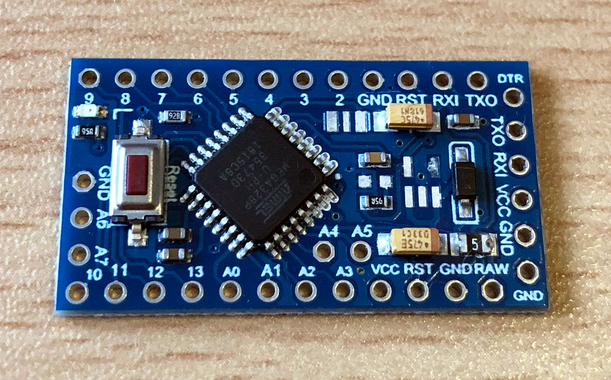

# ProMini8MHzTest

- Neulich bei AilExpress einen Arduino Pro Mini 8MHz/3,3V bestellt. Leider wurde dann aber ein 16MHz/5V geliefert der für AskSinPP-Projekte ohne Modifikationen nicht geeignet ist.

## Test eines Arduino Pro Mini auf 8MHz/16MHz

- In der Arduino IDE als Board den "Arduino Pro oder Pro Mini" mit Prozessor "ATmega328P (3.3V/8MHz)" einstellen.
- den Sketch ProMini8MHzTest.ino flashen.
- blinkt die LED auf dem Pro Mini mit 1Hz, ist es ein 8MHz Board. Blinkt sie hingegen mit 2Hz ist es ein 16MHz Board.

## So gelingt der "Umbau" eines 16MHz Boards auf 8MHz für AskSinPP

1. (Optional) LDO und Power-LED wegen [Ruhestrom](https://github.com/TomMajor/SmartHome/tree/master/Info/Ruhestrom) entfernen.
2. in den AVR Fuses den Takt auf 8MHz RC-Oszillator intern umstellen.
3. in den AVR Fuses die [Brown-Out-Detection (BOD)](https://asksinpp.de/Grundlagen/FAQ/babbling_idiot.html) deaktivieren.
4. 8MHz kompatiblen [Bootloader](https://github.com/TomMajor/SmartHome/tree/master/Info/Bootloader) flashen -> ATmegaBOOT_168_atmega328_pro_8MHz.hex
5. (Optional) den "falschen" 16MHz Resonator entfernen um das Board eindeutig als mit RC-Oszillator intern zu kennzeichnen - aber erst nachdem in Schritt 2. auf RC-Oszillator intern umgestellt wurde!

Für die Schritte 2. bis 4. braucht man einen AVR-ISP Programmer, z.B. Diamex o.ä.

Das Board sollte danach nur mit 3V bzw. 3,3V betrieben werden.

