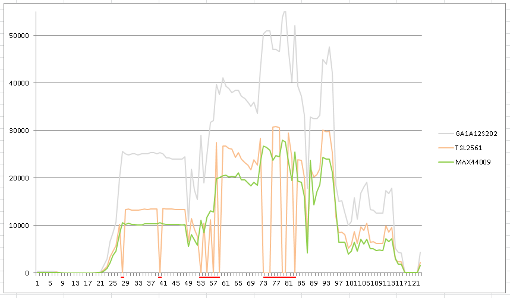
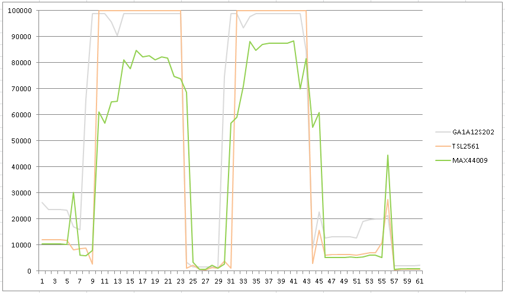
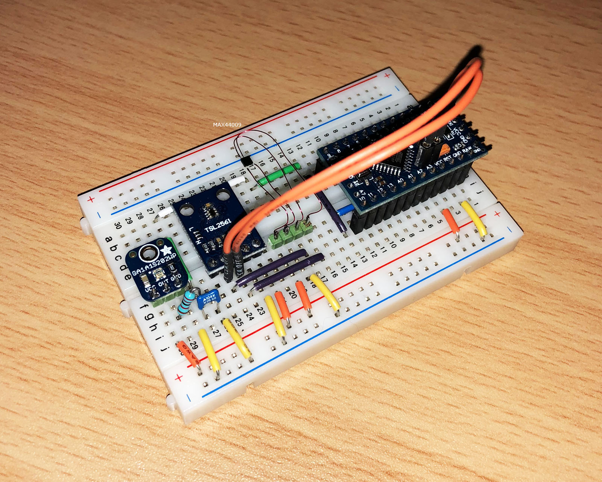

## SensorTest_Lux

- Erster Test der digitalen Helligkeitssensoren TSL2561 und MAX44009 gegeneinander, der analoge Sensor GA1A12S202 läuft außer Konkurrenz mit.
Messung war 18:30 abends, also noch keine maximalen Helligkeit.
- Der TSL2561 hat ein Problem bei hoher Helligkeit in der Sonne. Meine Sensorklasse gibt dann -1 zurück, ich habe die Stellen rot markiert.
Dies tritt in etwa bei ca. 30000 Lux auf, wie man im Diagramm sieht kann es aber auch bei geringerer Helligkeit passieren. Eine Auto-ranging-Funktion, die zwischen verschiedenen Integrationszeiten umschalten kann, ist in meiner TSL2561-Klasse aktiv.

 
- Zweiter Test 15 Uhr bei klarem Himmel und hoher Helligkeit (Maximum bei knapp 90000 Lux). Ich habe die Auto-ranging-Funktion in der TSL2561-Klasse noch mal angepasst und verifiziert. Diese Funktion schaltet die Integrationszeit des TSL2561 in den 3 Stufen 402ms/101ms/13ms runter, um bei Überlauf eventuell trotzdem noch gültige Werte zu bekommen. Außerdem gibt die Messfunktion jetzt 99999 Lux bei Überlauf zurück, um ein SmartHome-System nicht über die hohe Helligkeit im Unklaren zu lassen :)
- Dennoch ist der TSL2561 absolut ungeeignet für hohe Helligkeit. Eine Folie zur Helligkeitsfilterung würde helfen, allerdings verliert man dann den direkten Messwert in Lux.
- Ich werde in Zukunft den MAX44009 gegenüber dem TSL2561 bevorzugen. Der MAX hat eine interne Auto-ranging-Funktion und liefert direkt einen digitalen Lux-Wert zurück, so dass man nicht mit den TSL Lux-Näherungsformeln hantieren muss. Weiterhin übersteuert der MAX44009 in meinen bisherigen Tests nicht.

 
Messaufbau

