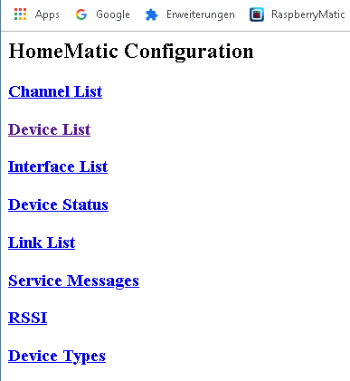
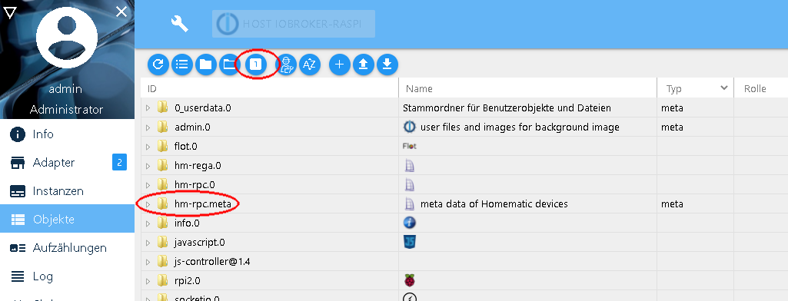

# HomeMatic / RaspberryMatic / ioBroker - Skripte und Lösungen


## Wiederherstellung der alten, nicht-alphabetische Menureihenfolge ab RaspberryMatic Ver. 3.47.18.20190918

- Die Datei [color.map](https://github.com/TomMajor/SmartHome/tree/master/Info/Skripte_und_Loesungen/Files/color.map) nach /usr/local/etc/config kopieren und die Permissions 0644 dafür setzen.
- danach den Browsercache löschen.
- Referenzen:<br>
[706](https://github.com/jens-maus/RaspberryMatic/issues/706)<br>
[709](https://github.com/jens-maus/RaspberryMatic/pull/709)<br>


## "No internet connection detected" - Überwachung deaktivieren 

- Die Überwachung der Internetverbindung mittels monit hat in RaspberryMatic ab Version 3.45.5.20190330 Einzug gehalten.
- mein Router wird nachts automatisch ausgeschaltet, deswegen kann ich den dadurch entstehenen Alarm gar nicht brauchen da er unter Umständen andere und wichtigere Alarme auf meinem ePaper Display "überdeckt" (Anzahl der Servicemeldungen und Alarme als Dezimalzahlen unten rechts) [HB-Dis-EP-42BW](https://github.com/TomMajor/SmartHome/tree/master/HB-Dis-EP-42BW)

#### ab RaspberryMatic Ver. 3.47.18.20190918

- Eine leere Datei /usr/local/etc/config/internetCheckDisabled anlegen und die Permissions 0644 dafür setzen.
- Die Änderung wird sofort wirksam.


#### vor RaspberryMatic Ver. 3.47.18.20190918

- ich habe mich mit dem Skript unten beholfen (gleichzeitig wird die Startzeit der Zentrale in eine Systemvariable CCU.StartTime geschrieben).
- CUxD/CMD_EXEC wie in den Bsp. braucht man dabei nicht zwingend. Man kann das auch mit system.Exec() aufrufen.
- Meine Versuche davor, den monit Befehl mittels Bootskript in /usr/local/etc/config/rc.d zu erledigen waren nicht erfolgreich, monit läuft zu diesem Zeitpunkt noch nicht, deswegen ein HomeMatic-Skript.
- Die Auslösebedingung für das Skript muss leer gelassen werden!
- Der monit Parameter hieß zuerst *hasInternet*, jetzt *internetCheck*
```
! -------------------------------------
! CCU.OnStart.hms
!
! Beim Reboot der CCU2 wird jedes Programm ausgeführt, das keine Bedingung hat.
! Ist gleichzeitig das Objekt "$src$" nicht definiert, handelt es sich sicher um einen Reboot und keinen z. B. manuellen Programmaufruf.
! Systemvariable CCU.StartTime muss existieren
!
object src = dom.GetObject("$src$");
if (!src) {
    string timeStr = system.Date("%d.%m.%Y %H:%M:%S");
    dom.GetObject("CCU.StartTime").State(timeStr);
    dom.GetObject("CUxD.CUX2801001:1.CMD_EXEC").State("monit unmonitor internetCheck");
}
```


## Verstecktes Config-Tool dauerhaft zum Systemsteuerungs-Menu hinzufügen

- SSH Konsole öffnen und folgendes Kommando ausführen:<br>
``` echo CP_DEVCONFIG=1 >> /etc/config/tweaks ```




- Um z.B. die in der CCU vorhandene Konfiguration neu an ein Gerät zu übertragen:<br>
``` DevConfig -> Device List -> Gerät anklicken -> MAINTENANCE -> Restore Config ```
- Um eine Konfiguration an ein nicht dauerhaft empfangsbereites Gerät zu übertragen (Fernbedienung, Sensor usw.) ist zuerst der Anlernmodus des Gerätes zu aktivieren und danach *Restore Config* auszuwählen.
- Referenzen:<br>
[HomeMatic-Forum](https://homematic-forum.de/forum/viewtopic.php?f=31&t=26624)<br>


## ioBroker zeigt bestimmte Datenpunkte eines Sensors nicht an

- Dies kann zum Beispiel passieren wenn ein Homebrew-Sensor ein Update für neue Datenpunkte bekommen hat. Nach meinen Erfahrungen bekommt der ioBroker nie automatisch eine geänderte Sensordaten-Konfiguration mit.

- Mögliche Lösungen:

1. Zunächst immer den Sensor in der Zentrale ablernen und neu anlernen.

2. Dann den fraglichen Sensor unter ioBroker/Objekte innerhalb von hm-rpc.meta löschen.<br>
Falls hm-rpc.meta nicht sichtbar ist, den Button oben "Wechseln Sie in die Statusansicht" (Viereck mit einer 1 drin) ggf. mehrmals umschalten.



3. Nach dem Löschen des Sensors in hm-rpc.meta die Geräte neu synchronisieren lassen (ioBroker/Instanzen, hm-rpc.0 konfigurieren, "Geräte neu einlesen" aktivieren).

4. Alternativ kann man versuchen, die fehlenden Datenpunkte mit dem richtigen Namen selber neu anzulegen (nicht getestet, bei mir funktionierte immer die Meta Methode.
