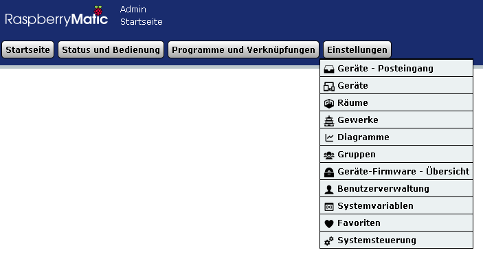
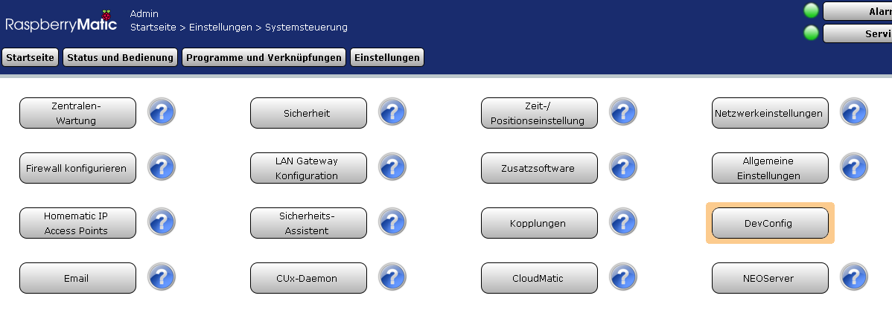
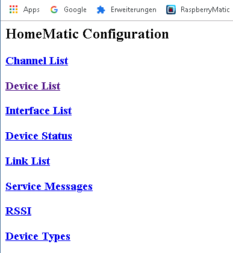

# HomeMatic - Skripte und Lösungen


## Wiederherstellung der alten, nicht-alphabetische Menureihenfolge ab RaspberryMatic Ver. 3.47.18.20190918

- Die Datei [color.map](https://github.com/TomMajor/SmartHome/blob/master/Info/Skripte_und_Loesungen_HomeMatic/Files/color.map) nach /usr/local/etc/config kopieren und die Permissions 0644 dafür setzen.
- danach den Browsercache löschen.
- Referenzen:<br>
[706](https://github.com/OpenCCU/OpenCCU/issues/706)<br>
[709](https://github.com/OpenCCU/OpenCCU/pull/709)<br>




## Verstecktes Config-Tool dauerhaft zum Systemsteuerungs-Menu hinzufügen

- SSH Konsole öffnen und folgendes Kommando ausführen:<br>
``` echo CP_DEVCONFIG=1 >> /etc/config/tweaks ```





- Um z.B. die in der CCU vorhandene Konfiguration neu an ein Gerät zu übertragen:<br>
``` DevConfig -> Device List -> Gerät anklicken -> MAINTENANCE -> Restore Config ```
- Um eine Konfiguration an ein nicht dauerhaft empfangsbereites Gerät zu übertragen (Fernbedienung, Sensor usw.) ist zuerst der Anlernmodus des Gerätes zu aktivieren und danach *Restore Config* auszuwählen.
- Referenzen:<br>
[HomeMatic-Forum](https://homematic-forum.de/forum/viewtopic.php?f=31&t=26624)<br>
