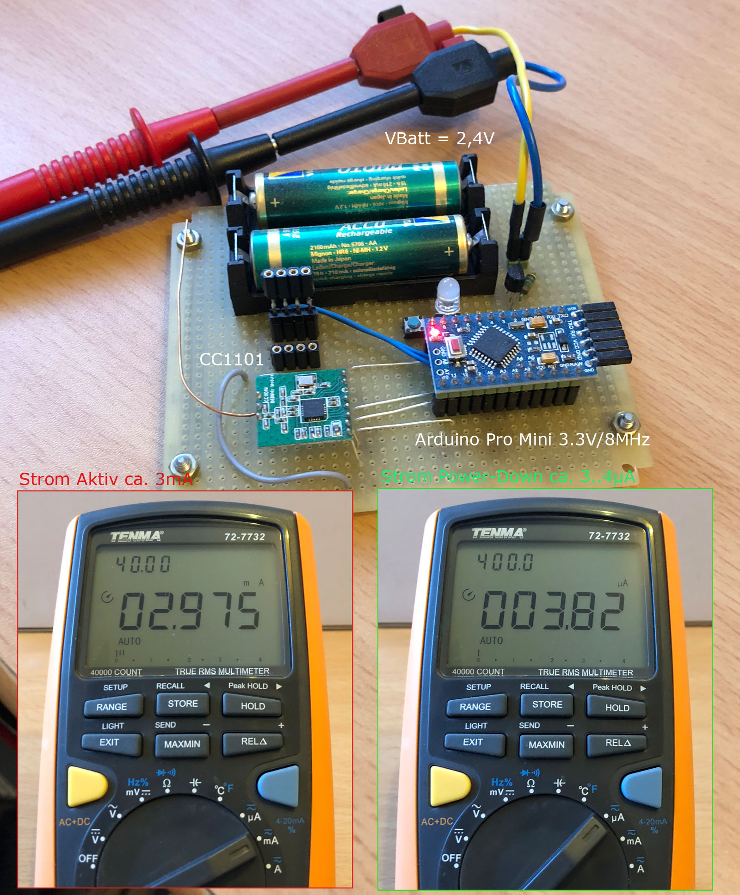

## SleepTest

- Dient zur Überprüfung von Aktiv- und Power-Down-Strom eines Arduino Pro Mini 328 - 3.3V/8MHz mit angeschlossenem CC1101 (das wäre ein Basic HM AskSinPP Gerät ohne angeschlossene Sensoren oder andere Zusatz-HW). Die Ströme sind bei batteriebetriebenen Geräten wichtig für die Batterielebensdauer.

- Der Sketch schickt den CC1101 in den Ruhezustand und schaltet dann aller 8sec zwischen aktivem Zustand und Power-Down-Modus um. Im aktivem Zustand wird außerdem die LED an Pin 13 eingeschaltet.

- Auf dem Arduino Pro Mini sind der Spannungsregler (LDO) sowie die Power-LED sind entfernt.

- Wenn die Fuses richtig gesetzt sind und die Hardware in Ordnung ist müssen sich die gezeigten Ströme in etwa einstellen (ca. 3mA im aktivem Zustand, ca. 4µA im Power-Down-Modus). 
Auf dem für den Test hier verwendeten Board für den HB-UNI-Sensor1 ist der DS18B20 Sensor noch drauf. Dieser hat ca. 0,8µA Stromaufnahme im Standby. Ohne diesen Sensor sollten sich also ca. 3µA im Power-Down-Modus ergeben.

- Die Werte sind bei einer Batteriespannung von 2,4V gemessen. Bei 3V wird der Strom im aktivem Zustand etwas höher sein, der Power-Down-Strom sollte sich kaum ändern.

- Multimeter haben meist einen relativ hohem Innenwiderstand im µA-Messbereich. Auf die µA-Messung sollte man deshalb nur dann kurz umschalten wenn der AVR im Power-Down-Modus ist (LED aus) und vor Ablauf der 8sec wieder zurück auf den mA-Messbereich. Andernfalls wird der AVR im aktivem Zustand eventuell nicht wieder anlaufen, da der Spannungsabfall dann über den µA-Messbereich des Multimeters zu hoch ist.

