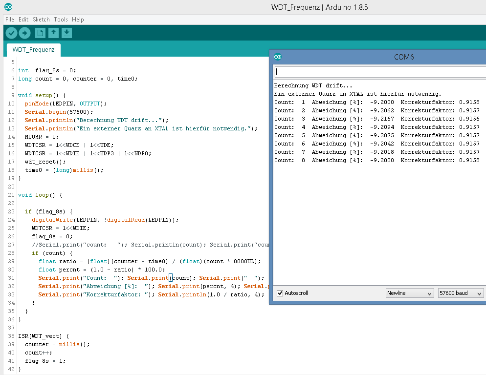

## WDT_Frequenz

- Misst die Abweichung der WDT Frequenz bei einen ATmega328 (bei einer bestimmten Spannung und Temperatur) in Bezug zur Quarzfrequenz. Die WDT Frequenz ist verantwortlich für das sleep timing wenn ein externer MHz Quarz (z.B. Arduino Pro Mini mit 8MHz Quarz) oder der interne 8MHz RC-Oszillator verwendet wird. In der AskSinPP Lib wäre das sysclock.

- Falls ein 32kHz Uhrenquarz zum Einsatz kommt (RTC) ist dieser für das sleep timing zuständig, in diesem Fall braucht man die hier gezeigte Korrektur nicht (in der AskSinPP Lib wäre das rtc).

- Mit der ermittelten Abweichung kann man den Wert für die regelmäsigen Sendeintervalle in der AskSinPP Lib korrigieren, um exaktere Sendezeitpunkte zu erhalten.

- Wenn mit diesem sketch z.B. der Korrekturfaktor 0.916 rauskommt muss man statt  
`seconds2ticks(3600)`
  mit  
`seconds2ticks(3298)`
 
korrigieren um auf ein Intervall von 1h zu kommen.

- Für das Ausmessen muss ein externer Quarz als Referenz angeschlossen sein, der interne 8MHz RC-Oszillator geht nicht als Referenz da er selber ungenau ist.

