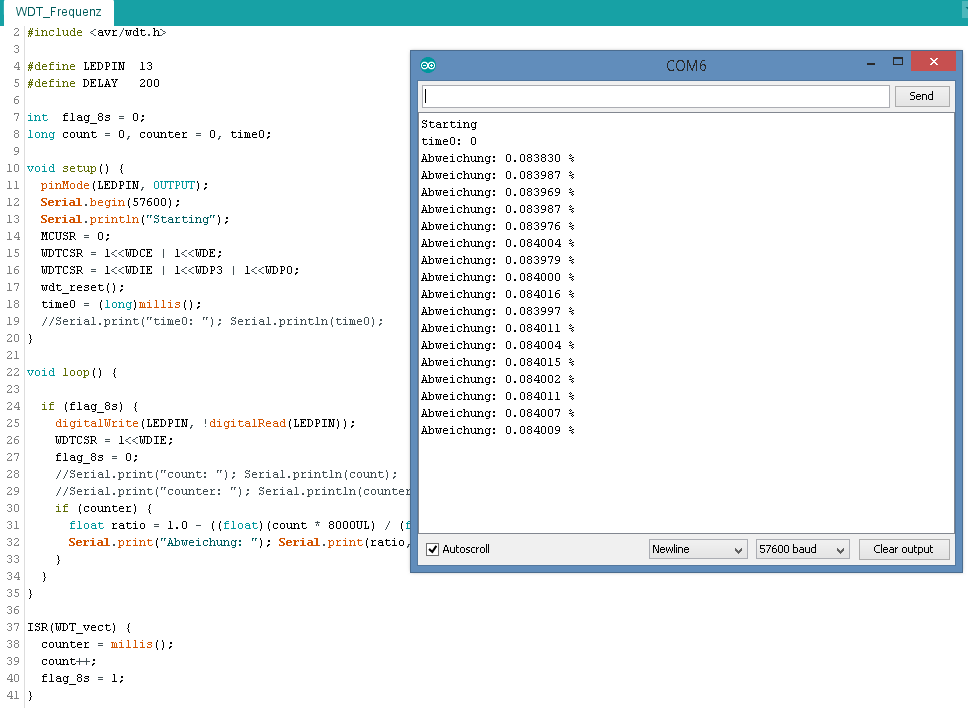

## WDT_Frequenz

- Misst die Abweichung der WDT Frequenz bei einen ATmega328 (bei einer bestimmten Spannung und Temperatur) in Bezug zur Quarzfrequenz.
- mit der ermittelten Abweichung kann man den Wert für die regelmäsigen Sendeintervalle in der AskSinPP Lib korrigieren, um exaktere Sendezeitpunkte zu erhalten, z.B. bei Aufruf von seconds2ticks(60UL*60*24)

