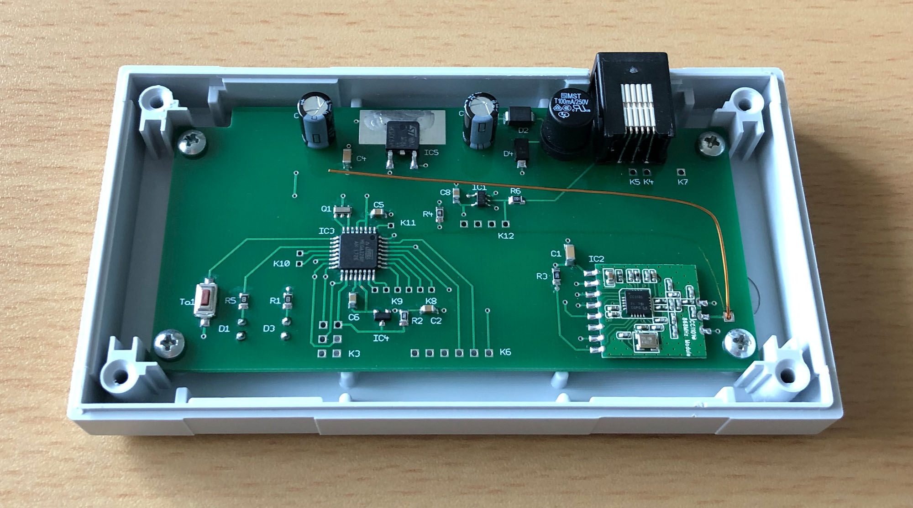
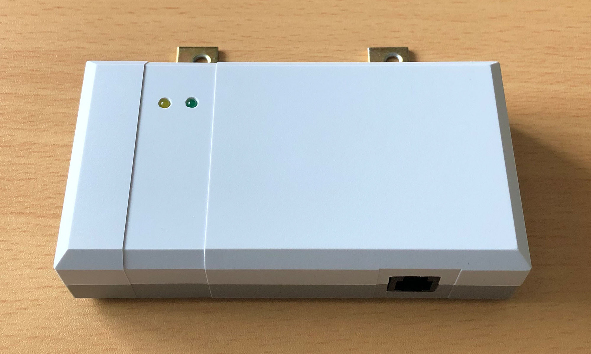

# Platine für den HB-SEN-LJet

- Kopplung der Projet LevelJET Ultraschall-Füllstandsanzeige mit HomeMatic

## Projekt und Software

[HB-SEN-LJet Projekt](https://github.com/TomMajor/SmartHome/tree/master/HB-SEN-LJet)

## Schaltung

[HB-SEN-LJet Schaltung](https://github.com/TomMajor/SmartHome/tree/master/PCB/03_HB-SEN-LJet/Files/HB-SEN-LJet.pdf)

## Hinweise

- :exclamation: Beim Flashen über einen FTDI-Adapter an K6 muss der Daten-Eingang vom LevelJet (K1, pin 6) an +5V oder +3,3V gelegt werden damit seriell geflasht werden kann! (der AVR-Pin PD0/RXD braucht High-Pegel). 
  Der LevelJet selbst muss beim Flashen von der Schaltung getrennt werden!
- Zur Geschichte: Die Füllstandsmessung mit LevelJet lief schon viele Jahre mit RFM69 und jeelink Anbindung an FHEM und sie war in dem unten genannten BOPLA Gehäuse verbaut. 
  Bei der Umstellung des Systems nach HomeMatic habe ich bequemerweise das Gehäuse an der Wand weiterverwendet und nur die Platine dafür neu designed. Ohne diese Randbedingung kann man die Platine natürlich kleiner machen.

## Bilder

## Bauelemente

- alle SMD Widerstände und Kondensatoren haben die Bauform 0805 (außer die 1u und 100u Kondensatoren)

- Gehäuse: BOPLA EG-1230

- Bauelementewerte siehe Schaltplan, keine extra Stückliste vorhanden

## Bestellung der Platine

Wer den Sensor nachbauen möchte, aber noch nie eine Platine bestellt hat:
- Es gibt unzählige Hersteller für Leiterplatten. Früher habe ich oft in Deutschland bestellt, bei Firmen wie Beta Layout und ähnlichen. Seit ein paar Jahren ist die Direktbestellung in China ziemlich unkompliziert und preislich sehr attraktiv geworden, deswegen bestelle ich mittlerweile meistens dort. 
Gute Erfahrungen habe ich z.B. mit JLCPCB gemacht, die Platinen kosten meisten nur ein paar Euro und sind innerhalb von 2-3 Wochen da.
- Die Gerberdateien können direkt beim Anbieter hoch geladen werden und man sieht eine Vorschau wie die Platine aussehen wird.
- Im folgenden Bild sind die Bestellparameter für die HB-SEN-LJet Platine zu sehen:

