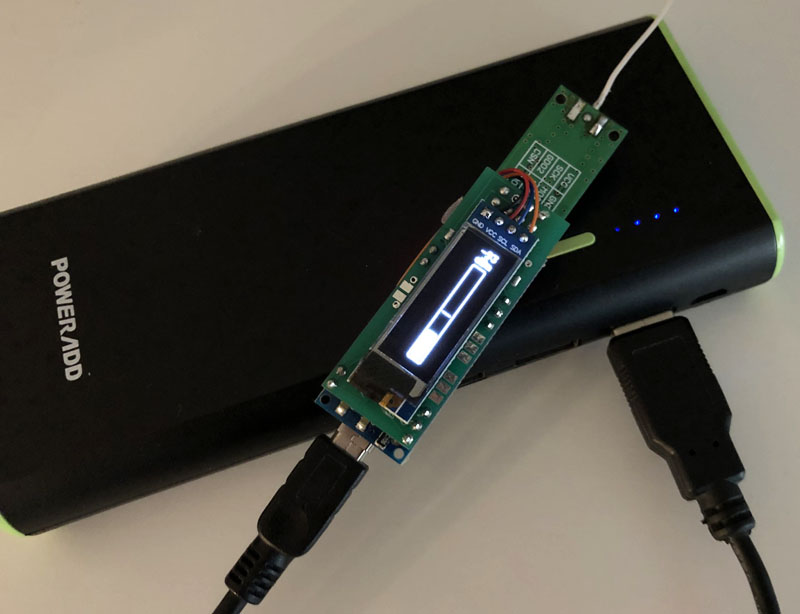
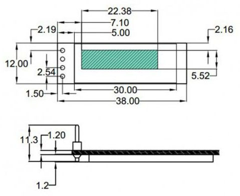

# AskSin Analyzer XS Board

- Ein Board für Christophs [AskSin Analyzer XS](https://homematic-forum.de/forum/viewtopic.php?f=76&t=56395), die Minimalversion des "großen" [AskSinAnalyzer](https://homematic-forum.de/forum/viewtopic.php?f=76&t=51161) - ohne ESP32 und ohne großes Display - zum Betrieb über den USB Port eines Computers.

- Außerdem lässt sich damit die Idee der [868 MHz Wünschelrute](https://homematic-forum.de/forum/viewtopic.php?f=76&t=56881) zur Suche nach einem [Babbling Idiot](https://github.com/TomMajor/SmartHome/tree/master/Info/Babbling%20Idiot%20Protection) (BI) Dauersender realisieren. 
Dabei wird das Gerät von einer USB-Powerbank versorgt und man kann sich damit auf Wanderung im Haus oder Garten begeben um durch die Anzeige der Signalstärke auf einem kleinen OLED-Display das fehlerhaft sendende Gerät - den BI - zu identifizieren.

- Das OLED und die Wünschelruten Funktion sind optional in der Bestückung. 
Außerdem ist für diesen Anwendungsfall eine kleine und individuell konfigurierbare Lastschaltung bestückbar, so dass die Powerbank nicht abschaltet.

- ich habe versucht durch Nutzung von fertig bestückte Boards wie dem Arduino Nano und dem Levelshifter-Board den nötigen Lötaufwand gering zu halten, bei gleichzeitig möglichst sauberen Schaltungsdesign mit 5V/3,3V Levelshiftern.

- Der Arduino Nano sitzt mit ein paar Pins einer Stiftleiste über dem CC1101 und dem Levelshifter-Board, ähnlich wie bei der [tmStamp](https://github.com/TomMajor/SmartHome/tree/master/PCB/tmStamp).

## Bilder

## Schaltplan

[:arrow_right: AskSin Analyzer XS 1.01](https://github.com/TomMajor/SmartHome/tree/master/PCB/AskSin-Analyzer-XS/Files/Analyzer_XS_101.pdf)

## Platine

[:arrow_right: PCB Gerber](Gerber)

**WIP**

## Aufbau / Stückliste

| Anzahl    | Name      | Wert              | Gehäuse       | Bemerkungen |
|---|---|---|---|---|
| - | R1                | (10k)             | (0805)        | nicht bestücken, das Levelshifter-Board hat bereits pull-ups an jedem Kanal |
| 1 | R2                | 1k                | 0805          | |
| 1 | R3                | 3,3k              | 0805          | |
| 1 | R12               | -                 | 0805          | :warning: nicht bestücken (nur falls man IC3 nicht einsetzt und man weiß was man tut) |
| 1 | C1                | 10µ               | 0805          | |
| 1 | C2                | 1µ                | 0805          | |
| 1 | IC1	            | Arduino Nano	    | -             | [Beispiel ebay](https://www.ebay.de/itm/Nano-ATmega328-V3-1-Board-CH340-USB-Chip-Arduino-Kompatibel/252742123829) |
| 1 | IC2	            | CC1101	        | -             | |
| 1 | IC3	            | MCP 1754-3302CB   | SOT23-3       | [Beispiel Reichelt](https://www.reichelt.de/ldo-regler-fest-150ma-3-3-v-sot-23-3-mcp-1754-3302cb-p137296.html) |
| 1 | IC4               | 4-fach I2C Levelshifter | 2x6     | [Beispiel ebay](https://www.ebay.de/itm/162352091615) |
| 1 | LED1	            | gelb	            | 0805          | |
| 1 | D1	            | BAT 54J NXP	    | -             | [Beispiel Reichelt](https://www.reichelt.de/schottkydiode-30-v-0-2-a-sod-323f-bat-54j-nxp-p219408.html) |
| 1 | L1	            | BLM21PG 300	    | 0805          | [Beispiel Reichelt](https://www.reichelt.de/emi-suppression-filter-smd0805-blm21-30-ohm-blm21pg-300-p89685.html) |
|   |                   |                   |               | |
| 2 | R9,R10            | tbd               | 0805          | Optional: Lastschaltung für USB-Powerbank, auf gewünschten Laststrom auslegen |
| 1 | R11               | 4,7k              | 0805          | Optional: Lastschaltung für USB-Powerbank |
| 1 | T3	            | IRLML6344         | SOT23-3       | Optional: Lastschaltung für USB-Powerbank |
|   |                   |                   |               | |
| 4 | K1                | OLED SSD1306 0,91" 128x32 | -     | Optional: BI-Wünschelrute |
| 4 | R5-R8             | 10k               | 0805          | Optional: BI-Wünschelrute |
| 2 | T1,T2             | BSS138            | SOT23-3       | Optional: BI-Wünschelrute |
| 1 | R4                | 3,3k              | 0805          | Optional: BI-Wünschelrute |
| 1 | LED2	            | gelb	            | 0805          | Optional: BI-Wünschelrute |

## Links

[HomeMatic Forum: AskSin Analyzer XS - Der Analyzer als Desktop-App ohne ESP](https://homematic-forum.de/forum/viewtopic.php?f=76&t=56395)

[HomeMatic Forum: AskSinAnalyzer-Sniffer mit Display (BI-Wünschelrute)](https://homematic-forum.de/forum/viewtopic.php?f=76&t=56881)

## Lizenz

**Creative Commons BY-NC-SA** 
Give Credit, NonCommercial, ShareAlike

 This work is licensed under a <a rel="license" href="http://creativecommons.org/licenses/by-nc-sa/4.0/">Creative Commons Attribution-NonCommercial-ShareAlike 4.0 International License</a>.
