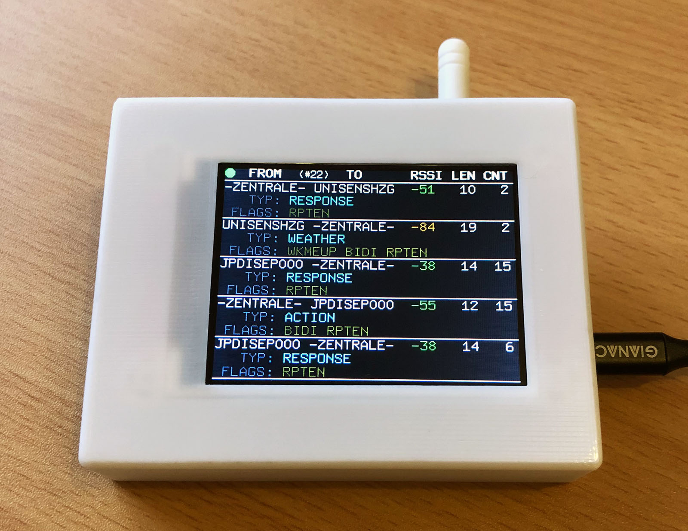
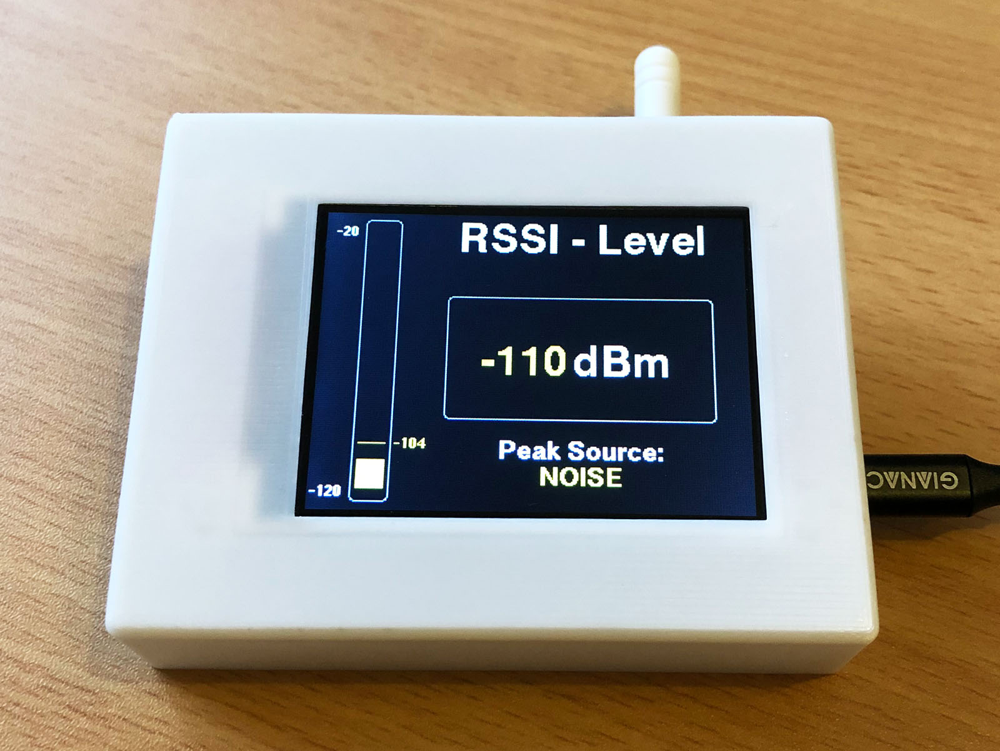
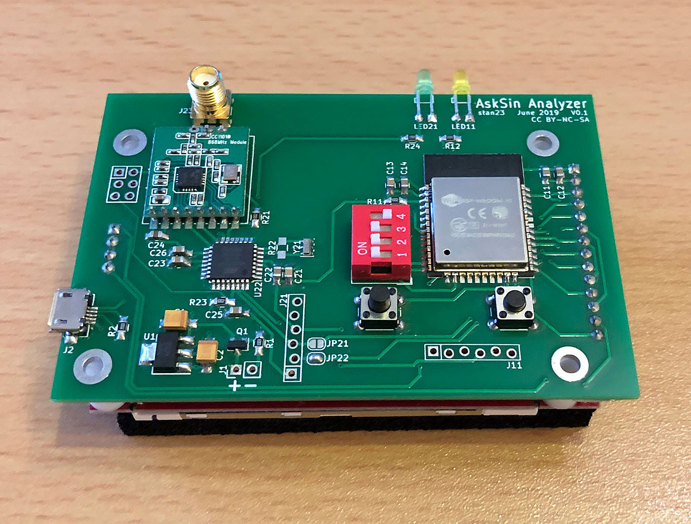
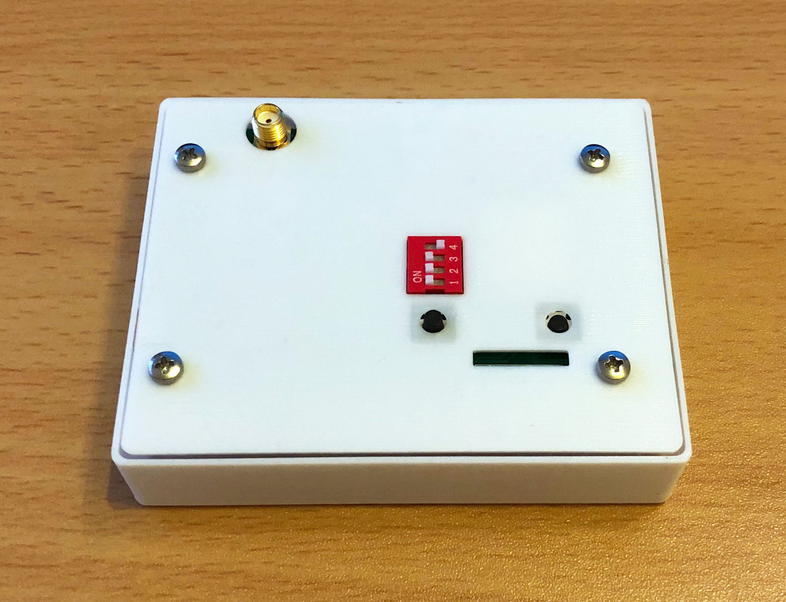
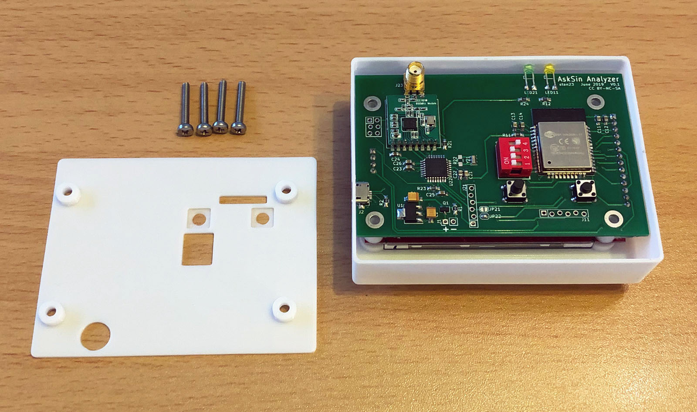
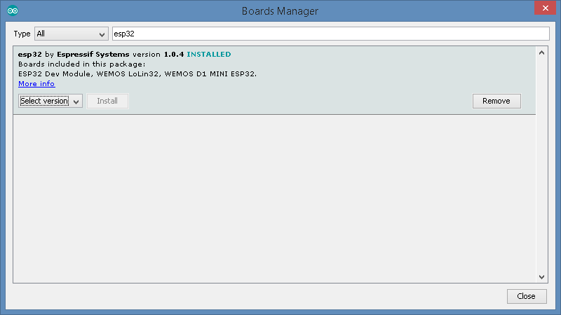
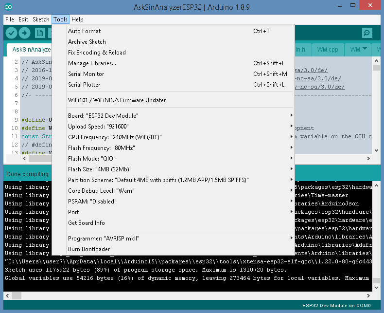
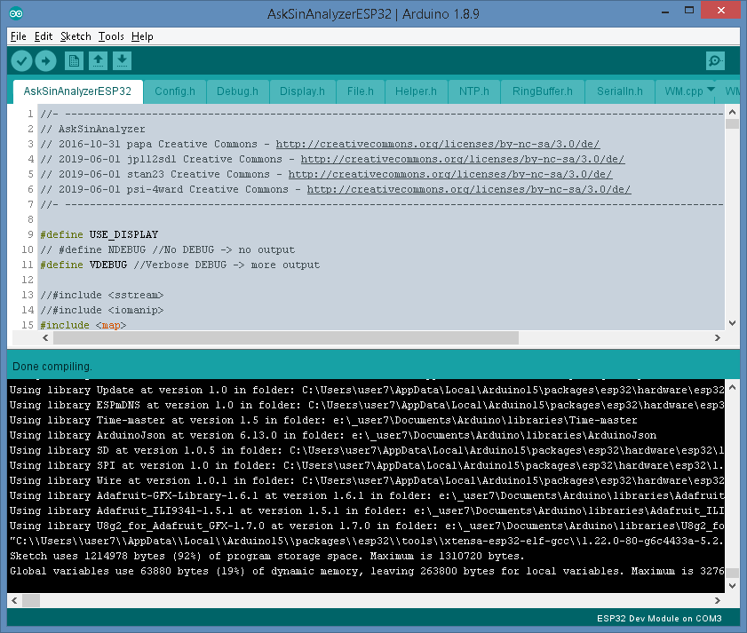

# AskSinAnalyzer Aufbau und Software

- Meine Linksammlung und Hinweise zum Aufbau und Software für den AskSinAnalyzer


## Bilder












## Schaltplan & Platine (Marco)

[:arrow_right: AskSinAnalyzer](https://github.com/TomMajor/SmartHome/tree/master/PCB/AskSin-Analyzer/Files)


## Aufbau (Marco)

[:arrow_right: AskSinAnalyzer](https://github.com/TomMajor/SmartHome/tree/master/PCB/AskSin-Analyzer/Files/Bauanleitung_stan23_V1.pdf)


## Gehäuse (Marco)

[:arrow_right: AskSinAnalyzer Case](https://github.com/TomMajor/SmartHome/tree/master/PCB/AskSin-Analyzer/Files)

[:arrow_right: AskSinAnalyzer Case](https://www.thingiverse.com/thing:3788587)

[:arrow_right: AskSinAnalyzer Case Beschreibung](https://github.com/TomMajor/SmartHome/tree/master/PCB/AskSin-Analyzer/Files/AskSinAnalyzer_Case_stan23_Thingiverse.pdf)


## Software vorbereiten und flashen

###### ATmega328P flashen

- In der Arduino IDE das Board *Pro Mini 328P/8MHz* auswählen

- den Sketch [FreqTest.ino](https://github.com/pa-pa/AskSinPP/tree/master/examples/FreqTest) flashen und damit das CC1101 Modul auf die Frequenz abstimmen

- den Sketch [AskSinSniffer328P.ino](https://github.com/jp112sdl/AskSinAnalyzer/tree/master/AskSinSniffer328P) flashen

###### ESP32 für Arduino installieren

- In der Arduino IDE unter Einstellungen diesen link bei *Additional Boards Manager URLs* eintragen:<br>
`https://dl.espressif.com/dl/package_esp32_index.json`


- Tools/Board xx/Boards Manager öffnen und die esp32 Plattform von Espressif Systems installieren



- Danach nicht vergessen das ESP32-Board in der Arduino IDE auszuwählen.

###### ESP32 Bibliotheken installieren

- Folgende 5 bzw. 8 Bibliotheken zu installieren:

1. ESPAsyncWebServer
2. AsyncTCP
  - Achtung :heavy_exclamation_mark: unbedingt den WDT deaktivieren
  - AsyncTCP.h: #define CONFIG_ASYNC_TCP_USE_WDT 1 auf 0 ändern
3. TimeLib
4. ArduinoJson
5. ESP32httpUpdate

- Nur bei Einsatz des Displays notwendig:

6. Adafruit_GFX
7. Adafruit_ILI9341
8. U8g2_for_Adafruit_GFX

###### ESP32 flashen

- In der Arduino IDE den Sketch AskSinAnalyzerESP32.ino laden

- die ESP32-Board Parameter so einstellen wie im Screenshot:



- Beim Anschließen der Versorgungsspannung muss der Taster SW12 (der Rechte wenn man von hinten drauf schaut) gehalten werden, damit der ESP32 in den Programmiermodus wechselt.

- Dann kann die Firmware über die Arduino IDE (oder ein anderes Tool) über den Verbinder J11 (pin1 DTR ist links wenn man von hinten drauf schaut) mit einem FTDI-Adapter geflasht werden.

- Erfolgreich geflasht habe ich sowohl mit externen Spannungsversorgung 5V an J1 als auch über USB versorgt (J2).

- Falls die Nachricht 'Brownout detector was triggered' beim Flashen erscheint schlägt die Strombegrenzung des Netzteils zu, Abhilfe brachte bei mir die Einstellung auf mindestens 500mA.

Build Resultat:



Flash Log:

```
esptool.py v2.6
Serial port COM6
Connecting.....
Chip is ESP32D0WDQ6 (revision 1)
Features: WiFi, BT, Dual Core, 240MHz, VRef calibration in efuse, Coding Scheme None
MAC: a4:cf:12:44:b9:a8
Uploading stub...
Running stub...
Stub running...
Changing baud rate to 921600
Changed.
Configuring flash size...
Auto-detected Flash size: 4MB
Compressed 8192 bytes to 47...

Writing at 0x0000e000... (100 %)
Wrote 8192 bytes (47 compressed) at 0x0000e000 in 0.0 seconds (effective 4096.0 kbit/s)...
Hash of data verified.
Compressed 17392 bytes to 11186...

Writing at 0x00001000... (100 %)
Wrote 17392 bytes (11186 compressed) at 0x00001000 in 0.1 seconds (effective 973.0 kbit/s)...
Hash of data verified.
Compressed 1156608 bytes to 656927...

Writing at 0x00010000... (2 %)
...
Writing at 0x000b0000... (100 %)
Wrote 1156608 bytes (656927 compressed) at 0x00010000 in 10.3 seconds (effective 898.3 kbit/s)...
Hash of data verified.
Compressed 3072 bytes to 128...

Writing at 0x00008000... (100 %)
Wrote 3072 bytes (128 compressed) at 0x00008000 in 0.0 seconds (effective 1536.0 kbit/s)...
Hash of data verified.

Leaving...
Hard resetting via RTS pin...
```

###### WLAN einrichten

- Wird das Gerät bei gedrückt gehaltenem Taster SW13 (der Linke wenn man von hinten drauf schaut) gestartet, leuchtet die gelbe LED dauerhaft. Dann ist der AP-Modus aktiv.<br>
Achtung :heavy_exclamation_mark: Schalter DIP2 *Online-Modus* muss dabei aktiv sein.

- Im AP-Modus mit einem Handy oder Notebook zum WLAN "Analyzer-AP" verbinden und http://192.168.4.1 aufrufen.<br>
Dort kann man dann SSID, Passwort, CCU-IP und weitere Parameter einstellen. Dann den AP-Modus beenden, nach einem Neustart verbindet sich der Analyzer mit dem eingestellten WLAN.

[Jérôme: WLAN einrichten](https://github.com/jp112sdl/AskSinAnalyzer/wiki/WLAN)

[Marco: WLAN einrichten](https://github.com/stan23/myPCBs/wiki/AskSinAnalyzer%20Inbetriebnahme)


## Schalter, Tasten und LED

| DIP Schalter | IO Pin | Funktion | Beschreibung |
|--|--|--|--|
| SW4 | IO_4  | RSSI Modi | ON: es wird nur der Wert des Störpegels ("Grundrauschen") angezeigt, OFF: es werden Störpegel und die Empfangsstärke von Telegrammen angezeigt |
| SW3 | IO_13 | Lines     | ON: zeige Linien zwischen Telegrammen, OFF: keine Linien |
| SW2 | IO_14 | Online    | ON: Online-Modus, OFF: Offline-Modus |
| SW1 | IO_12 | Detail    | ON: detaillierte Displayanzeige, OFF: einfache Displayanzeige |

SW1 ist unten.

- SW12
  - ESP Boot: muss bei Power-On bzw. Reset gedrückt werden um in den Bootloader zu springen.

- SW13
  - beim Booten: muss bei Power-On bzw. Reset gedrückt werden um in den AP-Modus zu springen. (DIP2 *Online-Modus* muss dabei aktiv sein).
  - im Betrieb: Umschaltung zwischen den verschiedenen Anzeigenmodi:<br>
  Telegrammauswertung (Startseite) / RSSI Anzeige einzeln / RSSI Anzeige Balkendiagramm / Info-Seite

- LED grün: Telegramm empfangen

- LED gelb: AP-Modus aktiv


## Links

[Jérôme: Schaltung / Software / Wiki](https://github.com/jp112sdl/AskSinAnalyzer)

[Marco: Platine und Gehäuse](https://github.com/stan23/myPCBs/tree/master/AskSinAnalyzer)

[HomeMatic Forum: AskSinAnalyzer - HM Funk Telegramm-Auswerter](https://homematic-forum.de/forum/viewtopic.php?f=76&t=51161)


## Lizenz

**Creative Commons BY-NC-SA**<br>
Give Credit, NonCommercial, ShareAlike

<a rel="license" href="http://creativecommons.org/licenses/by-nc-sa/4.0/"></a><br />This work is licensed under a <a rel="license" href="http://creativecommons.org/licenses/by-nc-sa/4.0/">Creative Commons Attribution-NonCommercial-ShareAlike 4.0 International License</a>.
