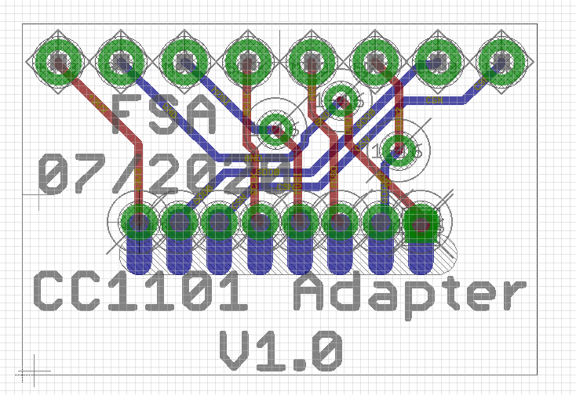
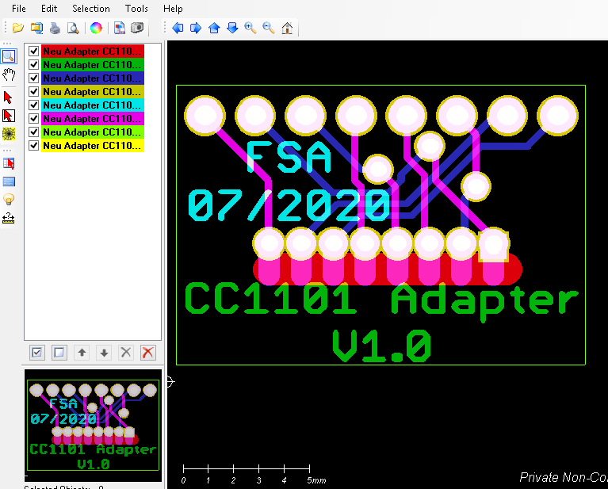
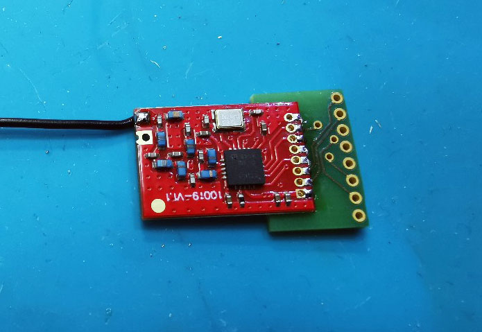

# GB_CC1101_Adapter

- Ein kleines Board für einen Adapter von einem CC1101-Modul rot im 1,27mm Raster auf ein CC1101-Modul Layout grün im 2mm Raster.

- Eine Entwicklung von Gelegenheitsbastler.

- Weitere Informationen dazu [hier im HM-Forum](https://homematic-forum.de/forum/viewtopic.php?f=76&t=49719&start=130).

## Bilder

## Platine

[:arrow_right: PCB Gerber](Gerber)

## Zusätzliche Infos

[:arrow_right: Erstellung Gerber-Dateien in Eagle](Files/HowToGenerateGerberAndDrillFilesInEagle-JLCPCB.pdf)

[:arrow_right: JLCPCB CAM Prozessdatei](Files/jlcpcb_2_layer_v72.zip)

