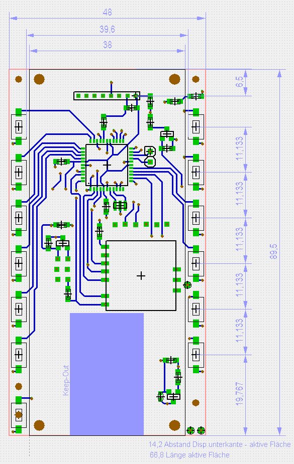
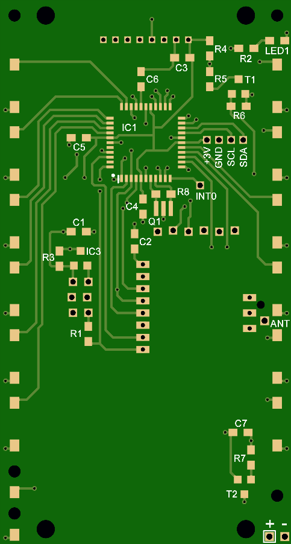
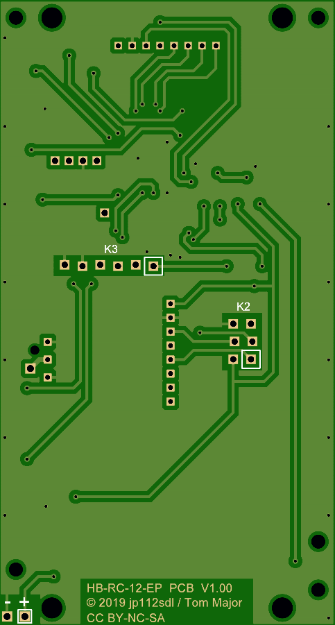
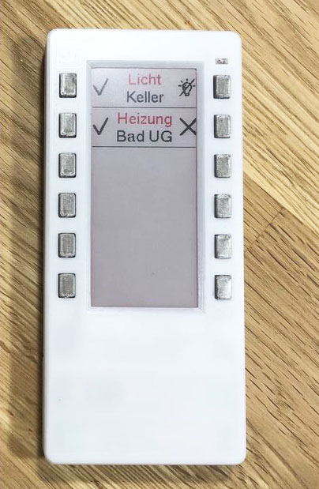
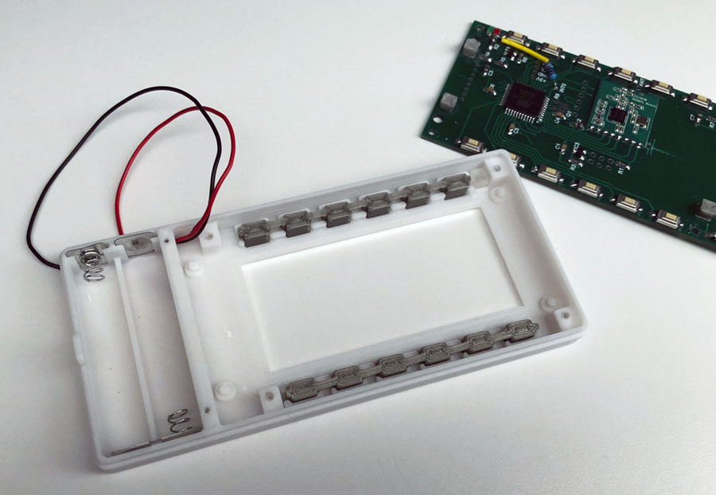
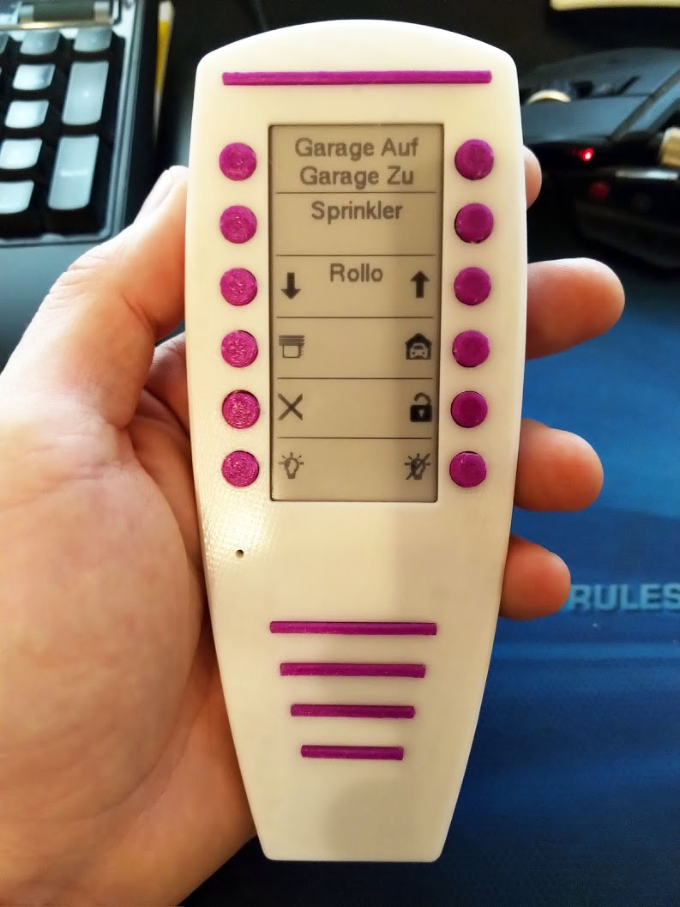

# HB-RC-12-EP Board

- Ein Board für Jeromes [HB-RC-12-EP](https://homematic-forum.de/forum/viewtopic.php?f=76&t=50160) Projekt, eine 12 Kanal Fernbedienung mit ePaper-Display.
- Es gibt momentan 2 Varianten für das Gehäuse (3D-Druck), von *Alveran* und *der-pw*

## Bilder

[comment]: 

###### Gehäusevariante von der-pw

[:arrow_right: Gehäuse 3D-Druck Variante der-pw](https://www.thingiverse.com/thing:4145186)

[:arrow_right: Aufbauanleitung Variante der-pw](https://cdn.thingiverse.com/assets/88/70/7e/3d/6d/Aufbauanleitung_YA_HB-RC-12-EP_Case.pdf)

###### Gehäusevariante von Alvaran

[:arrow_right: Gehäuse 3D-Druck Variante Alvaran](https://github.com/Alveran81/HB-RC-12-EP/tree/master/STL)

## Schaltplan

[:arrow_right: HB-RC-12-EP Board](https://github.com/TomMajor/SmartHome/tree/master/PCB/HB-RC-12-EP/Files/HB-RC-12-EP_V101.pdf)

## Platine

[:arrow_right: PCB Gerber](Gerber)

Achtung, die Platine hier ist für die 2,9"-ePaper Variante mit 2mm Raster am Stecker. 
Es gibt mittlerweile auch eine Variante dieses ePapers-Moduls mit 2,54mm Stecker-Raster, siehe den unten verlinkten Thread.

## Aufbau / Stückliste

| Anzahl    | Name      | Wert              | Gehäuse       | Bemerkungen |
|---|---|---|---|---|
| 2 | R1, R3            | 10k               | 0805          | |
| 2 | R2, R9            | 1,5k              | 0805          | R9 erst ab V1.01 im Layout vorhanden |
| 1 | R7                | 100k              | 0805          | |
| 5 | C1, C4, C5, C6, C7| 100n              | 0805          | |
| 2 | C2, C3            | 1µ                | 0805          | |
| 1 | T2                | IRLML2244         | SOT23-3       | |
| 1 | IC1	            | ATMEGA1284P-AU    | TQFP44        | 3,3V / 8MHz Version |
| 1 | IC2	            | CC1101	        | -             | |
| 1 | LED1	            | grün	            | 0805          | |
| 1 | LED2	            | rot	            | 0805          | LED2 erst ab V1.01 im Layout vorhanden |
| 12| SW1-12            | DTSM-3            | SMD           | [z.B. AliExpress 3X6X2,5mm](https://de.aliexpress.com/item/32672806661.html) |
| 1 | SW13              |                   | SMD           | DTSM-3 verkehrt herum auflöten oder anderer Taster bzw. Lösung |
| 1 | ANT1	            | 868 MHz Antenne   | -             | z.B. Drahtstück 86mm lang |
| 1 | K1                | 1x8pol. gewinkelt | RM 2,0 mm     | Reichelt: SL 1X10W 2,00 |
|   |                   |                   |               | |
| 1 | Q1	            | CSTCE8	        |SMD            | Optional (Resonator statt int. AVR RC-Osc.) |
|   |                   |                   |               | |
| 1 | R4	            | 30	            | 0805          | Optional (Echte Batt.messung unter Last) |
| 1 | R5	            | 10	            | 0805          | Optional (Echte Batt.messung unter Last) |
| 1 | R6	            | 4,7k	            | 0805          | Optional (Echte Batt.messung unter Last) |
| 1 | T1	            | IRLML6344         | SOT23-3       | Optional (Echte Batt.messung unter Last) |
|   |                   |                   |               | |
| 1 | IC3	            | MCP111T-240	    | SOT23-3       | Optional (BI-Protection) |

## Links

[HomeMatic Forum: HB-RC-12-EP - 12 Kanal Fernbedienung mit ePaper](https://homematic-forum.de/forum/viewtopic.php?f=76&t=50160)

## Lizenz

**Creative Commons BY-NC-SA** 
Give Credit, NonCommercial, ShareAlike

 This work is licensed under a <a rel="license" href="http://creativecommons.org/licenses/by-nc-sa/4.0/">Creative Commons Attribution-NonCommercial-ShareAlike 4.0 International License</a>.
