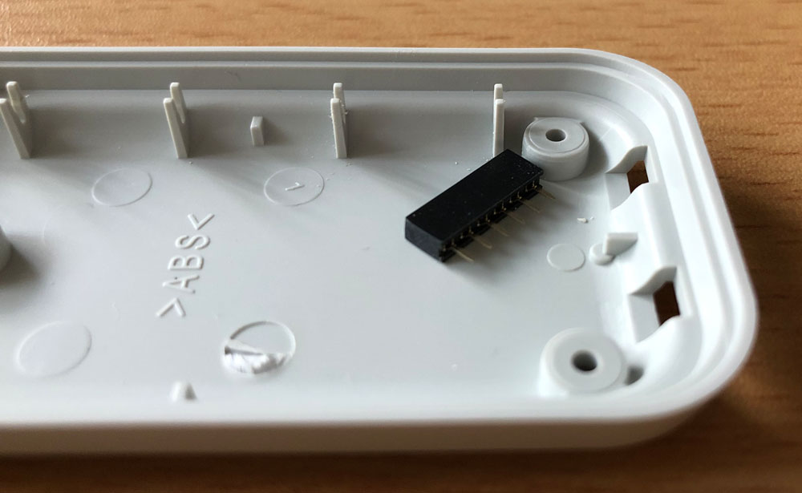
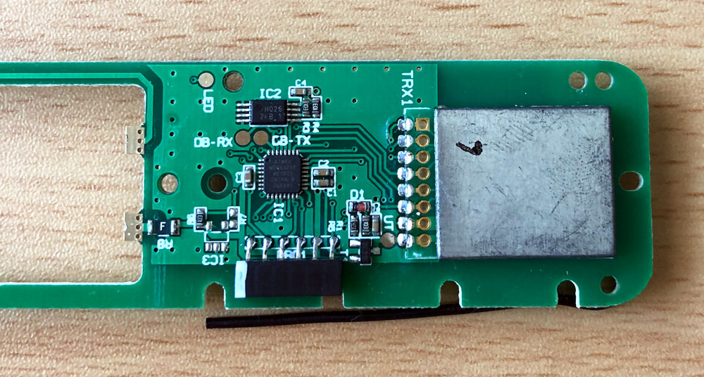
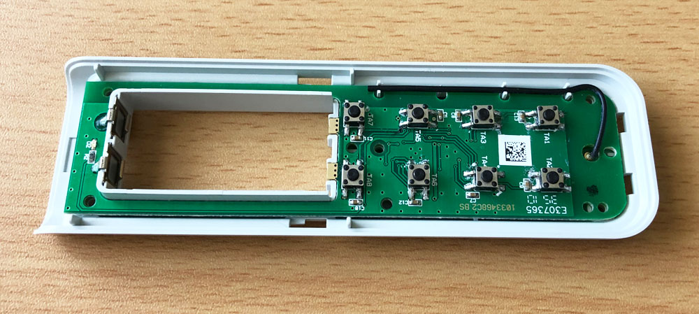
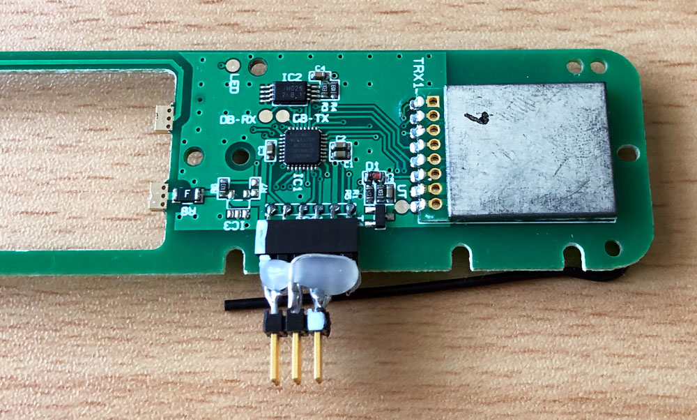
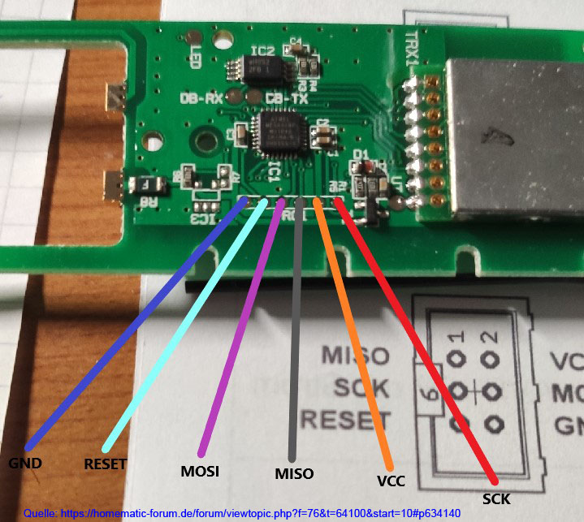
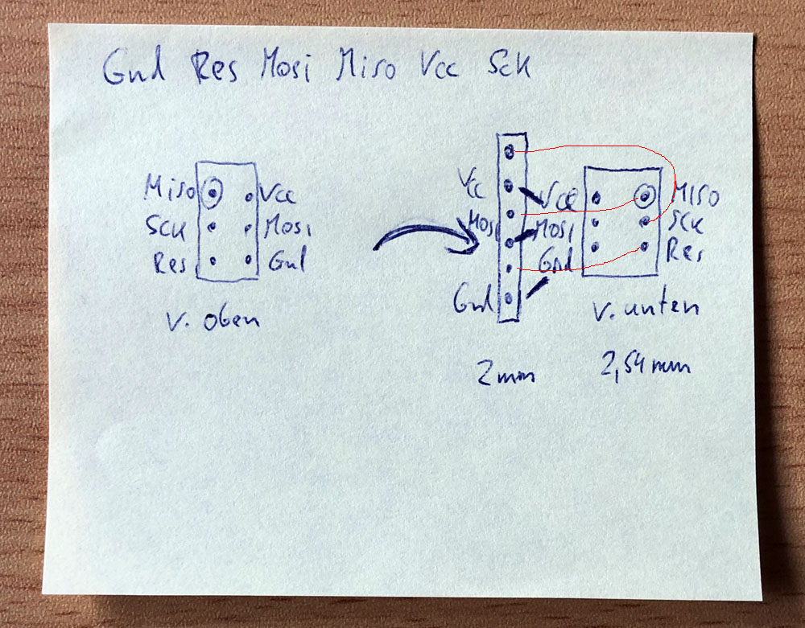
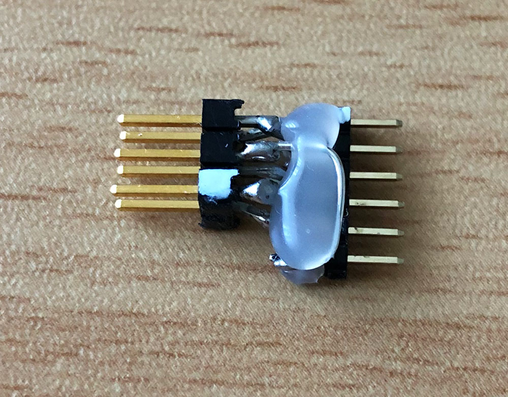
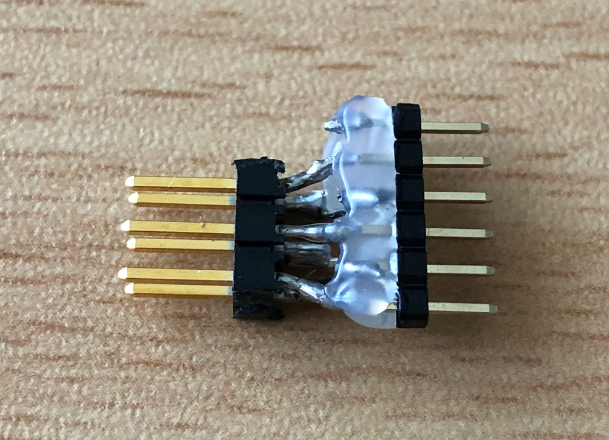
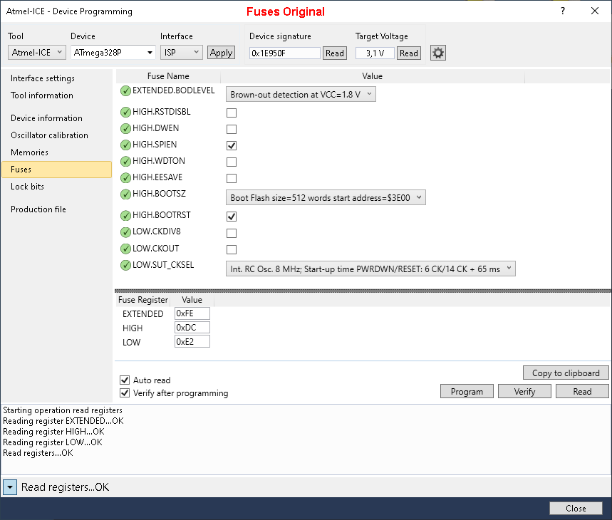
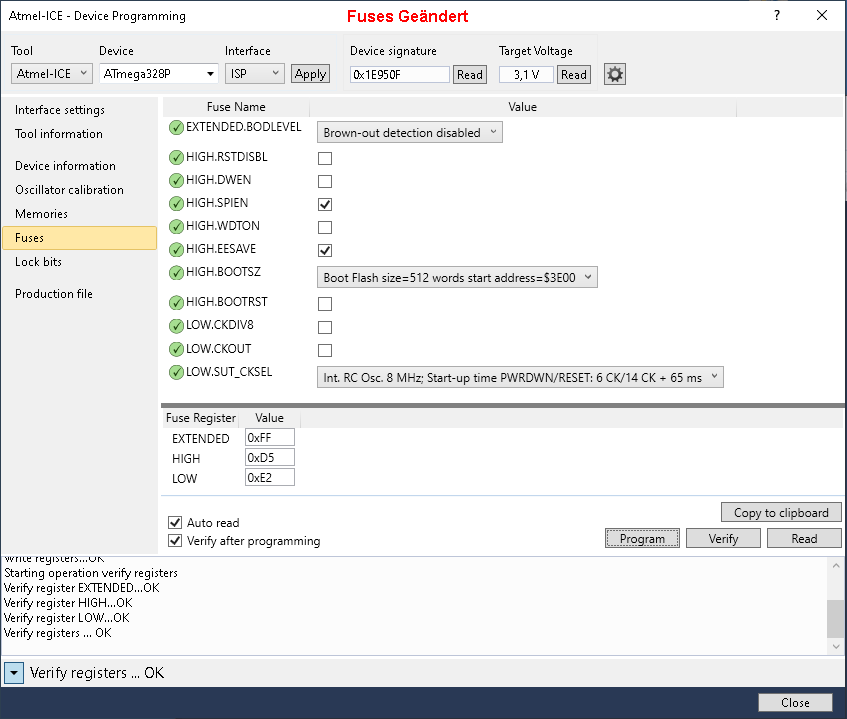

# RWE/Innogy/Livisi Fernbedienung BRC8

- habe das Projekt jetzt mal nachgebaut, funktioniert super, vielen Dank an die Ersteller des Projekts. :)

- da ich im Thread von beschädigten Leiterplatten-Pads beim An-/Ablöten der ISP-Verbindung gelesen hatte, habe ich eine andere Variante probiert und eine 2mm Buchsenleiste von Reichelt auf die ISP Pins gelötet, die verbleibt dann dort dauerhaft.

- von der Bauhöhe passt die gut rein, man muss nur einen der 4 Halter für die kleine Drahtantenne entfernen, im 3. Bild ist das zu sehen.

- so kann man jederzeit programmieren ohne sich um die Pads Gedanken zu machen. War bei mir schon hilfreich da ich bereits ein 2. mal mit ISP ran musste.

- und dann habe ich gleich noch einen Adapter Standard AVR-ISP auf 2mm RWE einreihig gebaut, ggf. auch für weitere RWE/Innogy/Livisi Geräte.

- Reichelt Buchsenleiste: z.B. BL 1X10G 2,00

- Autor des HM-RC-8_BRC8 Arduino Sketches: [jp112sdl](https://github.com/jp112sdl/Beispiel_AskSinPP/tree/master/examples/RWE/HM-RC-8_BRC8).

## Bilder

## Links

[HomeMatic Forum: RWE/Innogy/Livisi Fernbedienung BRC8 - Homematic/AskSinPP Firmware](https://homematic-forum.de/forum/viewtopic.php?f=76&t=64100)

## Lizenz

**Creative Commons BY-NC-SA** 
Give Credit, NonCommercial, ShareAlike

 This work is licensed under a <a rel="license" href="http://creativecommons.org/licenses/by-nc-sa/4.0/">Creative Commons Attribution-NonCommercial-ShareAlike 4.0 International License</a>.
