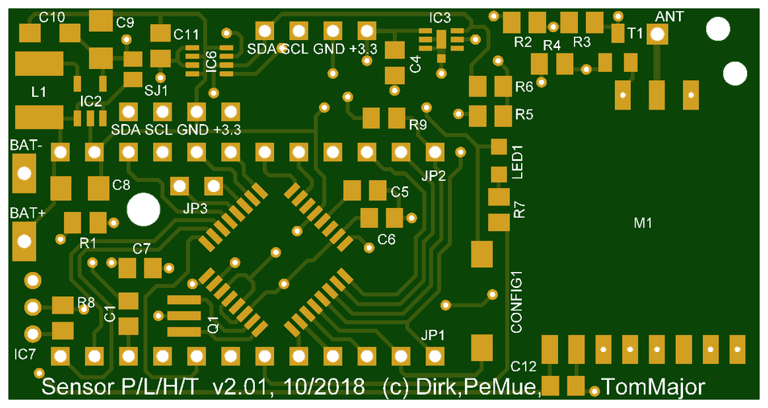
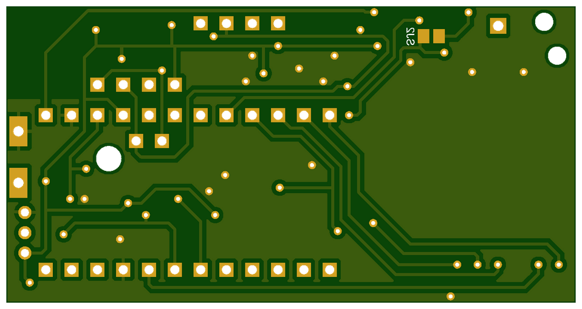
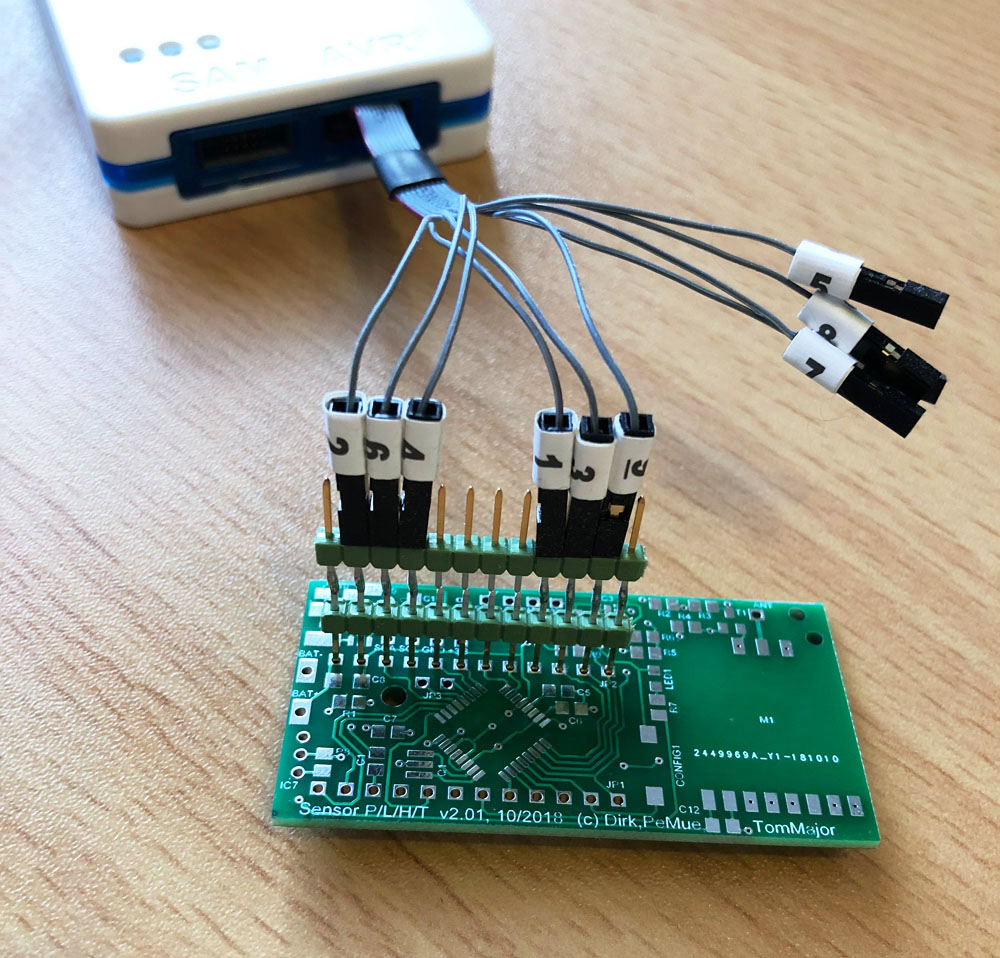
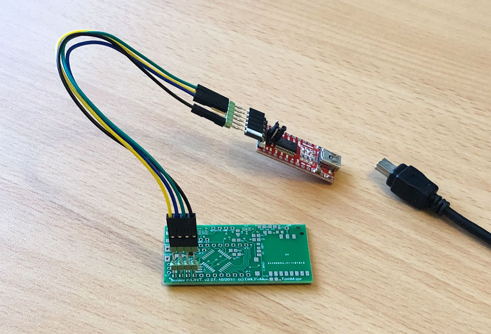

## PLHT Sensor Ver 2.01

Redesign von Dirks/PeMue's Platinen für Außen- oder Innenanwendungen, 10/2018

# Features

- Bestückung mit Arduino Pro Mini oder alternativ mit ATmega328P
- RC- oder Quarzoszillator möglich
- Sensoren für Temperatur (DS18x20, BME280), Luftdruck/Luftfeuchte (BME280), Helligkeit (MAX44009) bestückbar
- diese Sensoren können als SMD mit Reflow oder Heisßluft gelötet oder auf Breakout-Boards an den zwei I2C Stiftleisten angeschlossen werden
- andere I2C Sensoren über Breakout-Boards anschliessbar
- Spannungsversorgung: Batterien 2 Zellen / Batterie 1 Zelle mit MAX1724 / Netzteil

# Changelog Ver 2.01

- MAX44009 hinzugefügt
- BMP180 entfernt (Ersatz durch BME280)
- TSL2561 entfernt (Ersatz durch MAX44009) warum? [Vergleich TSL2561 MAX44009](https://github.com/TomMajor/AskSinPP_Examples/tree/master/Info/SensorTest_Lux)
- Zweite I2C Stiftleiste für zusätzliche Sensoren auf Breakout-Boards
- Schaltung für echte Batteriespannungsmessung unter Last hinzugefügt
- 10k pull-up Widerstand am ChipSelect des CC1101 für sicheres ISP-Flashen (Bootloader) mit verbautem CC1101
- Option: Miniatur-Quarz 8MHz bestückbar (anstatt int. RC-Osc.)
- alle Abstände der Leiterbahnen gegeneinander auf min. 0,25mm vergrößert
- Layout entflochten und verbessert
- Lötpads für BME280 und MAX44009 nach außen verlängert falls man versuchen will diese ohne Reflow oder Heisßluft zu löten

# Software

[HB-UNI-Sensor1](https://github.com/TomMajor/AskSinPP_Examples/tree/master/HB-UNI-Sensor1)

# Schaltung

[Sensor PLHT](https://github.com/TomMajor/AskSinPP_Examples/tree/master/PCB/Sensor_PLHT/Files/SensorPLHT_v201.pdf)

# Bilder

# Spezielle Bauelemente

- Gehäuse mit Klarsichtdeckel: GAINTA G201C (ohne Befestigunslaschen), GAINTA G201CMF (mit Befestigunslaschen)

- Batteriehalter 2xAA: COMF BH-321-1A

- MOSFET für Option 'Echte Batteriespannungsmessung unter Last'
    * Meine Wahl: IRML6344 (Gate Threshold Voltage 0,8V, RDSon 27mOhm, 5A, SOT-23 Gehäuse, Pinout Gate 1, Source 2, Drain 3, N-Channel)
    * Es gehen natürlich auch günstigere bzw. leichter beschaffbare MOSFETs, wichtig ist das dieser bei minimaler Betriebsspannung des Sensors (nehmen wir mal 2V an) sicher durchschalten kann (Gate Threshold Voltage) und das der RDSon möglichst klein im Bezug zu den Widerständen des Spannungsteilers R2/R3 ist.
    Und natürlich muss er den gewählten Laststrom aushalten und das Pinout muss passen.
    * Der Si2302 zum Beispiel wäre auch gut geeignet, ist leichter beschaffbar und günstiger (aliexpress), Gate Threshold Voltage 0,7V, RDSon 85mOhm, 2,6A.

- Spule für optionalen Step-Up Wandler: Murata LQH43CN100K03L oder vergleichbare, unbedingt Strom und DC-Widerstand beachten, aus Produktrange 'Power lines', 'DC/DC' o.ä.

# Bestückungsvarianten

| Thema | Variante | zu bestückende Bauelemente |
| --- | --- | --- |
| CC1101 | immer | M1, R9, C12 |
| Interface | immer | LED1, R7, CONFIG1 |
| I2C | immer | R5, R6 |
| CPU | ATmega328P Chip | IC1, R1, C1, C5, C6, C7 |
| CPU | Arduino Pro Mini | über Pin Header JP1, JP2, JP3 stecken oder löten |
| I2C Sensoren | Temperatur, Luftdruck, Luftfeuchte, Helligkeit | nach Bedarf IC3 + C4, IC6 + C11, SV1, SV2 |
| 1-Wire Sensor DS18B20 | Temperatur | IC7, R8 |
| Betriebsspannung | Standard 2x AA (3V) | SJ1 geschlossen |
| Betriebsspannung | Step-Up 1x AA oder Akku (1,2-1,5V) | MAX1724, L1, C8, C9, C10, SJ1 offen |
| Betriebsspannung | >3V | nur mit LDO, extern oder LDO auf dem Arduino Pro Mini, SJ1 offen |
| Messung Batteriespannung | Standard 3V | keine zusätzlichen Bauelemente nötig |
| Messung Batteriespannung | Step-Up MAX1724 | R2 470k, R3 100k, SJ2 geschlossen |
| Messung Batteriespannung | Messung unter Last (Schutz vor "Babbling Idiot") | R2 30, R3 10, T1, R4 bestücken, SJ2 offen, R2/R3 an gewünschten Laststrom anpassen |

# Flashen

###### 1. Bootloader (nur bei Verwendung eines ATmega328P Chips)

- Zunächst wird der Arduino Standard-Bootloader mittels eines ISP-Programmers geflasht.  Beispiele für ISP-Programmer sind u.a. USBasp, Diamex, Atmel-ICE. Auch ein Arduino Uno kann zum ISP-Programmer umfunktioniert werden.
- Die ISP Programmierung läuft über 6 Pins und so sieht die Anschlussbelegung zu JP2 auf der Platine aus:

| ISP | JP2 Pin |
| --- | --- |
| GND | 2 |
| RESET | 3 |
| +3,3V | 4 |
| SCK | 9 |
| MISO | 10 |
| MOSI | 11 |

- Es reicht die Pins auf JP2 aufzustecken und leicht zu verkanten, so wie im Foto zu sehen, der Bootloader muss nur einmal programmiert werden.
- Für den Vorgang muss der Chip aufgelötet sein und mit Spannung versorgt werden. Falls ein externer Quarz eingesetzt werden soll muss auch dieser bestückt sein.
- Wenn der ISP-Programmer einmal dran ist sollten auch gleich die Fuses geprüft und ggf. angepasst werden (Oszillator, BOD usw.).
- Beispiele für Bootloader und Fuse-Einstellungen:
[Bootloader HB-UNI-Sensor1](https://github.com/TomMajor/AskSinPP_Examples/tree/master/HB-UNI-Sensor1/bootloader)

###### 2. Applikation / Sketch

- Wenn der Bootloader vorhanden ist kann ganz normal mittels eines FTDI-Adapters direkt aus der Arduino IDE seriell programmiert werden. Dazu werden 4 Pins an JP1 verwendet:

| FTDI | JP1 Pin |
| --- | --- |
| RXD | 12 |
| TXD | 11 |
| DTR | 10 |
| GND | 9 |

###### 3. Warnung vor dem Flashen von 3,3V Geräten mit USBasp Klones

Die weit verbreiteten und billigen (1€) USBasp Klones haben einen Jumper zur 3,3V / 5V Umschaltung. 
Leider ist diese Umschaltung nur für die Versorgung des (Programmier-)Ziels zuständig, nicht für die Betriebsspannung des Controllers auf dem USBasp! 
Dies führt dazu dass der zu programmierende AVR zwar mit 3,3V betrieben wird, die Programmierleitungen SCK/MISO/MOSI/RESET führen jedoch 5V Pegel was ganz klar eine Verletzung der Spezifikation für den zu programmierenden AVR ist. 
Das Gleiche gilt für einen angeschlossenen CC1101. 
Es besteht somit die Gefahr, sowohl AVR als auch CC1101 durch Einsatz eines USBasp Klones zu zerstören. 
Ich habe Berichte von Usern gelesen wo das Programmieren gut ging, aber sicher ist das nicht. Es gibt auch Berichte wo der USBasp Chips zerstört hat. 
**Aus diesen Gründen rate ich vom Einsatz eines USBasp Klones in 3,3V Umgebungen ab.** 
Der Thread zu diesem Thema:
[HM Forum](https://homematic-forum.de/forum/viewtopic.php?f=76&t=47361&start=50#p480173)

# Verbesserungen für's nächste Redesign

- das linke Bohrloch D2,5mm besser zu den vorhandenen Löchern im Batteriehalter ausrichten, zweites Bohrloch rechts vorsehen (TomMajor)
- Arduino Pro Mini Leiste JP2/U-Bat: Jumper vorsehen um beim Pro Mini den Eingang des LDO abzuklemmen, der LDO wird bei Batteriebetrieb nicht benötigt. Am Besten ist es sowieso den LDO zu entfernen um Ruhestrom zu sparen. (TomMajor)
- MAX44001 und BME280 Pin 1 Markierungen nachtragen (PeMue)
- SHT10 optional (kpwg)
- die Breakout-Boards Pinreihen beide am Rand platzieren und mit Abstand zueinander - aktuell musste ich am MAX44009 feilen, damit es passte (kpwg)
- alle wichtigen Beschriftungen des Bestückungsdruckes größer machen - die Chinesen haben offenbar Probleme mit so kleinen Zeichen (kpwg)
- die LED Pads als 1206 vorsehen - 0805 lässt sich auf 1206 gut auflöten, aber 1206 auf 0805 ist schon grenzwertig (kpwg)
- ich verfolge etwas die Diskussion über GND bei der Antennen des CC1101. Um da flexibler zu sein (also eventuell die Durchkontaktierung aufbohren zum Trennen) ist es eventuell besser, sich das GND für den T1 aus einer getrennten Durchkontaktierung und nicht aus dem linken GND des CC1101 zu holen. (harvey)
- ISP-Header zum bequemen initialen Prog. des Bootloaders - noch unklar ob im Layout machbar (TomMajor, kpwg)
