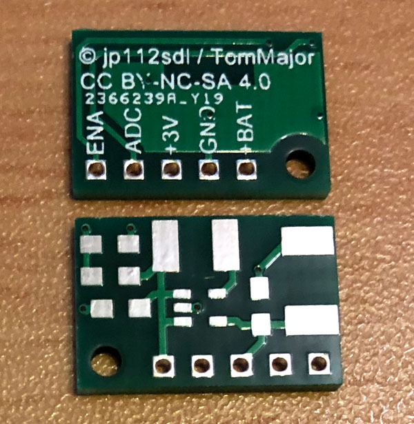
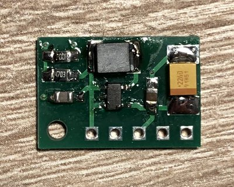
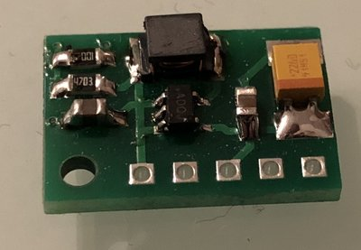

# StepUp-Board MAX1724

- Ein kleines Board für den Step-Up Wandler MAX1724.

- Entstanden in Zusammenarbeit mit Jerome (jp112sdl) um vorhandene HomeBrew AskSinPP-Projekte auf die Versorgung mit einer Zelle umzustellen. 
  Ich habe mich vor einiger Zeit etwas mit dem korrekten Layouten für DC/DC-Wandler Applikationen beschäftigt. :biohazard:

- Eingangspannung NiMH 1,2V oder Alkaline 1,5V, Ausgangsspannung 3V bzw. 3,3V.

- Der Spannungsteiler 100k/470k für die AskSinPP Batteriespannungsmessung *BatterySensorUni* kann optional bestückt werden.

## Bilder

## Schaltplan

[:arrow_right: StepUp-Board MAX1724](https://github.com/TomMajor/SmartHome/tree/master/PCB/StepUp_Board_MAX1724/Files/StepUp_Board_MAX1724.pdf)

## Platine

[:arrow_right: PCB Gerber](Gerber)

## Aufbau / Stückliste

| Anzahl	| Name	    | Wert	            | Gehäuse       | Bemerkungen |
|---|---|---|---|---|
| 2 | C1, C2 | 10µ            | 0805	| |
| 2 | C3   | 22µ              | Bauform B oder C | Tantalelko |
| 1 | L1   | 10µ              | - | LQH43CN100K03L |
| 1 | IC1  | MAX1724EZK30     | SOT23-5 | auch MAX1724EZK33 möglich |
| 1 | R1   | 100k             | 0805	| optional, für AskSinPP Batteriespannungsmessung |
| 1 | R2   | 470k             | 0805	| optional, für AskSinPP Batteriespannungsmessung |

###### Bezugsquellen LQH43CN100K03L und MAX1724

- [Conrad](https://www.conrad.de), [TME](https://www.tme.eu/de), [RS privat](https://www.rsonline-privat.de), [Mouser](https://www.mouser.de) - **alle auch für Privatkunden**
- [Farnell](https://de.farnell.com) - **nur gewerbliche Kunden**

Bei Farnell finde ich die parametrische Suche genial, z.B. 
"*liste mir alle P-Kanal Mosfet im SOT-23 Gehäuse mit einer Ugs von >= 20V und sortiere sie aufsteigend nach ihrem Rdson-Widerstand.*" 
Mouser macht nach meinen Erfahrungen nur Spaß wenn man über dem Mindestbestellwert von ca. 50€ kommt, sonst fallen hohe Versand-/Zollkosten an.

## Lizenz

**Creative Commons BY-NC-SA** 
Give Credit, NonCommercial, ShareAlike

 This work is licensed under a <a rel="license" href="http://creativecommons.org/licenses/by-nc-sa/4.0/">Creative Commons Attribution-NonCommercial-ShareAlike 4.0 International License</a>.
