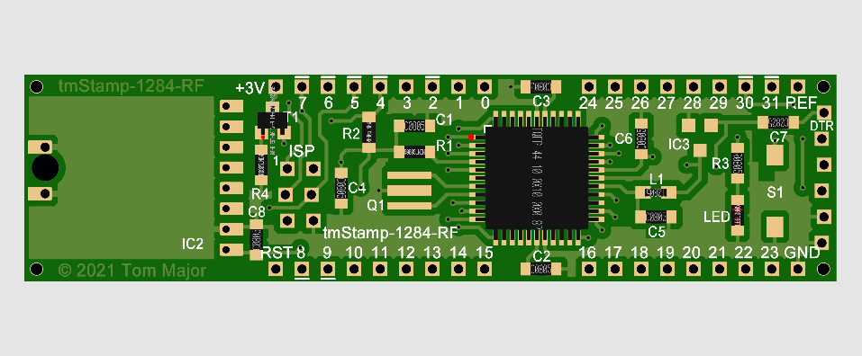
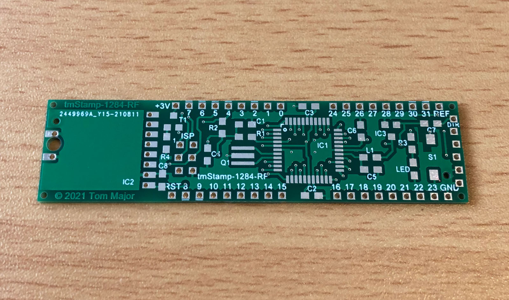
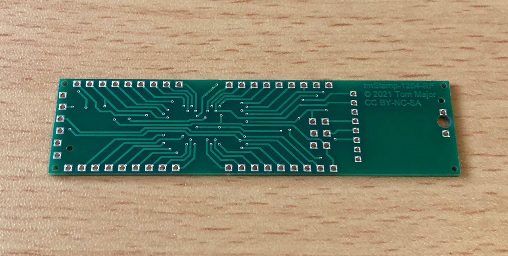
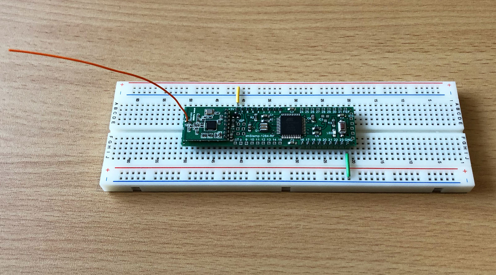
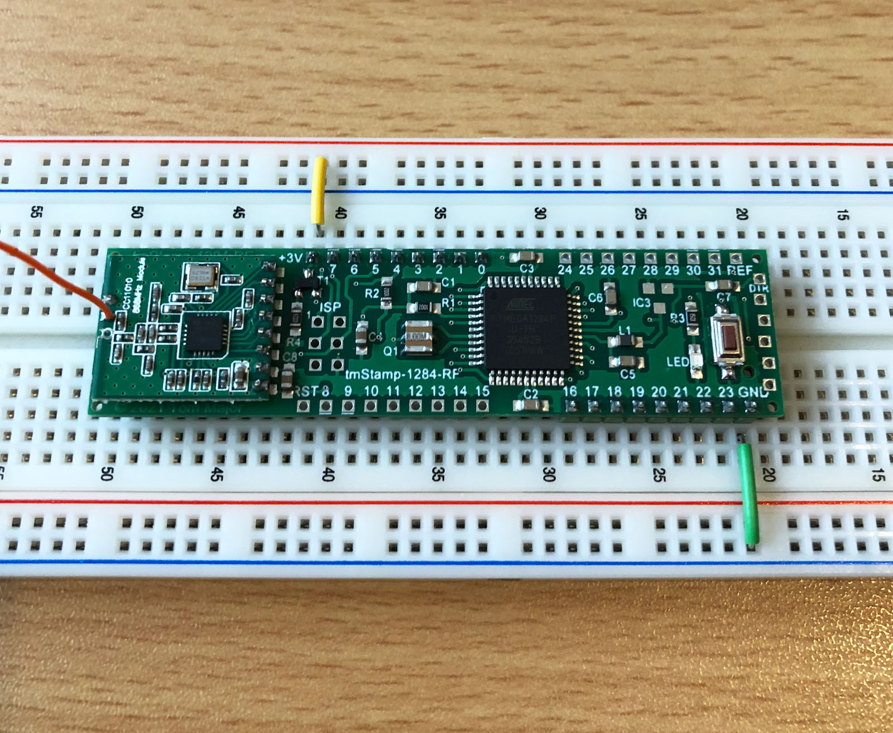
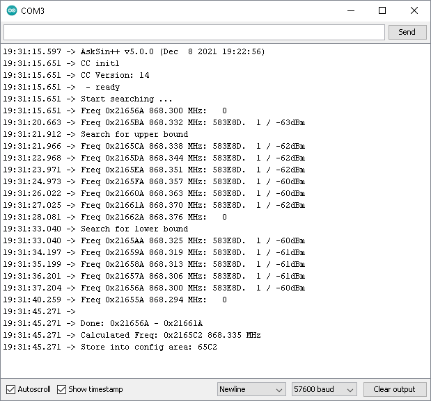
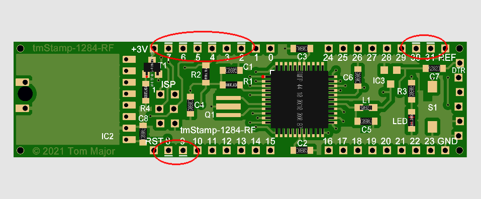

# tmStamp-1284-RF - AskSinPP Universalplatine mit 128k Flash und 16k RAM

Schon länger wollte ich eine einfache AVR AskSinPP Universalplatine für Experimente auf dem Steckbrett etc. haben, die für anspruchsvolle Sketche und Tests mehr als 32k Flash mitbringt. 
Man kann die Platine natürlich auch in eigenen Selbstbau-Geräten einsetzen wenn der Platz reicht. 
Herausgekommen ist dabei die tmStamp-1284-RF mit einem ATmega1284P. 
Sie basiert auf der hervorragenden [Mighty Mini 1284P](https://github.com/JChristensen/mini1284) Platine von Jack Christensen und wurde von mir für AskSinPP Zwecke angepasst.

## Features

- ATmega1284P mit 128k Flash und 16k RAM, es ist auch der ATmega644 (64k Flash, 4k RAM) bestückbar
- Abmessungen 79mm x 20mm
- Raster 2,54mm, kompatibel zu Experimentier-Steckboards und Lochraster-Platinen
- CC1101, Config-Taster und LED On-Board
- Verpolschutz On-Board
- ISP und FTDI-Programmier-Schnittstelle
- Alle 32 I/O Pins herausgeführt
- Pin-Beschriftung [MightyCore Standard pinout](https://github.com/MCUdude/MightyCore#pinout)
- [JLCPCB](https://jlcpcb.com/) kompatible BOM (Bill of materials) und Pick-and-Place Dateien vorhanden
- Die folgenden zusätzlichen Optionen existieren, alle nur *bei Bedarf* bestückbar:
  - Optionaler Reset-Baustein MCP111 (Schutz vor "Babbling Idiot")
  - Optionaler 8MHz Keramikresonator

## Bilder

## Schaltplan

[:arrow_right: tmStamp-1284-RF](https://github.com/TomMajor/SmartHome/tree/master/PCB/tmStamp-1284-RF/Files/tmStamp-1284-RF.pdf)

## Platine

[:arrow_right: PCB Gerber](Gerber)

## Aufbau / Stückliste

- siehe Verzeichnis Gerber: **BOM_tms1284.xlsx** - Teileliste für die Bestückung bei JLCPCB.

- im gleichen Verzeichnis: **Pick_Place_tms1284.xlsx** - Pick-and-Place Datei für JLCPCB.

- die JLCPCB Teileliste wurde auf minimale Kosten ausgelegt, d.h. keine "extended parts" (außer der AVR natürlich). Dafür muss man den Mosfet T1 sowie die (optionalen) Bauteile Q1 (AWSCR-8.00CV-T) und IC3 (MCP111T-240) selber bestückten. Sowohl Q1 als auch IC3 braucht man nicht unbedingt für minimale AskSinPP Bestückung.

- Auf jeden Fall selber bestücken muss man also T1, das CC1101-Modul und den Config-Taster (DTSM-3).

## Pinbelegung

- alle 32 I/O Pins des AVR sind herausgeführt, zusätzlich noch VCC, GND, Reset und ARef.

- die intern auf dem Board belegten Pins haben eine kleine Linienmarkierung am jeweiligen Lötpad. Dies betrifft 4 SPI-Leitungen (4-7), /INT2 (2) und PA6/PA7 (30,31). Die Pins RXD0/TXD0 (8,9) sind intern nicht wirklich belegt, werden jedoch bei der Programmierung über Bootloader und FTDI-Programmier-Schnittstelle verwendet.

- Eine SPI ist immer Multi-Device fähig, d.h. mit zusätzlichen Chip-Select Signal kann man die SPI zum CC1101 auch noch außen parallel für andere SPI-Chips benutzen. Eventuell sind dafür aber SW-Anpassungen nötig um die dann gemeinsam genutzte Ressource SPI zwischen AskSinPP und anderen SW-Modulen konfliktfrei zu teilen, z.B. mit Hilfe eines Mutex.

- Falls man PA6/PA7 unbedingt außen brauchen sollte kann man auf die Bestückung vom Taster und LED verzichten.

## Links

[AskSinPP Library](https://github.com/pa-pa/AskSinPP)

[HomeMatic Forum: tmStamp-1284-RF](https://homematic-forum.de/forum/viewtopic.php?f=76&t=71463)

## Lizenz

**Creative Commons BY-NC-SA** 
Give Credit, NonCommercial, ShareAlike

 This work is licensed under a <a rel="license" href="http://creativecommons.org/licenses/by-nc-sa/4.0/">Creative Commons Attribution-NonCommercial-ShareAlike 4.0 International License</a>.
