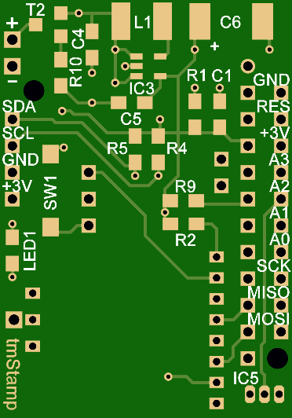
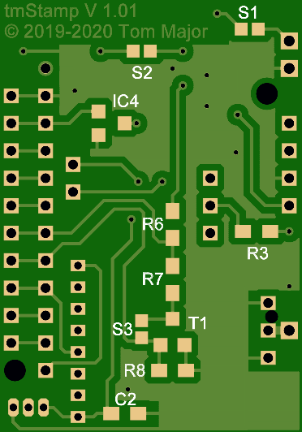
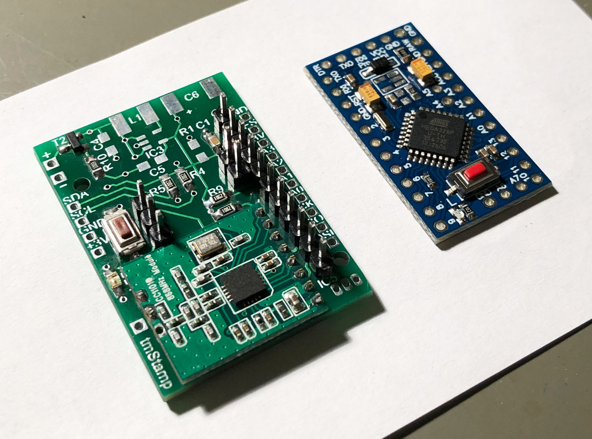
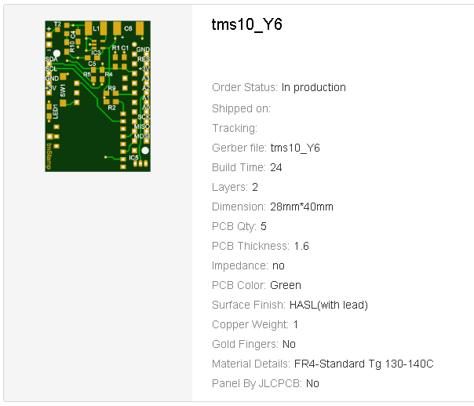

# tmStamp - kleine AskSinPP Universalplatine basierend auf Arduino Pro Mini

Im Oktober des Jahres 2019 verspürte ich das Verlangen nach einer kleinen AskSinPP Universalplatine, um mal eben schnell ein HomeMatic-Gerät aufbauen zu können **und** nicht jedesmal den ATmega328P als SMD TQFP32 löten zu müssen. 
Es gibt ja bereits einige Platinen dieser Art auf dem "Markt", aber einige davon sind nicht Open Source :crying_cat_face: und die anderen hatten nicht die zusätzlichen Optionen die ich im Sinn hatte. 
Herausgekommen ist dabei die *tmStamp*.

Features:

- Einsatz eines Arduino Pro Mini um nicht immer den ATmega328P als SMD TQFP32 löten zu müssen
- Es wurde ein Kompromiss angestrebt zwischen einerseits minimalen Abmessungen (Pro Mini und CC1101 als Stack übereinander) und andererseits zusätzlichen Optionen um das Board möglichst universell einsetzen zu können
- CC1101, Config-Taster und LED natürlich On-Board
- Die folgenden zusätzlichen Optionen existieren, alle nur *bei Bedarf* bestückbar:
  - Verpolschutz
  - StepUp-Wandler MAX1724 zur Versorgung aus einer Zelle
  - Echte Batteriespannungsmessung unter Last
  - Optionaler Reset-Baustein MCP111 (Schutz vor "Babbling Idiot")
  - DS18B20 Temperatursensor On-Board
  - vollständiger I2C-Anschluß mit Power-Pins zum schnellen Anschluß von Sensor Breakout-Boards wie BME280 usw.
  - I2C pull-up Widerstände
  - Zugang zu den SPI-Pins SCK/MOSI/MISO über extra Lötpads (rechten Seite)
  - Zugang zu den Analog-Pins A0..A3 über extra Lötpads (rechten Seite)
  - Zugang zu den frei verwendbaren Digital-Pins D5..D9 direkt am Arduino Pro Mini (linken Seite)

## Bilder

## Schaltplan

[:arrow_right: tmStamp V1.0](https://github.com/TomMajor/SmartHome/tree/master/PCB/tmStamp/Files/tmStamp_V10.pdf)

## Platine

[:arrow_right: PCB Gerber](Gerber)

## Aufbau / Stückliste

| Anzahl    | Name      | Wert              | Gehäuse       | Bemerkungen |
|---|---|---|---|---|
| 1 | R2                | 10k               | 0805          | |
| 1 | R3                | 1,5k              | 0805          | |
| 1 | C1                | 100n              | 0805          | |
| 1 | C2                | 1µ                | 0805          | |
| 1 | SW1               | DTSM-3            | SMD           | |
| 1 | LED1	            | gelb	            | 0805          | |
| 1 | IC1	            | Arduino Pro Mini  | -             | 3,3V / 8MHz Version |
| 1 | IC2	            | CC1101	        | -             | |
| 1 | ANT1	            | 868 MHz Antenne   | -             | z.B. Drahtstück 86mm lang |
|   |                   |                   |               | |
| 2 | R4, R5            | 10k               | 0805          | Optional (I2C pull-up Widerstände) |
|   |                   |                   |               | |
| 1 | R10               | 100k              | 0805          | Optional (Verpolschutz) |
| 1 | T2                | DMG3415U          | SOT23-3       | Optional (Verpolschutz) |
|   |                   |                   |               | |
| 1 | L1	            | 10µ -> LQH43CN100K03L | SMD       | Optional (StepUp-Wandler zur Versorgung aus einer Zelle) |
| 2 | C4, C5	        | 10µ	            | 0805          | Optional (StepUp-Wandler zur Versorgung aus einer Zelle) |
| 1 | C6	            | 22µ/16V           | ELKO_C        | Optional (StepUp-Wandler zur Versorgung aus einer Zelle) |
| 1 | IC3	            | MAX1724EZK30 oder MAX1724EZK33 | SOT23-5 | Optional (StepUp-Wandler zur Versorgung aus einer Zelle) |
|   |                   |                   |               | |
| 1 | R6	            | 30	            | 0805          | Optional (Echte Batt.messung unter Last) |
| 1 | R7	            | 10	            | 0805          | Optional (Echte Batt.messung unter Last) |
| 1 | R8	            | 4,7k	            | 0805          | Optional (Echte Batt.messung unter Last) |
| 1 | T1	            | IRLML6344         | SOT23-3       | Optional (Echte Batt.messung unter Last) |
|   |                   |                   |               | |
| 1 | IC4	            | MCP111T-240	    | SOT23-3       | Optional (BI-Protection) |
|   |                   |                   |               | |
| 1 | R9	            | 10k	            | TO92          | Optional (Temperaturmessung) |
| 1 | IC5	            | DS18B20	        | TO92          | Optional (Temperaturmessung) |

**Achtung: Wenn der DC-DC/StepUp Wandler MAX1724 nicht benutzt wird muss S2 gebrückt werden!**

R1 war als der Standard pull-up Widerstand für die Resetleitung des AVR vorgesehen. 
Da der Arduino Pro Mini den bereits On-Board hat braucht er nicht bestückt werden.

WIP: Bemerkung über Länge der Pfostenleiste.

## Verbesserungen für's nächste Redesign

- R1 entfernen
- Die 3 Pad-Löcher auf der Antennenseite des CC1101 haben im Gegensatz zur SPI-Seite ein 2,54mm Raster (SPI-Seite hat 2mm). 
Ich habe jedoch dort den gleichen Bohrlochdurchmesser von 0,7mm wie für die SPI-Seite verwendet. Dadurch passen nur die Pins eines 2mm Pfostensteckers, nicht die eines 2,54mm Pfostensteckers. Eventuell diese 3 Löcher auf 0,9mm vergrößern.

## Lizenz

**Creative Commons BY-NC-SA** 
Give Credit, NonCommercial, ShareAlike

 This work is licensed under a <a rel="license" href="http://creativecommons.org/licenses/by-nc-sa/4.0/">Creative Commons Attribution-NonCommercial-ShareAlike 4.0 International License</a>.
