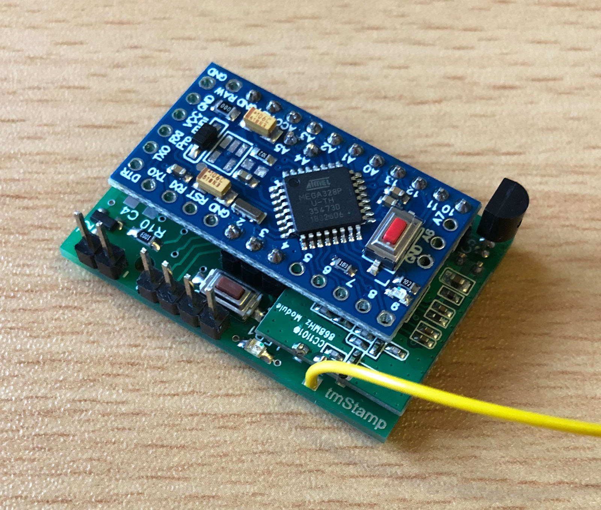
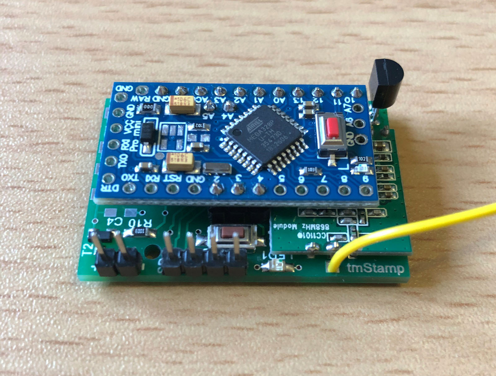
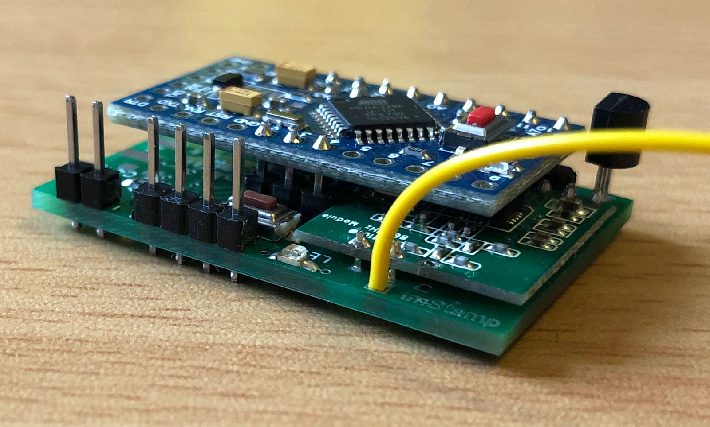
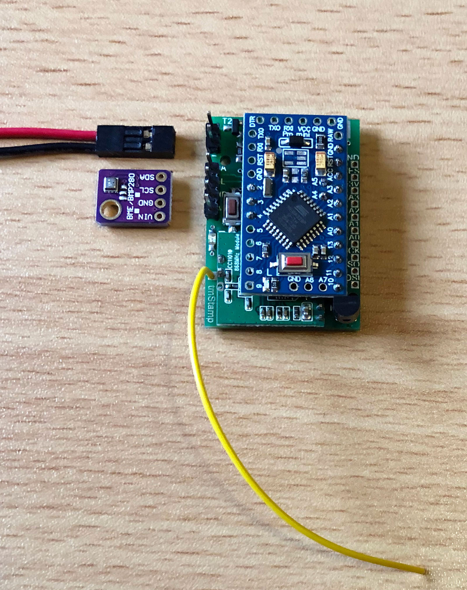
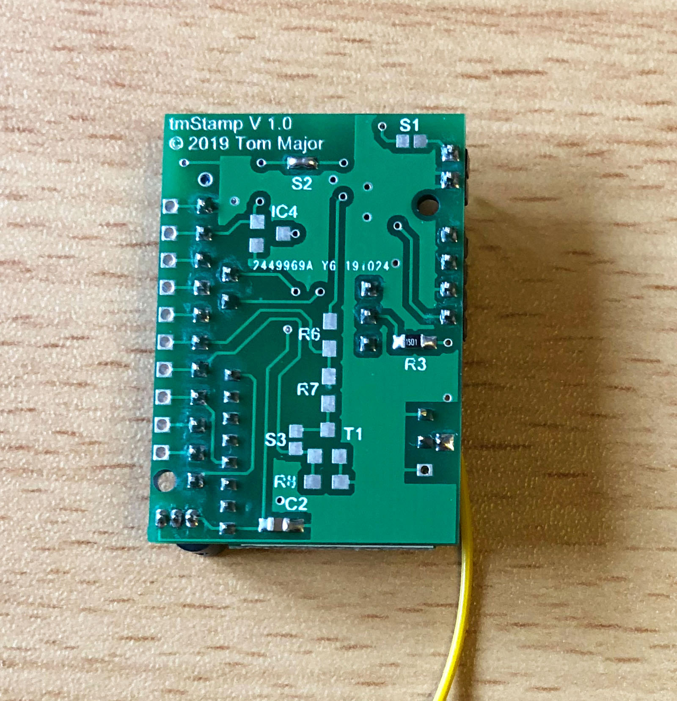

# tmStamp - kleine AskSinPP Universalplatine basierend auf Arduino Pro Mini

Im Oktober des Jahres 2019 verspürte ich das Verlangen nach einer kleinen AskSinPP Universalplatine, um mal eben schnell ein HomeMatic-Gerät aufbauen zu können **und** nicht jedesmal den ATmega328P als SMD TQFP32 löten zu müssen. 
Es gibt ja bereits einige Platinen dieser Art auf dem "Markt", aber einige davon sind nicht Open Source :crying_cat_face: und die anderen hatten nicht die zusätzlichen Optionen die ich im Sinn hatte. 
Herausgekommen ist dabei die *tmStamp*.

Features:

- Einsatz eines Arduino Pro Mini um nicht immer den ATmega328P als SMD TQFP32 löten zu müssen
- Es wurde ein Kompromiss angestrebt zwischen einerseits minimalen Abmessungen (Pro Mini und CC1101 als Stack übereinander) und andererseits zusätzlichen Optionen um das Board möglichst universell einsetzen zu können
- CC1101, Config-Taster und LED natürlich On-Board
- Die folgenden zusätzlichen Optionen existieren, alle nur *bei Bedarf* bestückbar:
  - Verpolschutz
  - StepUp-Wandler MAX1724 zur Versorgung aus einer Zelle
  - Echte Batteriespannungsmessung unter Last
  - Optionaler Reset-Baustein MCP111 (Schutz vor "Babbling Idiot")
  - DS18B20 Temperatursensor On-Board
  - vollständiger I2C-Anschluß mit Power-Pins zum schnellen Anschluß von Sensor Breakout-Boards wie BME280 usw.
  - I2C pull-up Widerstände
  - Zugang zu den SPI-Pins SCK/MOSI/MISO über extra Lötpads (rechten Seite)
  - Zugang zu den Analog-Pins A0..A3 über extra Lötpads (rechten Seite)
  - Zugang zu den frei verwendbaren Digital-Pins D5..D9 direkt am Arduino Pro Mini (linken Seite)

## Bilder

## Schaltplan

[:arrow_right: tmStamp V1.0](https://github.com/TomMajor/SmartHome/tree/master/PCB/tmStamp/Files/tmStamp_V10.pdf)

## Platine

[:arrow_right: PCB Gerber](Gerber)
 **WIP**

## Aufbau / Stückliste

| Anzahl	| Name	    | Wert	            | Gehäuse       | Bemerkungen |
|---|---|---|---|---|
**WIP**

**Achtung: Wenn der DC-DC/StepUp Wandler MAX1724 nicht benutzt wird muss S2 gebrückt werden!**

## Lizenz

**Creative Commons BY-NC-SA** 
Give Credit, NonCommercial, ShareAlike

 This work is licensed under a <a rel="license" href="http://creativecommons.org/licenses/by-nc-sa/4.0/">Creative Commons Attribution-NonCommercial-ShareAlike 4.0 International License</a>.
