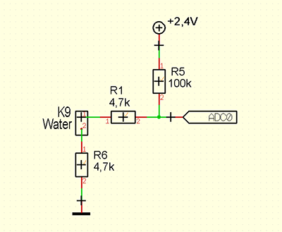

# AskSinPP_Examples
Meine Beispiele für papa's AskSinPP library
[AskSinPP Library](https://github.com/pa-pa/AskSinPP)

## Wassermelder (HM-SEC-WDS-2)

- Demonstriert die Verwendung vom ThreeStateSensor device type mit einer anpassbaren Messroutine, in diesem Fall eine Leitfähigkeitsmessung zwischen den Elektroden mit ADC.
- Eingangsschaltung:

## Universalsensor (HB-UNI-Sensor1)

- Demonstriert einen HM/RM/FHEM Universalsensor für Temperatur, Luftdruck, Luftfeuchte, Helligkeit usw.
- modifizierbar für andere Sensoren
- mit konfigurierbaren Sendeintervall über WebUI

