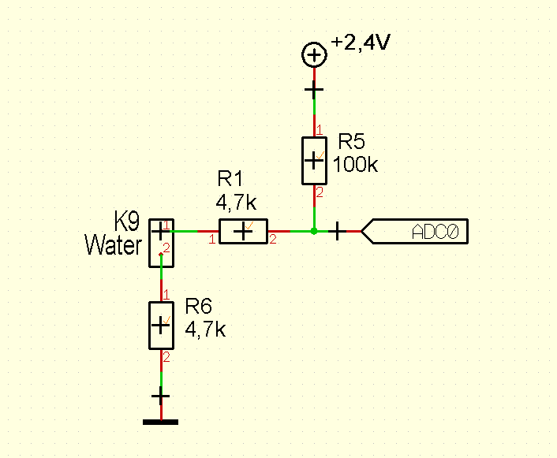
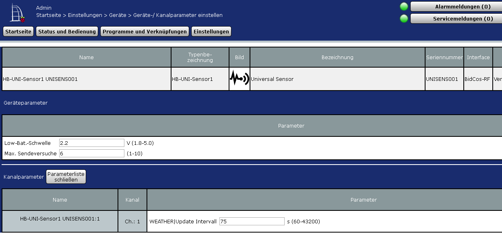

# AskSinPP_Examples
Meine Beispiele für papa's AskSinPP library
[AskSinPP Library](https://github.com/pa-pa/AskSinPP)

## HM-SEC-WDS-2
- Demonstriert die Verwendung vom ThreeStateSensor device type mit einer anpassbaren Messroutine, in diesem Fall eine Leitfähigkeitsmessung mit ADC.
- Eingangsschaltung:

## HB-UNI-Sensor1
- Demonstriert einen HM/RM/FHEM Universalsensor für Temperatur, Luftdruck, Luftfeuchte, Helligkeit usw., erweiterbar für andere Sensorwerte
- mit konfigurierbaren Sendeintervall

